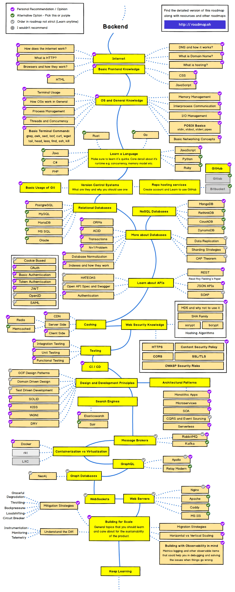

# back-end-skill-tree
## **Index of Contents**

```
.
├── advanced-go-learning-notes
│   ├── 01.微服务概览与治理.md
│   ├── 02.异常处理.md
│   ├── 03.并行编程1.md
│   ├── 03.并行编程2.md
│   ├── 04.工程化实践1.md
│   ├── 04.工程化实践2.md
│   ├── 05.评论系统架构设计1.md
│   ├── 06.微服务可用性设计1.md
│   ├── 08.分布式缓存&分布式事务1.md
│   ├── 08.分布式缓存&分布式事务2.md
│   └── 12.runtime.md
├── aws-certified-developer-associate-notes
│   ├── implementing-microservices-on-aws
│   │   ├── 01.Microservices-architecture-on-AWS.md
│   │   ├── 02.Reducing-Operational-Complexity.md
│   │   └── 03.Distributed-systems-components.md
│   └── udemy-course
│       ├── 03.Getting-started-with-AWS.md
│       └── 04.IAM-&-AWS-CLI.md
├── caching
│   ├── local-cache-vs-distributed-cache.md
│   ├── redis
│   │   ├── basic-data-structure
│   │   │   ├── 1.string.md
│   │   │   ├── 2.list.md
│   │   │   ├── 3.hash.md
│   │   │   ├── 4.set.md
│   │   │   ├── 5.zset.md
│   │   │   └── index.md
│   │   ├── index.md
│   │   ├── rehash.md
│   │   ├── underlying-data-structure
│   │   │   ├── 1.simple-dynamic-string.md
│   │   │   ├── 2.dict.md
│   │   │   ├── 3.ziplist.md
│   │   │   ├── 4.skiplist.md
│   │   │   └── index.md
│   │   ├── 原理
│   │   │   ├── 1.线程IO模型.md
│   │   │   ├── 2.通信协议.md
│   │   │   ├── 3.持久化.md
│   │   │   ├── 4.管道.md
│   │   │   ├── 5.事务.md
│   │   │   ├── 6.PubSub消息多播.md
│   │   │   ├── 7.小对象压缩.md
│   │   │   └── 8.主从同步.md
│   │   ├── 应用
│   │   │   ├── 1.bitmap.md
│   │   │   ├── 2.bloom-filter.md
│   │   │   ├── 3.简单限流.md
│   │   │   ├── 4.漏斗限流.md
│   │   │   ├── 5.GeoHash.md
│   │   │   └── 6.分布式锁.md
│   │   ├── 拓展
│   │   │   ├── 1.过期策略.md
│   │   │   ├── 2.内存淘汰.md
│   │   │   ├── 3.懒惰删除.md
│   │   │   ├── 4.Redlock-再谈分布式锁.md
│   │   │   ├── 5.Info.md
│   │   │   └── index.md
│   │   └── 集群
│   │       ├── 1.Sentinel.md
│   │       ├── 2.Cluster.md
│   │       └── index.md
│   ├── redis-cache-lock-problem.md
│   └── why-use-cache.md
├── cloud-native-learning-notes
│   └── 1.docker.md
├── cracking-the-coding-interview-notes
│   └── 01.the_interview_process.md
├── go-expert-programming-notes
│   ├── 1.数据结构
│   │   ├── 1.channel.md
│   │   ├── 2.slice.md
│   │   ├── 3.map.md
│   │   ├── 4.struct.md
│   │   ├── 5.iota.md
│   │   ├── 6.string.md
│   │   ├── go语言坑之并发访问map.md
│   │   ├── json包变量不加tag会怎么样.md
│   │   ├── nil切片和空切片一不一样.md
│   │   └── sync.Map揭秘.md
│   ├── 2.控制结构
│   │   ├── 1.defer.md
│   │   ├── 2.select.md
│   │   ├── 3.range.md
│   │   └── index.md
│   ├── 3.协程
│   │   ├── 1.协程的概念.md
│   │   ├── 2.调度模型.md
│   │   ├── 3.调度策略.md
│   │   └── index.md
│   ├── 4.内存管理
│   │   ├── 1.内存分配原理.md
│   │   ├── 2.垃圾回收原理.md
│   │   ├── 3.逃逸分析.md
│   │   ├── 4.内存泄漏.md
│   │   ├── index.md
│   │   └── resp.Body.Close()引发的内存泄漏.md
│   ├── 5.并发控制
│   │   ├── 1.Channel.md
│   │   ├── 2.WaitGroup.md
│   │   ├── 3.Context.md
│   │   ├── 4.mutex.md
│   │   ├── 5.rwmutex.md
│   │   ├── 6.内存模型.md
│   │   └── index.md
│   ├── 6.反射
│   │   ├── 1.反射机制.md
│   │   └── index.md
│   ├── 9.定时器
│   │   ├── 1.Timer.md
│   │   ├── 2.Ticker.md
│   │   ├── 3.timer.md
│   │   └── index.md
│   ├── context.md
│   ├── error-handling.md
│   └── http超时机制.md
└── internet
    ├── 1.传输层
    │   ├── 1.什么是三次握手.md
    │   ├── 2.什么是四次挥手.md
    │   ├── 3.TCP如何实现流量控制.md
    │   ├── 4.TCP的拥塞控制是怎么实现的.md
    │   ├── 5.TCP与UDP的区别.md
    │   ├── 6.TCP如何保证传输的可靠性.md
    │   └── index.md
    ├── 2.应用层
    │   ├── 1.HTTP和HTTPS.md
    │   ├── 3.Session与Cookie.md
    │   ├── 4.从输入网址到获得页面的过程.md
    │   ├── http协议
    │   │   ├── 1.GET和POST.md
    │   │   ├── 2.PUT和POST.md
    │   │   └── index.md
    │   └── index.md
    ├── 3.网络体系结构
    │   ├── 1.计算机网络体系结构.md
    │   └── index.md
    ├── 4.网络层协议
    │   ├── 1.IP地址的分类.md
    │   └── index.md
    ├── Idempotence.md
    └── restful.md
```

```shell
# generate this index
tree -L 4 -I *.jpg -I *.png -I *.webp -I img -I images -I README.md -I readme.md
```

<br>

this picture is from: https://roadmap.sh/backend
