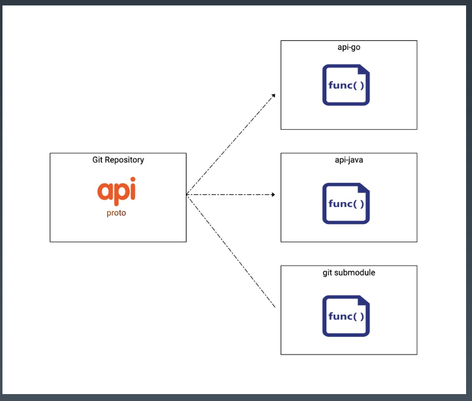
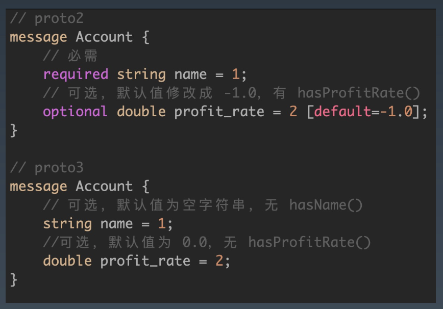

# **工程化实践2**

<br>

# **0. INDEX**

- **1. API 设计**
    - **1.1. gRPC**
    - **1.2. API Compatibility**
    - **1.3. API Naming Conventions**
    - **1.4. API Primitive Fields**
    - **1.5. API Errors**
    - **1.6. API Design**
- **2. Configuration**
    - **2.1. 分为四大类**

<br>

# **1. API 设计**
## **1.1. gRPC**
> gRPC 是什么可以用官网的一句话来概括：“A high-performance, open-source universal RPC framework”

- ***为什么用 grpc，最看重的***

    1. IDL: **基于文件定义服务，通过 proto3 工具生成指定语言的`数据结构`、`服务端接口`以及客户端 Stub**。

        - **把`客户端的代码`也生成好了，基本上不用关注调用服务端接口时协议怎么拼凑, 对使用者方便, 内网的 rpc 框架就用 grpc 就可以了**

        - `http restful` 不是很容易去描述接口的定义

            - swagger 生成 restful api 文档，**时间久了 api 和文档就失联了**

        - **grpc 定义了 `message` 实际就等于定义了一个 `dto` 对象，很容易促进与`业务领域对象 do` 做转换 (不得不转换)**

        - pb 文件：**rpc 服务的注释、rpc 方法的注释、消息体内容的注释，都可以在一个文件内描述出来**, pb 文件只有一份定义，**既等同于 doc 文档, 又等同与代码**，可以用来生成各个语言的代码, 所以**定义文档代码三者合一**

        - ***服务而非对象、消息而非引用***：**促进微服务的系统间粗粒度消息交互设计理念**

    2. 元数据交换：常见的横切关注点，如认证或跟踪，依赖数据交换。
        
        - **很方便带一些 metadata, 如链路追踪**

    3. 标准化状态码：**客户端通常以有限的方式响应 API 调用返回的错误**。 (按照 http 2.0)

- 为了统一检索和规范 API，我们内部建立了一个 统一的 bapis 仓库，整合所有对内对外 API。

    
    
    - API仓库，方便跨部门协作。(不再是问各个部门 api 到底在哪里而是自己现在 api 仓库搜索)

    - 版本管理，基于git控制。(检查变更是否破坏 api)
    
    - 规范化检查，APIlint。
    
    - APIdesignreview，变更diff。 
    
    - 权限管理，目录OWNERS。(在每个目录中写明是谁拥有这个目录的权限)

    - 参考：

        - https://github.com/googleapis/googleapis 
        
        - https://github.com/envoyproxy/data-plane-api 
        
        - https://github.com/istio/api

<br>

## **1.2. API Compatibility**
- **向后兼容 (非破坏性) 的修改**
    
    - **给 API 服务定义添加 API 接口**：从协议的角度来看，这始终是安全的。
    
    - **给请求消息添加字段**：只要客户端在新版和旧版中对该字段的处理不保持一致，添加请求字段就是兼容的。
    
    - **给响应消息添加字段**：在不改变其他响应字段的行为的前提下，非资源(例如，ListBooksResponse) 的响应消息可以扩展而不必破坏客户端的兼容性。即使会引入冗余，先前在响应中填充的任何字段应继续使用相同的语义填充。

- **向后不兼容 (破坏性) 的修改**
    
    - 删除或重命名服务，字段，方法或枚举值 (两种解决方法：**rpc 服务版本不变新增 XXX_v2 的 rpc 方法；若大量接口变更新增 v2 的 rpc 服务**)
        
        - 从根本上说，如果客户端代码可以引用某些东西，那么删除或重命名它都是不兼容的变化，**这时必须修改 major 版本号**。
    
    - 修改字段的类型 
    
        - 即使新类型是传输格式兼容的，这也可能会导致客户端库生成的代码发生变化，因此必须增加 major版本号。 对于编译型静态语言来说，会容易引入编译错误。 
    
    - 修改现有请求的可见行为 (接口内部逻辑不能变化)
        
        - 客户端通常依赖于 API 行为和语义，即使这样的行为没有被明确支持或记录。 因此，在大多数情况下，修改 API 数据的行为或语义将被消费者视为是破坏性的。如果行为没有加密隐藏，您应该假设用户已经发现它，并将依赖于它。
    
    - 给资源消息添加读取/写入字段 (**比如有个 update 接口，你新增了一个字段，有可能把数据库的值搞坏**)

<br>

## **1.3. API Naming Conventions**
- 包名为应用的标识 (APP_ID)，用于生成 gRPC 请求路径，或者 proto 之间进行引用 Message。
    
    - package google.example.library.v1

- 文件中声明的包名称应该与产品和服务名称保持一致。带有版本的 API 的软件包名称必须以此版本结尾。
    
    - my.package.v1，为 API 目录，定义 service 相关接口，用于提供业务使用。
    
    - // RequestURL: /<package_name>.<version>.<service_name >/{method}
    
    - package <package_name>.<version>;

- grpc 不建议使用 empty request，方便扩展, 输入输出都定义一个 message 方便以后扩展

<br>

## **1.4. API Primitive Fields**
- **gRPC 默认使用 Protobuf v3 格式，因为去除了 required 和 optional 关键字，默认全部都是 optional 字段**。

- 如果没有赋值的字段，默认会基础类型字段的默认值，比如 0 或者 “”。(**无法区分没填还是默认值**)

- **Protobuf 作为强 schema 的描述文件**，也可以方便扩展，是不是用于配置文件定义也可? (强类型强格式) **而且可以加扩展(约束 [default=-1.0])**

    

- 如何区分可选必选？
    
    - Protobuf v3 中，建议使用: https://github.com/protocolbuffers/protobuf/blob/master/src/google/protobuf/wrappers.proto
    
    - Warpper 类型的字段，即包装一个 message，使用时变为指针。(见图 google.protobuf.DoubleValue)

    - message DoubleValue {}，在 message Account 就是为指针，指针没填就是 nil

> 国内很少用 pb 做配置文件，海外有，比较推荐, yaml 可以转化为 pb

<br>

## **1.5. API Errors**
- 示例: dao 报错返回

    ```go
    // dao
    func BatchGetGirl() ([]Girl, error) {
        rows, err := db.Query("SELECT * FROM girls WHERE ")
        if err != nil {

        }
        
        // rows.Err 要注意
        err := rows.Err()
        if err != nil {
            // sql.ErrNoRows 把错误吞掉并使用业务错误码
            // 标准的非透明错误处理 business code, 可以进行错误判断 
            // warp + stack stace
            return errors.Wrapf(code.ErrNotFound, fmt.Sprinf("quert: %s failed: %v", sql, err))
        }
        return []Girl{}, 
    }

    // biz
    func Usecase() error {
        v, err := BatchGetGirl()
        // 1. is 内部调 unwrap 可以自动寻找到根因
        // 2. 处理的是业务逻辑的错误
        // 3. 无视是 sql or mongodb or hbase 
        if errors.Is(code.ErrNotFound, err) {

        }
    }
    ```

<br>

- http 状态码
    
    - **大部分人返回的都是`状态码 200` 然后在 json 里包自定义的业务错误码**
    
    - **这样上层运维 ( 比如7层 slb) 不好监控**, 永远都是 200, 又不能解析 body 拿到里面的内容
    
    - google grpc 建议使用标准的 grpc 状态码或 http 2.0 的状态码 (**用户找不到、稿件找不到都可以用 404**)

- 全局错误码
    
    - **全局错误码，是松散、易被破坏契约的, 很容易被破环，君子协议很不建议，完全是设计失误**

- 错误传播
    
    - **如果错误码透传，无法讲清 api 会返回哪些错误码**。如果您的 API 服务依赖于其他服务，则不应盲目地将这些服务的错误传播到您的客户端 (往上抛)。在翻译错误时，我们建议执行以下操作:
        
        - 隐藏实现详细信息和机密信息。

        - 调整负责该错误的一方 (**负责这个错误就要负责把这个错误码转化成自己的错误码, 不关心可以返回 500 (unknown error)**)。例如，从另一个服务接收 INVALID_ARGUMENT 错误的服务器应该将 INTERNAL 传播给它自己的调用者。

        - **在每个服务传播错误的时候，做一次翻译**，**这样保证`每个服务 + 错误枚举`，应该是`唯一的`, 不关心的返回 500**，而且在 proto 定义中是可以写出来文档的。

- 参考 kratos/errors/errors.go

    ```go
    // 大类的错误
    type StatusError struct {
        Code int // http 状态码
        Message string // http 状态码 的 message
        Details []interface{} // 可以挂载自定义的东西进去
    }

    // 小类的错误
    type ErrorInfo struct {
        Reason string // 具体的 reason 为什么 404
        Message string
    }

    // 怎么用
    func Error(code, message, details) return StatusError{}

    // 对外使用
    func Unknown(reason, message) {
        return StatusError{
            Code: 2,
            ...
        }
    }

    // 使用, errors.GirlNotFound 枚举值
    // dao
    import "api/errors"
    return errors.Wrapf(errors.Wrapf(errors.NotFound(errors.GirlNotFound, "")))

    err := xxclient.SayHello()
    apierrors.IsNotGirl(err)

    // 参考 errors_errorws.pb.go
    func IsRequestBlocked(err) {
        errors.Reason(err).Reason == kratos_requestBlocked // 错误处理的语义比较好理解 Reason 根因底层用 errors.As
        // 不需要去解析 response body 然后判断错误码 =
    }
    ```

- 例子参考：kratos/examples/kratos-demo/api/kratos/demo/v1/greeter_grpc.pb.go
    
- **其实是用库里面的错误码翻译成 grpc 的错误码再传递到客户端，然后客户端再使用**（service error -> grpc error -> service error）

    - **自己内部错误翻译成传递对象，和 dto 的思路完全一样，然后到了客户端再翻译回来** (自己框架的错误) --- **目前是找到的 grpc 做错误传递错误处理最好的方式**
    
    - **如果不这样只能放在 message 返回里，但解析出来又不能直接判断** (拿到别人的 response 先判断 err != nil，然后判断 response 里的 err 不等于某个值, 非常蛋疼)

<br>

## **1.6. API Design**
- 比如只更新部分字段，有些搞成了把所有字段更新一遍，有些搞成了更新头像一个接口，更新新别一个接口

    ```go
    service LibraryService {
        // 若 update 行为对外只提供一个接口
        rpc UpdateBook(UpdateBookRequest) returns (Book);
    }
    // request 定义所有需要更新的字段
    // book 这个对象读也用写也用
    // 读写的 request 和 reply 建议隔离
    message UpdateBookRequest { Book book = 1; }
    message Book {
        // the name is ignored when creating a book
        string name = 1; // 怎么区分是空还是没传 (部分更新)
        string author = 2;
        string title = 3;
        bool read = 4; // users report they get bored
    }
    ```

- 解决方法

    ```go
    service LibraryService {
        rpc UpdateBook(UpdateBookRequest) returns (Book);
    }
    message UpdateBookRequest {
        Book book = 1;
        google.protobuf.FieldMask mask = 2; // 就是个掩码, 标示哪些字段需要被更新
    }
    ```

- FieldMask 部分更新的方案:
    
    - **客户端可以执行需要更新的字段信息**: 
        
        - paths: "author" // 表示只更新这个字段
        
        - paths: "submessage.submessage.field" 
        
        - 空 FieldMask 默认应用到 “所有字段”

> 要看：**google api design guide** (例如字段的命名)

<br>

# **2. Configuration**
## **2.1. 分为四大类**
1. 环境变量 (配置) 
- Region (华中)、Zone (杭州 01)、Cluster、Environment (pre, test)、Color (染色)、Discovery (服务发现的一组 ip)、AppID (应用 ID)、Host (机器的 host name)，等之类的环境信息，**都是通过`在线运行时平台` (发布平台，k8s 平台部署应用时已经确定了) 打入到容器或者物理机，供 kit 库读取使用**。

2. 静态配置 (**静态配置应该与正常发版没有任何区别**)
- 资源需要初始化的配置信息，比如 http/gRPC server、redis、mysql 等

- **这类资源在线变更配置的风险非常大，我通常不鼓励 `on-the-fly` 变更**
    
    - **所有在线服务，动态在线变更配置，风险非常大，非常不鼓励，一个程序的`二进制版本`应该和`静态配置文件的版本`应该是没有任何区别的，应该完完整整的走一次迭代发布**, 而不是通过一个在线的配置中心改完配置立马推送到线上的应用，有可能出大事故。
    
    - **而且即便配置中心支持热加载，redis mysql grpc http listen 要做在线变更非常困难**，基础库不太好做 reload, 比如 mysql 突然改地址，一个事务怎么办。建议重启一下。只要支持平滑重启。
    
    - **即便长链接非要重启，往要重启的节点发一个指令，告诉它要重启，所有正在活跃的连接全部 redirect 到其他的节点**。等个几分钟不就下线了。然后立即重启。重启后其他的连接在切回来。
    
    - **很可能会导致业务出现`不可预期的事故`，变更静态配置和发布 bianry app 没有区别，应该走一次迭代发布的流程**。

3. 动态配置 (**运营配置，大部分场景建议后台起一个 goroutine 去轮询 db, 尽量不要把运营配置放到动态配置里去做热加载。配置中心改配置远没有运营后台操作起来爽**)
    
    - 应用程序可能需要一些在线的开关，来控制业务的一些简单策略，会频繁的调整和使用，我们 把这类是基础类型 (int, bool) 等配置，用于可以动态变更业务流的收归一起，同时可以考虑结合类似 https://pkg.go.dev/expvar 来结合使用。

4. 全局配置
    
    - 通常，**我们依赖的各类组件、中间件都有大量的默认配置或者指定配置**，在各个项目里大量拷 贝复制，容易出现意外，**所以我们使用全局配置模板来定制化常用的组件**，然后再特化的应用里进行局部替换。