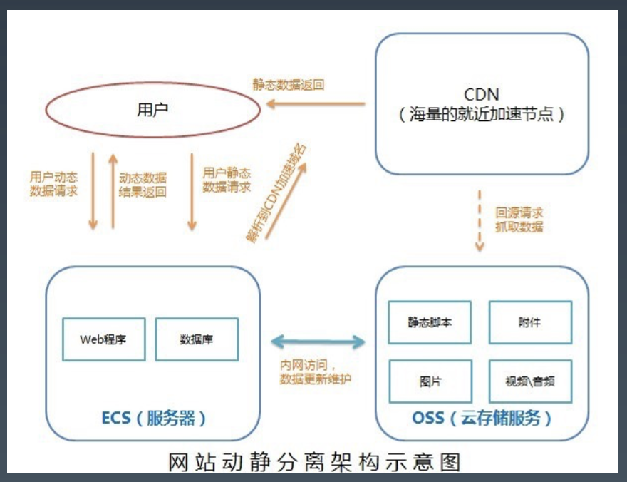
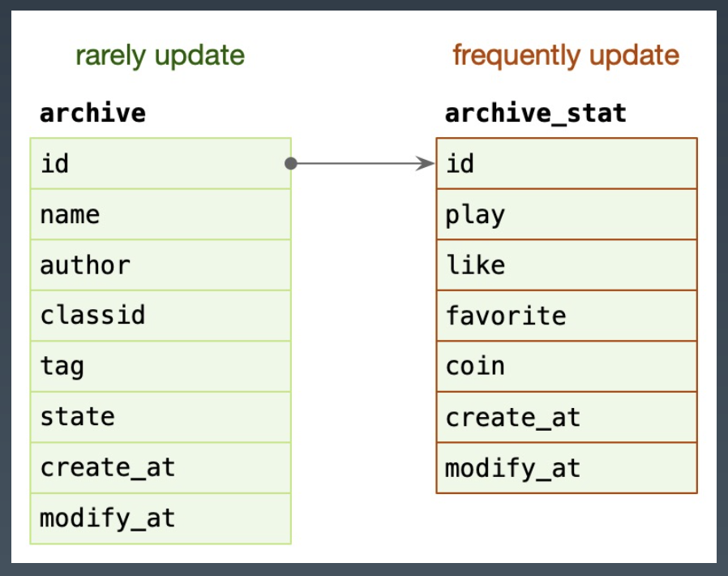
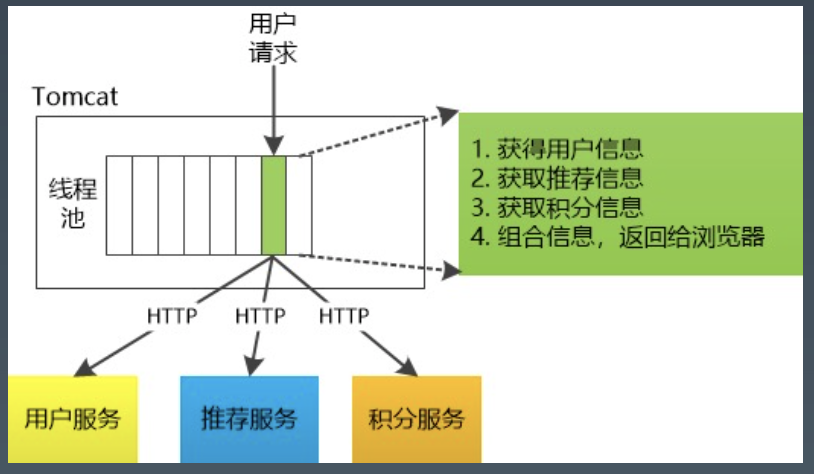
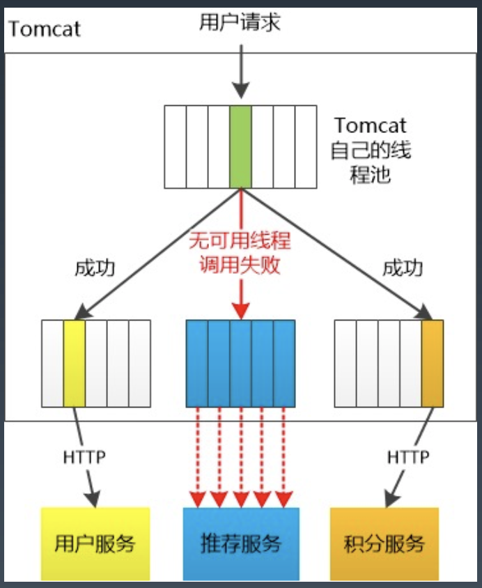

# **微服务可用性设计**

 

# **0. Index**
- **1. 隔离**
    - **1.1. 隔离 - 服务隔离**
    - **1.2. 隔离 - 轻重隔离**
    - **1.3. 隔离 - 物理隔离**
    - **1.4. 隔离 - Case Study**
- **2. 超时控制**
    - **1. 进程间的超时控制**
    - **2. 服务间的超时控制**
    - **3. 超时 - Case Study**

 

# **1. 隔离**
- 隔离，本质上是对系统或资源进行分割，从而实现当`系统发生故障时`能`限定传播范围`和`影响范围`， 即发生故障后`只有出问题的服务不可用`，保证`其他服务仍然可用`。

- `服务隔离`
    
    - 动静分离、读写分离 (cqrs)

- `轻重隔离`
    
    - 核心、快慢、热点 

- `物理隔离`
    
    - 线程、进程、集群、机房 (多活)

 

## **1.1. 隔离 - 服务隔离**
### **1.1.1. 动静隔离**
- 小到 CPU 的 cacheline [false sharing](https://www.cnblogs.com/cyfonly/p/5800758.html) (并发讲过, 两个进程同时操作一个结构体的两个字段, 不会产生 data race，但是容易产生 false sharing，因为两个字段是连续内存，频繁读写的话 cache line 就会失效，一般是两个字段间加一些 padding 空内存，让他们站两个 cache line)

- **数据库 mysql 表设计中避免 `bufferpool` 频繁过期** (评论设计讲过，将表分为 `content` 和 `index`，**是为了 `index` 能够在内存里缓存更多的行**)，隔离动静表

- 大到架构设计中的图片、静态资源等缓存加速

- 本质上都体现的一样的思路，即`加速/缓存`访问`变换频次小`的。比如 CDN 场景中，将静态 资源和动态 API 分离，也是体现了隔离的思路: 

    

> - 写代码不能只关注程序，程序部署在哪里，cdn 是怎么访问到你的程序的，要从全局去看，从**最小的 `dns 解析`，dns 解析时给你一个 `ip` 怎么做智能路由，再去连这个 ip，`tcp 三次握手`，握手之后发送一个 `http 或 grpc 的应用协议`，到`机房的入口`，机房入口怎么把流量到 `lvs`，`4 层负载均衡`，或者怎么到 `7 层负载均衡`，再到 `api gateway`，再到 `bff`，再到`微服务` (尽量有一些`全局视野`)**

> - 比如之前做大数据，数据上报，**中间放一个 `cdn 做动态加速`，开发的同学如果只知道在机房做了一个数据接收 gateway，那能做的所有优化只是这个网关如何优化性能**，优化吞吐，怎么做数据压缩，了解 cdn 的话，既然用户的流量要先到 cdn，那么也可以在 cdn 上布一个节点(agent,小程序，cdn 都支持边缘计算，布一个小程序吃不了多少cpu，cdn 是带宽流量密集不是cpu 密集)，然后通过 agent 发到机房。以前如果是100万用户发请求，那么 qps 就是 100万，用 cdn 的话只是蹭了一下 cdn 的资源布了一个小程序，然后请求先到 cdn, cdn 转发到小程序,批量把数据打包，再往回发。假设 agent 有 100 个，那最终到机房的 qps 就只有 100了。（看图）密集的流量先聚合掉在往回发，源站的 qps 就会大降 (小小的架构调整会带来非常大的收益) (动静隔离)

- **示例**

    - `archive`: 稿件表，存储稿件的名称、作者、分类、tag、状态等信息，表示`稿件的基本信息`。

        - 在一个投稿流程中，一旦稿件创建`改动的频率比较低`。

    - `archive_stat`: 稿件统计表，表示稿件的播放、点 赞、收藏、投币数量，比较`高频的更新`。
        
        - 随着稿件获取流量，稿件被用户所消费，各类`计数信息更新比较频繁`。
        
        - **MySQL `BufferPool` 是用于缓存 `DataPage` 的， DataPage 可以理解为`缓存了表的行`，那么如果`频繁更新 DataPage 不断会置换`，会导致命中率下降的问题**
        
        - **所以我们在表设计中，仍然可以沿用类似的思路，其`主表基本不更新`，在上游 Cache 未命中，透穿到 MySQL，仍然有 `BufferPool 的缓存`**

- `读写分离`：`主从`、Replicaset (`多集群多副本`)、CQRS

    

 

### **1.1.2. 核心隔离**
- 业务按照 Level 进行资源池划分(L0/L1/L2)。
    
    - `核心/非核心`的故障域的差异隔离(机器资源、依赖资源)。
    
    - `多集群`，通过冗余资源来`提升吞吐和容灾能力`。

- **隔离是非常容易实现，并且最容易做到的做法**

    - 若整个业务就在 8 台物理机上，所有的服务都在里面，有一个人写一个死循环，所有人都受影响

    - 后来就用了`容器化`的技术

 

### **1.1.3. 热点隔离**
- 何为热点？
    
    - 热点即经常访问的数据。很多时候我们希望统计某个热点数据中访问频次最高的 `Top K` 数据，并对其访问进行缓存。
    
    - 比如:

        - `小表广播`: 从 `remotecache` 提升为 `localcache`， app 定时更新，甚至可以让运营平台支持广播刷新 localcache。`atomic.Value`

        - `主动预热`: 比如直播房间页`高在线`情况下 bypass 监控主动防御。(**`旁路预热`，kit 统计 `top key` 变成 `local cache`**)

        - 比如`高在线`房间直播现场网线断了，断流就会黑屏，黑屏用户就会猛刷，高频刷新，要`主动防御`

 

### **1.1.4. 线程隔离 (tomcat)**
- 主要通过`线程池`进行隔离，也是实现`服务隔离`的基础。

- 把`业务进行分类`并交给`不同的线程池`进行处理，当某个线程池处理一种业务请求发生问题时，不会讲故障扩散和影响到其他线程池，保证服务可用。

- **对于 Go 来说，所有 `IO` 都是 `Nonblocking`，且托管给了 `Runtime`，只会`阻塞 Goroutine`，`不阻塞 M`，我们只需要考虑 `Goroutine 总量的控制`，不需要`线程模型语言`的`线程隔离`**。

    

    

- java 常出现的一个问题，如果用户服务特别卡，用户会再来一个请求，狂刷，tomcat `线程池会耗尽`，耗尽之后再请求，`没有工作线程`就炸了。

    - 其实大部分事故都是`线程耗尽`导致，导致请求没办法继续处理了

- java 怎么处理：划分`不同的线程池`，用户、推荐、积分，某个池没有线程快速报错 `fail fast`，不会堵住，就有办法做`降级`了，因为`其他业务不影响`

- go 比较爽的一点，所有的`网络请求`，都是 `non blocking` 的，非阻塞，m 其实就是个线程 thread ，只要 `goroutine 总量`不会炸

- java `线程隔离`比较多的就是通过`线程池`来控制，go 只要控制好 `goroutine 总量`不会炸，服务就不会 `oom`, 如何控制 goroutine 总量后面讲
