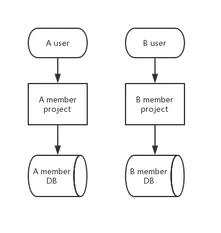
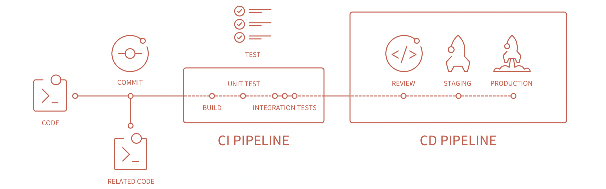
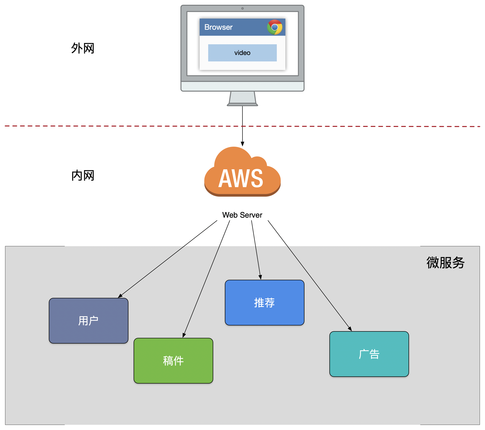
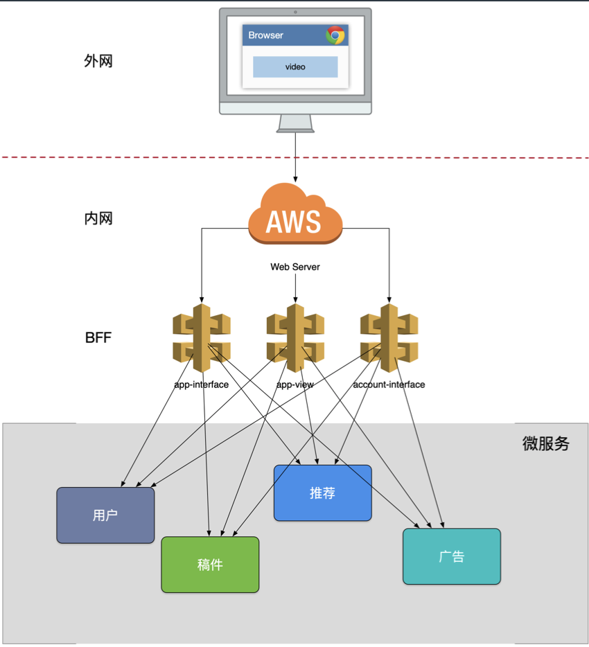

# **微服务概览与治理**

 

# **1. 架构：http + restful api**
- rest，representational state transfer，表现层转化。

- 符合 rest 原则的架构即 restful 架构

 

## **1.1. 资源（Resources）**
- "表现层"其实指的是"资源"（Resources）的"表现层"。
    
    - 所谓"资源"，就是网络上的一个实体，或者说是网络上的一个具体信息。
    
    - 你可以用一个 URI（统一资源定位符）指向它，每种资源对应一个特定的 URI。
    
    - **要获取这个资源，访问它的 URI 就可以，因此 URI 就成了每一个资源的地址或独一无二的识别符**。

 

## **1.2. 表现层（Representation）**
- "资源"是一种信息实体，它可以有多种外在表现形式。**我们把"资源"具体呈现出来的形式，叫做它的"表现层"（Representation）**。

- **它的具体表现形式，应该在 HTTP 请求的头信息中用 `Accept` 和 `Content-Type` 字段指定**，这两个字段才是对"表现层"的描述。

 

## **1.3. 状态转化（State Transfer）**
- 互联网通信协议 HTTP 协议，是一个无状态协议。这意味着，所有的状态都保存在服务器端。

- 因此，**如果客户端想要操作服务器，必须通过某种手段，让服务器端发生"状态转化"（State Transfer）。而这种转化是建立在表现层之上的，所以就是"表现层状态转化"**。

- 客户端用到的手段，只能是 HTTP 协议。具体来说，就是 HTTP 协议里面，四个表示操作方式的动词：GET、POST、PUT、DELETE。它们分别对应四种基本操作：**GET 用来获取资源，POST 用来新建资源（也可以用于更新资源），PUT 用来更新资源，DELETE 用来删除资源**。

 

## **1.4. 综述**
- 综合上面的解释，我们总结一下什么是 RESTful 架构：

    1. **每一个 URI 代表一种资源；**

    2. **客户端和服务器之间，传递这种资源的某种表现层；**

    3. **客户端通过四个 HTTP 动词，对服务器端资源进行操作，实现"表现层状态转化"。**

 

# **2. 微服务概览**
## **2.1. SOA (面向服务的架构模式)**
- 面向服务的架构模式，它和微服务又是什么关系？

    - **你可以把微服务想成是 SOA 的一种实践**。

        1. **小即是美**：小的服务代码少，bug 也少，易测试，易维护，也更容易不断迭代完善。

        2. **单一职责**：一个服务也只需要做好一件事，专注才能做好。

        3. **尽可能早地创建原型**：尽可能早的提供服务 API，建立服务契约，达成服务间沟通的一致性约定，至于实现和完善可以慢慢再做。

        4. **可移植性比效率更重要**：服务间的轻量级交互协议在效率和可移植性二者间，首要依然考虑兼容性和移植性。

 

## **2.3. 微服务定义**
- 围绕业务功能构建的，服务关注单一业务，**服务间采用轻量级 (跨语言、跨平台，protobuf Thrift，Avro)的通信机制**，可以全自动独立部署，可以使用不同的编程语言和数据存储技术。

- 微服务架构通过业务拆分实现服务组件化，通过组件组合快速开发系统，业务单一的服务组件又可以独立部署，使得整个系统变得清晰灵活.

- **优点：**

    - **原子服务**

    - **独立进程**

    - **隔离部署**

    - **去中心化服务治理**

 

- **缺点：**

    - **基础设施的建设、复杂度高**

 

- 旧版架构：服务部署在虚拟机上，一人一个独立的 ip

- 新版架构：容器化、独立进程、隔离部署、k8s

 

## **2.4. 微服务不足**
1. **分布式系统的固有复杂性**
    
    - 不得不使用 rpc 或消息传递实现进程间通信。

    - 必须写代码去处理消息传递中速度过慢或服务不可用等局部失效问题。

2. **数据库分区**

    - 同时更新多个业务主体的事务，需要通过一些手段保证原子性。

3. **测试一个基于微服务架构的应用也是很复杂的任务**

4. 由于服务模块间的依赖，**应用的升级**有可能会波及多个服务模块的修改。

5. 对**运维基础设施**的挑战比较大。(例如日志收集) (解决基建：小企业上云)

 

## **2.5. 组件服务化**
- **库的局部变化意味着整个应用的重新部署**

- 通过服务来实现组件，**意味着将应用拆散为一系列的服务运行在不同的进程中**，那么单一服务的局部变化只需重新部署对应的服务进程。

- **比如用 Go 实施一个微服务由以下组成**:

    1. **kit：一个微服务的基础库(框架)。**

    2. **service：业务代码+kit依赖+第三方依赖组成的业务微服务**

    3. **rpc + message queue：轻量级通讯**

- **多个微服务类似于 ddd 的多个 `domain` 域，多个服务在上层组装成 `usecase`**

 

## **2.6. “烟囱式”的架构**
- 每个业务线之间由不同的开发团队独立建设，技术栈不同，互不联系。大多数的架构会通过虚拟机或容器部署。

    

- **烟囱式架构的弊端：**

    - **重复开发**。每个业务线中同样的模块会重复开发。比如业务线 a 要有一个下单购买模块，业务线 b 也要有一个下单购买模块。

    - **技术栈不统一**。技术力无法积累。

    - **数据分布广而且格式不统一**。有 mysql 有 tidb。

 

## **2.7. 微服务需要按业务组织服务**
- **按业务能力组织服务的意思是服务提供的`能力`和`业务功能`对应**

- 比如：订单服务和数据访问服务
    
    - 前者反应了真实的订单相关业务，后者是一种技术抽象服务不反应真实的业务。
    
    - 所以按微服务架构理念来划分服务时，是不应该存在数据访问服务这样一个服务的。

- 我们的模式：**大前端(移动/Web) -> 网关接入 -> 业务服务 -> 平台服务 -> 基础设施 (PaaS/Saas)** ???

 

## **2.8. 去中心化**

1. **数据去中心化**

2. **治理去中心化**

3. **技术去中心化**

- *每个服务独享自身的数据存储设施(缓存，数据库等)，不像传统应用共享一个缓存和数据库，这样有利于服务的独立性，隔离相关干扰。*

 

## **2.9. 基础设施自动化**
- **无自动化不微服务，自动化包括测试和部署**

- **单一进程的传统应用被拆分为一系列的多进程服务后，意味着开发、调试、测试、监控和部署的复杂度都会相应增大**

- 必须要有合适的自动化基础设施来支持微服务架构模式，否则开发、运维成本将大大增加。

    - **CICD**：Gitlab + GitlabHooks+k8s

    - **Testing**：测试环境、单元测试、API 自动化测试
    
    - **在线运行时**：k8s，以及一系列 Prometheus、ELK、ConrtolPanle

    

 

## **2.10. 可用性 & 兼容性设计**
- Design For Failure 思想

- 微服务架构采用粗粒度的进程间通信，**引入了额外的复杂性和需要处理的新问题**，如网络延迟、消息格式、负载均衡和容错

    - 隔离
    
    - 超时控制 
    
    - 负载保护 
    
    - 限流
    
    - 降级
    
    - 重试
    
    - 负载均衡

- **发送时要保守，接收时要开放**，按照`伯斯塔尔法则 (Robustness principle、Postel's law)` 的思想来设计和实现服务时：
    
    - **发送的数据要更保守，意味着`最小化`的传送`必要的信息`**
    
    - **接收时更开放意味着要最大限度的`容忍冗余数`据，保证`兼容性`。**

 

# **3. 微服务设计**
## **3.1. API Gateway**
- **SOA 服务化的架构演进**
    1. 按照**垂直功能**进行了拆分，对外暴露了一批微服务，但是因为缺乏统一的出口面临了不少困难：

        - 客户端到微服务直接通信，强耦合。

        - 需要多次请求，客户端聚合数据（**客户端自己拼数据**），工作量巨大，延迟高。

        - 协议不利于统一，各个部门间有差异，需要端来兼容。

        - 面向“端”的 API 适配，耦合到了内部服务。（内部服务要去适配客户端）

        - 多终端兼容逻辑复杂，每个服务都需要处理。（每个内部服务都需要适配**客户端的各个版本**）

        - 统一逻辑无法收敛，比如安全认证、限流。(与业务无关的**跨横截面逻辑**各个内部服务重复去实现)

            

     

    2. 新增了一个 `app-interface` 用于统一的协议出口，**在服务内进行大量的 dataset join (拼数据)，按照业务场景来设计粗粒度的 API**，有利于后续服务的演进。

        - 注：**一定设计要面向用户业务场景的 api**

        - **backend for frontend**：**BFF** 可以认为是一种适配服务，**将后端的微服务进行适配(主要包括聚合裁剪和格式适配等逻辑)，向无线端设备暴露友好和统一的 API**，方便无线设备接入访问后端服务。

            - **bff 就是数据组装和编排**。例如打开视频：(视频、up 主信息、稿件信息等) 组装

        - 问题：
            
            - 整个 app-interface 属于 single point of failure，严重代码缺陷或者流量洪峰可能引发集群宕机。

            - 单块的无线 BFF 和多团队之间就出现不匹配问题，团队之间沟通协调成本高，交付效率低下

            - 不仅包含了业务逻辑，**也包含了很多跨横切面逻辑，比如安全认证，日志监控，限流熔断等**。随着时间的推移，代码变得越来越复杂，技术债越堆越多。

                

     

    3. **把`面向横向切面的逻辑`都放到一个`无状态无业务逻辑`的模块中**。

        - 整个架构分层，**越上面离业务越远，越下面越原子**

        - 跨横切面 (Cross-Cutting Concerns) 的功能，需要协调更新框架升级发版 (路由、认证、限流、安全)，因此全部上沉，引入了 `API Gateway`，**把业务集成度高的 `BFF` 层和通用功能服务层 `API Gateway` 进行了分层处理**。

        - 把跨横切面逻辑从 BFF 剥离到网关上去以后，**BFF 的开发人员可以更加专注业务逻辑交付**，实现了架构上的**关注分离** (Separation of Concerns)。

        - 业务流量实际为：

            - 移动端 -> API Gateway -> BFF -> Mircoservice，在 FE Web 业务中，**BFF 可以是 nodejs 来做服务端渲染 (SSR，Server-Side Rendering)**，注意这里忽略了**上游的 CDN、4/7 层负载均衡 (ELB)**。

 

## **3.2. Mircoservice 划分**
- **微服务架构时遇到的第一个问题就是如何划分服务的边界**。

- 在实际项目中通常会采用两种不同的方式划分服务边界
    
    1. **通过业务职能 (Business Capability) 划分**

        - 由公司内部不同部门提供的职能。**例如客户服务部门提供客户服务的职能，财务部门提供财务相关的职能**。
    
    2. **DDD 的限界上下文(Bounded Context) 划分**

        - 限界上下文是 DDD 中用来划分不同业务边界的元素
        
        - 这里业务边界的含义是“解决不同业务问题”的问题域和对应的解决方案域，为了解决某种类型的业务问题

        - **一个场景能闭环的解决客户的一个问题，那就是一个微服务**

- CQRS (Command and Query Responsibility Segregation)

    - 将应用程序分为两部分：命令端和查询端。
        
        - **命令端处理程序创建，更新和删除请求，并在数据更改时发出事件**。
        
        - **查询端通过针对一个或多个物化视图执行查询来处理查询**，这些物化视图通过**订阅数据更改时发出的事件流**而保持最新。

        - **保证最终一致性**

    - 在稿件服务演进过程中，我们发现围绕着创作稿件、审核稿件、最终发布稿件有大量的逻辑揉在一块，其中**稿件本身的状态也有非常多种**，但是最终前台用户只关注稿件能否查看
    
    - **我们依赖稿件数据库 binlog 以及订阅 binlog 的中间件 canal，将我们的稿件结果发布到消息队列 kafka 中** 

        - **binlog 读写分离的一种思路，将原复杂的表数据，清洗到新的表**
    
    - **最终消费数据独立组建一个稿件查阅结果数据库，并对外提供一个独立查询服务**，来拆分复杂架构和业务。
    
    - 我们架构也从 `Polling publisher` -> `Transaction log tailing` 进行了演进 (**Pull vs Push**)。

 

## **3.3. Mircoservice 安全**
- 对于外网的请求来说，我们通常在 API Gateway 进行统一的认证拦截，一旦认证成功，**我们会使用 JWT 方式通过 RPC 元数据传递的方式带到 BFF 层**

- **BFF 校验 Token 完整性后把身份信息注入到应用的 Context 中**

- BFF 到其他下层的微服务，建议是**直接在 RPC Request 中带入用户身份信息 (UserID) 请求服务**。

 

## **3.4. gRPC & 服务发现**
- gRPC

    - 多语言：语言中立，支持多种语言。
        
    - 轻量级、高性能：序列化支持 PB (Protocol Buffer) 和 JSON，**PB 是一种语言无关的高性能序列化框架**。

    - IDL：**protobuf 代码 (idl) 即文档**, 通过定义可以生成调用代码: **基于文件定义服务，通过 proto3 工具生成指定语言的数据结构、服务端接口以及客户端 Stub**。

    - **服务而非对象 service 、消息 message 而非引用**

 

- http 1.1 缺陷：发一个 request 等 response，这个连接就是废掉的 (单向请求等 response)
    
    - 解决：http2 双向流，单 TCP 的多路复用