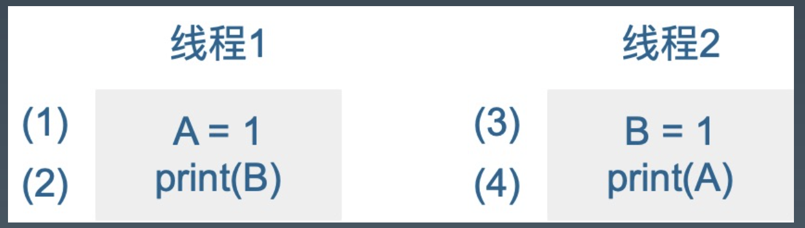
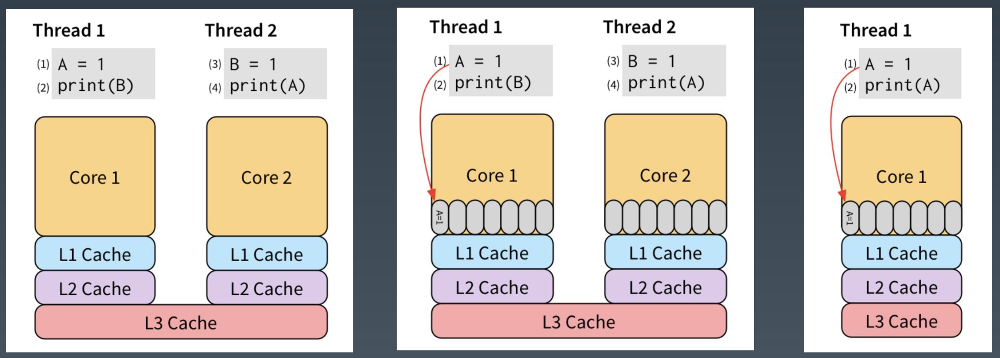

# **并行编程1**

- **go `最好用的关键字`：chan 和 go，go `原生支持并行语义`**

- **先用对再看 runtime 怎么实现的**

<br>

# **0. Index**
- **1. Goroutine**
    - **1.1. Processes and Threads (进程与线程)**
    - **1.2. Goroutines and Parallelism**
    - **1.3. Keep yourself busy or do the work yourself**
    - **1.4. Leave concurrency to the caller 并发逻辑留给调用者**
    - **1.5. Never start a goroutine without knowing when it will stop**
    - **1.6. Incomplete Work**
- **2. memory model**
    - **2.1. Memory Reordering (内存重排)**
- **3. Package sync**
    - **3.1. Share Memory By Communicating**
    - **3.2. Detecting Race Conditions With Go**

<br>

# **1. Goroutine**
## **1.1. Processes and Threads (进程与线程)**
- **操作系统会为该`应用程序`创建一个`进程`**。作为一个应用程序，它像一个为`所有资源`而运行的`容器`。**这些资源包括`内存地址空间`、`文件句柄`、`设备`和`线程`**。

- **`线程`是操作系统调度的一种执行路径，用于在处理器执行我们在`函数中编写的代码`**。
    
    - **`一个进程从一个线程开始`，即`主线程`，当该线程终止时，进程终止**。这是因为`主线程`是`应用程序的原点`。

    - 然后，**`主线程`可以依次`启动更多的线程`，而这些线程可以启动更多的线程**。

    - **无论`线程`属于哪个`进程`，操作系统都会安排线程在`可用处理器`上运行**。每个操作系统都有自己的算法来做出这些决定。

<br>

## **1.2. Goroutines and Parallelism**
- Go `语言层面`支持的 go 关键字，可以快速的让一个函数创建为 goroutine，**我们可以认为 main 函数就是作为 `goroutine` 执行的**。

- **`操作系统`调度`线程`在`可用处理器`上运行，Go 运行时调度 `goroutines` 在绑定到`单个操作系统线程`的`逻辑处理器`中运行 (P)**。

- ***Concurrency is not Parallelism，并发不是并行***

    - **并发是指两个或多个线程`同时`在不同的处理器执行代码**。

    - **如果将运行时配置为使用`多个逻辑处理器`，则调度程序将在这些逻辑处理器之间分配 goroutine，这将导致 goroutine 在`不同的操作系统线程`上运行**。
    
    - 但是，要获得真正的并发性，**您需要在具有多个`物理处理器`的计算机上运行程序。否则，goroutines 将针对`单个物理处理器并行运行`，即使 Go 运行时使用多个逻辑处理器**。

<br>

## **1.3. Keep yourself busy or do the work yourself**
- **如果你的 goroutine 在从另一个 goroutine 获得结果之前无法取得进展**，那么通常情况下，你自己去做这项工作比委托它 (go func()) 更简单。

- **这通常消除了将结果从 goroutine 返回到其启动器所需的大量状态跟踪和 chan 操作**。

- 错误示例

    ```go
    // 不推荐
    func main() {
        http.HandleFunc("/", func(w http.ResponseWriter, r *http.Request) {
            fmt.Fprintln(w, "hello")
        })

        // main func 无法感知这个 goroutine 什么时候退出
        go func() {
            if err := http.ListenAndServe(":8080", nil); err != nil {
                // 所以加了个 fatal，log.Fatal 内部调用 os.exit 会导致 defer 不能执行
                log.Fatal(err)
            }
        }()

        select{}
    }
    ```

- ***Any time you start a Goroutine you must ask yourself:***
    
    - When will it terminate? **何时结束**
    
    - What could prevent it from terminating? **如何结束**

- ***never start a goroutine without knowing when it will stop***

    ```go
    func main() {
        mux := http.NewServeMux()
        mux.HandleFunc("/", func(resp http.ResponseWriter, req *http.Request) {
            fmt.Fprintln(resp, "Hello")
        })

        // 后台执行
        go http.ListenAndServe("127.0.0.1:8001", http.DefaultServeMux) // go tool debug pprof, 退出了感知不到
        http.ListenAndServe("0.0.0.0:8000") // app traffic
    }
    ```

- 期望监听性能调优和应用程序有任何一个挂了程序都退出，怎么改

    ```go
    func serveApp() {
        mux := http.NewServeMux()
        mux.HandleFunc("/", func(resp http.ResponseWriter, req *http.Request) {
            fmt.Fprintln(resp, "hello")
        })
        if err := http.ListenAndServe("0.0.0.0:8000", mux); err != nil {
            log.Fatal(err)
        }
    }

    func serveDebug() {
        if err := http.ListenAndServe("127.0.0.1:8001", http.DefaultServeMux); err != nil {
            log.Fatal(err)
        }
    }

    func main() {
        go serveDebug()
        go serveApp()
        select {}
    }
    ```

- **不推荐**

    - **`log.Fatal` 调用了 `os.Exit`，会无条件终止程序；`defers` 不会被调用到**。
    
    - **Only use `log.Fatal` from `main.main` or `init functions`. 有点像 panic**

- **注意**

    - 自己做 busy work, **不应该在内部启用 goroutine, 应该由调用者决定是不是要起 goroutine**。

    - goroutine 生命周期一定是自己管理

- **参考答案**

    ```go
    func serve(addr string, handler http.Handler, stop <- chan struct{}) error {
        s := http.Server{
            Addr: addr,
            Handler: handler,
        }

        go func() {
            <-stop // wait for stop signal
            s.Shutdown(context.Background) // shutdown 即使正在监听可以使应用平滑退出 ListenAndServe 对标的操作 Shutdown
        }()

        return s.ListenAndServe() // 若失败会报错
    }

    func main() {
        done := make(chan error, 2) // 两个应用，接收 err
        stop := make(chan struct{}) // 0 值 channel

        go func() {
            done <- serveDebug(stop)
        }()

        go func() {
            done <- serveApp(stop)
        }()

        var stopped bool 
        // 接收 err
        for i := 0; i < cap(done); i++ {
            if err := <-done; err != nil {
                fmt.Println("err:", err)
            }

            // for 循环 2 次等待两个 app 都退出
            if !stopped {
                stopped = true
                close(stop) // 唤醒后台两个 goroutine
            }
        }
    }
    ```

    - 参考：https://github.com/da440dil/go-workgroup

<br>

## **1.4. Leave concurrency to the caller 并发逻辑留给调用者**
- 两个 api 什么区别

    ```go
    // 假设目录很大
    func ListDirectory(dir string) ([]string, error)

    func ListDirectory(dir string) chan string
    ```

    - **1**

        - 将目录读取到一个 slice 中，然后返回整个切片，或者如果出现错误，则返回错误。
        
        - 这是同步调用的，ListDirectory 的调用方会阻塞，直到读取所有目录条目。
        
        - **根据目录的大小，这可能需要很长时间，并且可能会分配大量内存来构建目录条目名称的 slice**。

    - **2**

        - ListDirectory 返回一个 chan string，将通过该 chan 传递目录。

        - **当通道关闭时，这表示不再有目录**。

        - **调用方无法区分空目录与完全从目录读取的错误之间的区别**。这两种情况都会导致**从 ListDirectory 返回的通道会立即关闭**。

        - **调用者必须继续从通道读取，直到它关闭**，因为这是调用者知道开始填充通道的goroutine已经停止的唯一方法

        - **channel 中的数据不消费完对方肯定会堵住，只有数据全部读完之后那个 goroutine 才会安全退出**, 除非 buffer 无限大。必需读完。

- **建议做法：标准库 `filepath.WalkDir `的做法**

    ```go
    func listDirectory(dir string, fn func(string))
    ```

    ```go
    // example
    // 可以通过判断 callback 函数是否返回 err 来决定是否继续执行
    err = filepath.Walk(".", func(path string, info fs.FileInfo, err error) error {
        if err != nil { // 解析目录中途报错
            fmt.Printf("prevent panic by handling failure accessing a path %q: %v\n", path, err)
            return err
        }
        if info.IsDir() && info.Name() == subDirToSkip { // 自定义业务逻辑错误
            fmt.Printf("skipping a dir without errors: %+v \n", info.Name())
            return filepath.SkipDir
        }
        fmt.Printf("visited file or dir: %q\n", path)
        return nil
    })
    if err != nil {
        fmt.Printf("error walking the path %q: %v\n", tmpDir, err)
        return
    }
    ```

- 如果函数启动 goroutine，**则必须向调用方提供显式停止该 goroutine 的方法**。通常，将异步执行函数的决定权交给该函数的调用方通常更容易。

- **标准库很多设计理念不错的要看**

<br>

## **1.5. Never start a goroutine without knowing when it will stop**
```go
// example 01 泄漏示例
func leak() {
    ch := make(chan int)

    go func() {
        val := <-ch
        fmt.Println("val:", val)
    }
}
```

```go
// example 02 模拟长时间操作
func search(term string) (string, error) {
    time.Sleep(200 * time.Millisecond)
    return "value", nil
}

// 问题：不知道 search 多长时间返回，这个 goroutine 可能阻塞、堆积
func process(term string) error {
    record, err := search(term)
    if err != nil {
        return err
    }

    fmt.Println("received:", record)
    return nil
}
```

- **一定要做代码的超时控制**

    - **如何用 context 控制超时？**

<br>

## **1.6. Incomplete Work**
- 服务端埋点代码

    ```go
    // 使用服务端埋点来追踪一些事情
    // tracker knows how to track events for the app
    type Tracker struct{}

    // Event records an event to a database or system
    func(t *Tracker) Event(data string) {
        time.Sleep(time.Millisecond) // 模拟网络延时
        log.Println(data)
    }

    type App struct {
        tracker Tracker
    }

    func (a *App) Handle(w http.ResponseWriter, req *http.Request) {
        // do some actual work

        // response to the client
        w.WriterHeader(http.StatusCreated)

        // BUG: not managing this goroutine 无法保证创建的 goroutine 生命周期, 服务关闭时会丢失
        go a.tracker.Event("this event")
    }
    ```

- 使用 sync.WaitGroup 追踪每个 goroutine

    ```go
    func (t *Tracker) Event(data string) {
        t.wg.Add(1)

        // 注意：不建议在高频 http 服务中去大量创建 goroutine，因为成本较高
        go func() {
            defer t.wg.Done()

            // do something
        }()
    }

    func (t *Tracker) Shutdown() {
        t.wg.Wait()
    }

    func main() {
        var a App

        // 等待所有 goroutine 结束
        a.track.Shutdown()
    }
    
- 改进版

    ```go
    const timeout = 5 * time.Second
    ctx, cancel := context.WithTimeout(context.Background(), timeout)
    defer cancel()

    err := a.track.Shutdown(ctx)

    func (t *Tracker) Shutdown(ctx context.Context) error {
        ch := make(chan struct{})

        // 问题：大量创建 goroutine 代价高
        go func() {
            t.wg.wait()
            close(ch)
        }

        select {
        case <-ch:
            return nil
        case <-ctx.Done():
            return ErrTimeout
        }
    }
    ```

- 改进版 2

    ```go
    func main() {
        tr := NewTracker()
        go tr.Run() // 把并行交给调用者
        _ = tr.Event(context.Background(), "test") // 发消息
        _ = tr.Event(context.Background(), "test") // 发消息
        _ = tr.Event(context.Background(), "test") // 发消息

        ctx, cancel := context.WithDeadline(context.Background(), time.Now().Add(2 * time.Second))
        defer cancel()

        tr.Shutdown(ctx) // 通过 context 控制 shutdown 什么时候退出
    }

    func NewTracker() *Tracker {
        return &Tracker{
            ch: make(chan string, 10)
        }
    }

    type Tracker struct {
        ch chan string
        stop chan struct{}
    }

    // ctx 管控生命周期
    func (t *Tracker) Event(ctx context.Context, data string) error {
        select {
        case t.ch <- data: // ch 暂存 10 个消息, 满了也可以报错 或者丢掉
            return nil
        case <-ctx.Done():
            return ctx.Err()
        }
    }

    // 消费消息
    // 如何控制退出：把 ch close
    func (t *Tracker) Run() {
        for data := range t.ch {
            time.Sleep(1 * time.Second)
            fmt.Println(data)
        }
        t.stop <- struct{}{} // 退出时向 close 发信号
    }

    func (t *Tracker) Shutdown(ctx context.Context) {
        close(t.ch)
        select {
        case <- t.stop: // 说明 run 正常退出了
        case <- ctx.Done(): // 又可以通过 context 控制超时
        }
    }
    ```

- 三个关键字用好 go

    1. **chan 什么时候退出 (管控生命周期)**

    2. **能控制 chan 退出 (context, channel)**

    3. **把并行 (concurrency) 交给调用者**

- **优雅关闭其实就是关了 chan 不能写了但是还能读 (effective go 都讲过)**

<br>

# **2. memory model**
- 读 https://golang.org/ref/mem

- 如何保证在一个 goroutine 中看到在另一个 goroutine 修改的变量的值，如果程序中修改数据时 有其他 goroutine 同时读取，**那么必须将读取串行化**。**为了串行化访问，请使用 channel 或其他同步原语，例如 `sync` 和 `sync/atomic` 来保护数据**。

- 在一个 goroutine 中，读和写一定是按照程序中的顺序执行的。**即编译器和处理器只有在不会改变这个 goroutine 的行为时才可能修改读和写的执行顺序**。

- 由于重排，不同的 goroutine 可能会看到不同的执行顺序。例如，一个goroutine 执行 a = 1;b = 2;，另一个 goroutine 可能看到 b 在 a 之前更新。

    

## **2.1. Memory Reordering (内存重排)**
    
- 其中，**为了提高读写内存的效率，会对读写指令 进行重新排列**，这就是所谓的内存重排，英文为 MemoryReordering。

- 这一部分说的是 CPU 重排，其实还有编译器重排。比如:

    ```go
    // 1
    x = 0
    for i in range (100):
        x = 1
        print x

    // 2 编译器优化时进行分支预测处理后：
    x = 1
    for i in range (100):
        print x
    ```

- 现代 CPU 为了“抚平” 内核、内存、硬盘之间的速度差异，搞出了各种策略，例如三级缓存等。**为了让 (2) 不必等待 (1) 的执行“效果”可见之后才能执行，我们可以把 (1) 的效 果保存到 store buffer**:

    ```
    cpu
    速度：
    core1 > l1 > l2 > l3

    容量：
    core1 < l1 < l2 < l3
    ```

    

- store buffer 对单线程是完美的

- 先执行 (1) 和 (3)，将他们直接写入 store buffer

- 看了 下 store buffer，并没有发现有 B 的值，于是从 Memory 读出了 0，(4) 同样从 Memory 读出了 0。最后，打印出了 00

- 因此，对于多线程的程序，所有的 CPU 都会提供“锁”支持，称之为 barrier (内存屏障)，或者 fence。
    
    - 它要求: **barrier 指令要求所有对内存的操作都必须要“扩散”到 memory 之后才能继续执行其他对 memory 的操作**。
    
    - 因此，我们可以用高级点的 atomic compare-and-swap，或者直接用更高级的锁，通常是标准库提供 (**基本上都是基于内存屏障实现的**)。

- 为了说明读和写的必要条件，我们定义了`先行发生 (Happens Before)`。如果事件 e1 发 生在 e2 前，我们可以说 e2 发生在 e1 后。**如果 `e1 不发生在 e2 前`也`不发生在 e2 后`，我们就说 e1 和 e2 是`并行`的**。

- **在单一的独立的 goroutine 中先行发生的顺序即是程序中表达的顺序。** (即便如何重排，不会出现逻辑错误)

- 当下面条件满足时，**对变量 v 的`读操作 r` 是被允许看到对 v 的`写操作 w`** 的: 

    1. r 不**先行发生**于 w

    2. **在 w 后 r 前没有对 v 的其他写操作**

- 为了保证对**变量 v 的`读操作 r` 看到对 v 的`写操作 w`，要确保 w 是 r 允许看到的`唯一写`操作**。即当下面条件满足时，r 被保证看到 w:

    1. w **先行发生**于 r

    2. **其他对共享变量 v 的`写操作`要么`在 w 前`，要么`在 r 后`**

- 读 https://www.jianshu.com/p/5e44168f47a3 (要看 - 内存模型)

- 当多个 goroutine 访问`共享变量 v` 时，它们必须使用**同步事件**来**建立`先行发生`这一条件来保证`读操作`能看到需要的`写操作`**。

    - **对变量 v 的`零值初始化`在内存模型中表现的与写操作相同。**

    - **对大于`single machine word`的变量的`读写操作` (非原子) 表现的像以`不确定顺序`对多个 `single machine word` 的变量的操作**。

- ***一个 `64 位 cpu` 可以`原子`的操作一个 `8bytes` (`single machine word`)***
    
    - **即比如`赋值`时可以原子的一次赋值 `8 个字节`**，(类似硬盘的原子写入，比如有些硬盘可以一次`原子写入 64k 数据`)

        ```go
        // goroutine 1
        a := new(A) // 8bytes 这两个赋值操作是原子的
        a = new(A)

        // goroutine 2
        go func() {
            fmt.Println(a) // safe data race, 是 atomic, go build -race
        }
        ```
    
    - go slice `sliceheader` (不是 8bytes (single machine word))，go map (是 8bytes)

        ```go
        type SliceHeader struct {
            Data uintptr
            Len  int
            Cap  int
        }
        ```

    - 但是万一 runtime 改了 8bytes 的逻辑就会有问题

- ***`single machine word` 即多大的内存是可以`原子赋值`的***

    - **一个指针赋值是否可能读一半？** `x86` 的机器有可能，**single machine word 是 `4bytes`, 如果操作一个 `double 8bytes` 要两次非原子**

    - **go memory model 要去读，知道什么是`原子赋值`**

- **io 操作也是有原子性的**

- **有兴趣看** 
    
    - mysql double buffer write 两次写

    - nginx memeory barrier 
    
    - nginx 时间缓存

    - cpu 不能通过锁总线来实现一致性(stw)

    - **go 其实只需要知道如何通过 `sync`, `sync.atomic`, `chan` 建立一个 `happens before` 条件就可以了**

    - nginx 源码不建议系统去看

    - cch123 reference

<br>

# **3. Package sync**
## **3.1. Share Memory By Communicating**
- **共享内存通过`通讯`来解决，而不是通过底层的`锁`**

- **传统的语言`通过锁来使用共享内存`**

    - 传统的线程模型 (通常在编写 Java、C++ 和 Python 程序时使用) 程序员在**线程之间通信需要使用共享内存**。
    
    - 通常，**共享数据结构`由锁保护`，线程将`争用这些锁`来访问数据**。在某些情况下，**通过使用线程安全的数据结构** (如 Python 的 Queue)，这会变得更容易。

- ***Do not communicate by sharing memory; instead, share memory by communicating***

- **用传统的锁怎么处理**

    ```go
    // 用传统的锁怎么处理
    type Resource struct {
        url string
        polling bool // 是否正在被使用
        lastPolled int64
    }

    type Resources struct {
        data []*Resource
        lock *sync.Mutex
    }

    func Poller(res *Resource) {
        for {
            // get the least recently-polled resource
            // and mark it as being poller
            res.lock.Lock()
            var r *Resource
            for _, v := range res.data {
                // 被使用的跳过
                if v.polling {
                    continue
                }
                if r == nil || v.lastPolled < r.lastPolled { // 获取最近的资源, 刚被扫描的不扫
                    r = v
                }
            }
            if r != nil {
                r.polling = true
            }
            res.lock.Unlock()
            if r == nil {
                continue
            }

            // poll the url

            // update the resource's polling and lastPolled
            res.lock.Lock()
            r.polling = false
            r.lastPolled = time.Nanosecond()
            res.lock.Unlock()
        }
    }
    ```

- **用 channel 怎么处理**

    ```go
    // 用 channel 怎么处理
    type Resource string
    func Poller(in, out chan *Resource) {
        for r := range in {
            // polling the url

            // send the processed resource to out 处理完的扔进去
            out <- r
        }
    }
    ```

<br>

## **3.2. Detecting Race Conditions With Go**
- **`data race` 是两个或多个 goroutine 访问`同一个资源` (如变量或数据结构)，并尝试对该资源进行`读写`而不考虑其他 goroutine。**

- **这种类型的代码可以创建您见过的最疯狂和最随机的 bug**。通常需要大量的日志记录和运气才能找到这些类型的 bug。

- 工具：

    ```bash
    go build -race # 不建议到线上
    go test -race
    ```

- 示例：

    ```go
    var Wait sync.WaitGroup // 记录开了多少 goroutine
    var Counter int = 0

    func main() {
        for routine := 1; routine <= 2 ; routine ++ {
            Wait.Add(1)
            go Routine(routine)
        }

        Wait.Wait()
        fmt.Printf("Final Counter: %d\n", Counter)
    }

    func Routine(id int) {
        for count :=0 ; count <2; count++ {
            value := Counter
            time.Sleep(1 * time.Nanosecond) // 延长代码执行时间
            // race 的主要原因：这里不是原子
            // time.sleep 刚好触发了 goroutine(G) 的切换
            value ++ // 底层其实不是原子的，3条指令，可以 go tool compile -S XXX.go 查看汇编语言
            Counter = value
        }
        Wait.Done()
    }
    ```

- **这里应该使用同步语义：`mutex` `atomic`**

- 我们第一感觉是 `single machine word` 应该是原子赋值，为啥 `-race` 会乱报。我们执行这个代码看看会发生什么。

    ```go
    type IceCreamMaker interface {
        // Hello greets a customer
        Hello()
    }

    type Ben struct {
        id int
        name string
    }

    func (b *Ben) Hello() {
        fmt.Printf("Ben says, Hello my name is: %s\n", b.name)
    }

    type Jerry struct {
        name string
    }

    func (j *Jerry) Hello() {
        fmt.Printf("Jerry says, Hello my name is: %s\n", j.name)
    }

    // 注意：有时候报 race 有时候不报
    func main() {
        var ben = &Ben{id: 10, name: "Ben"}
        var jerry = &Jerry{name: "Jerry"}
        var maker IceCreamMaker = ben

        var loop0, loop1 func()
        loop0 = func() { // 互相调用，模拟无限调用
            maker = ben
            go loop1()
        }

        loop1 = func() {
            maker = jerry
            go loop0()
        }

        go loop0()

        for {
            maker.Hello()
        }
    }
    ```

- **用 map 或一个指针去做原子替换时，可能会觉得比较安全，但是有可能踩坑**

- **比如 `interface` 内部可能是两个字段**

    ```go
    // 一个指向类型一个指向原始数据
    type interface struct {
        Type uintptr // -----> type *Jerry struct
        Data uintptr // -----> var jerry *Jerry 具体的值
    }
    ```

- **不要假设它是 `single machine word`**

- 在这个例子中，Ben 和 Jerry 内存结构布局是相同的，因此它们在某种意义上是兼容的。
    
    - **想象一下，如果他们有不同的内存布局会发生什么混乱?**
        
        - ben 不加 id 不大可能 race，但是加了 id 就比较可能 race

        - **一次赋值非 single machine word，可能分为多次 single machine word 的赋值**

- **如果是一个普通的指针、map、slice 可以安全的更新吗?**

    - **建议：没有安全的 data race(safe data race)**。**您的程序要么完全没有 data race，要么其操作未定义 (undefined behavior，到底发生什么是不确定的)**。
    
    - **data race 存在两个问题 (不满足以下两个)：**
        
        - **原子性** 

        - **可见性**

    - 注意：**赋值对于 for 循环里的有可能是永远不可见**，因为不满足可见性，看运气，不一定。

    - **即便熟悉 `runtime` 也不要尝试去挑战 data race**