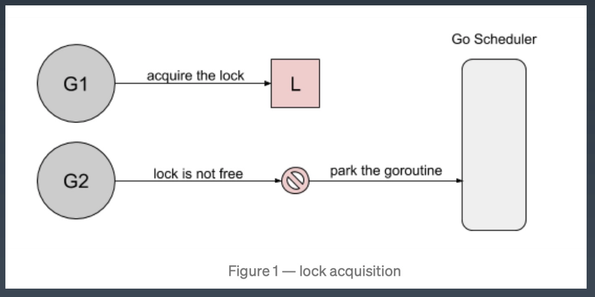
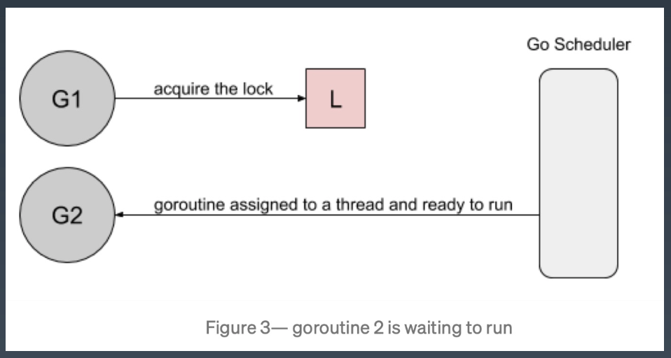
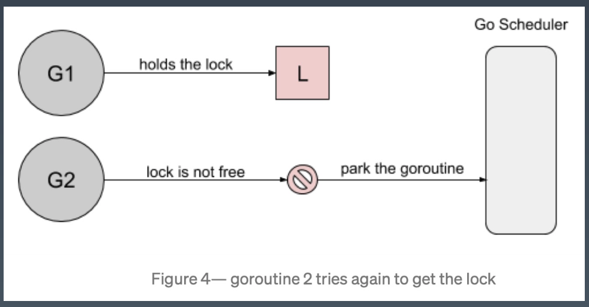
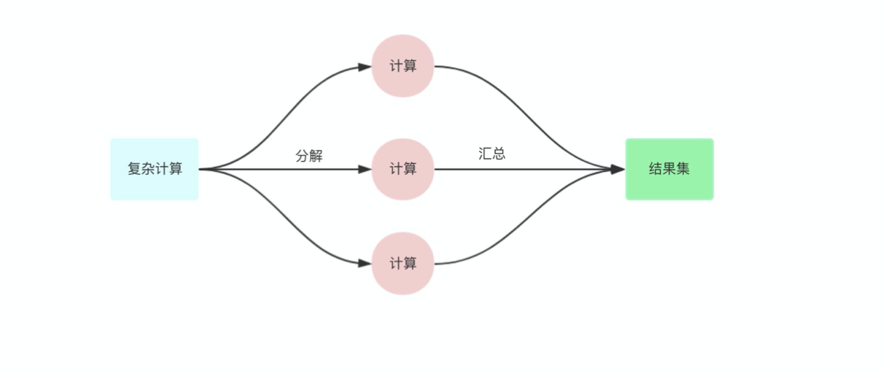
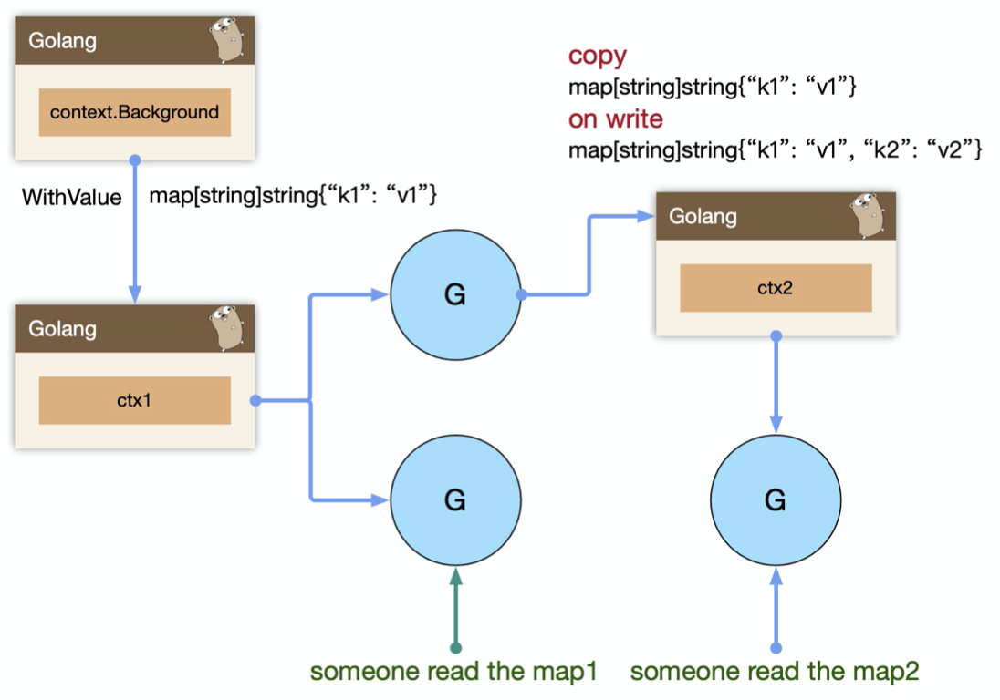
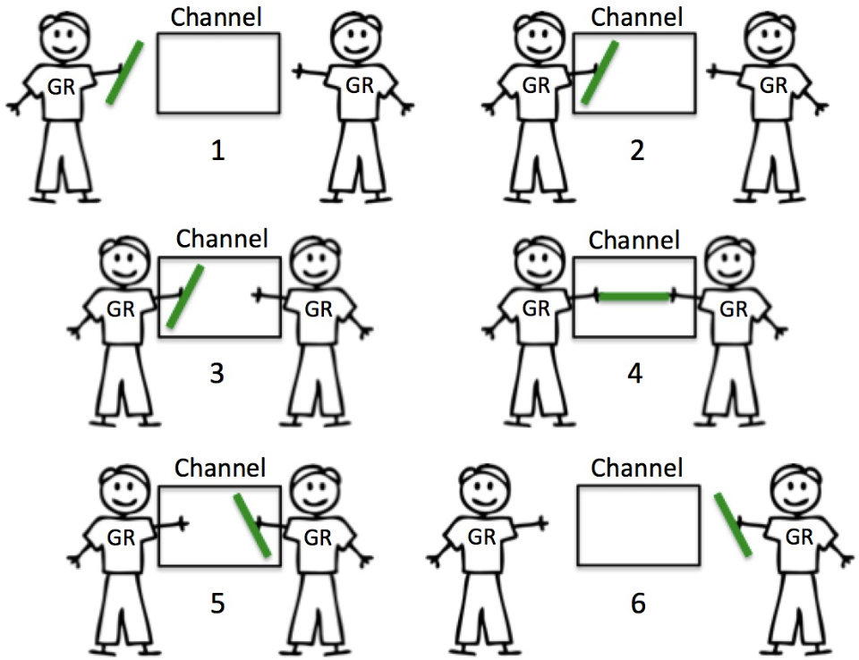

# **并行编程2**

# **3. Package sync**
## **3.1. sync.atomic**
- 锁怎么用好：**最晚加锁，最早释放，锁内是临界区，临界区内代码要轻量**

    - 问题：**读 map 读出 val 然后加锁，起两个 goroutine 都读 map 然后加锁，最后死锁了，为什么**

- cfg 作为包级全局对象，在这个例子中被多个 goroutine 同时访问，**因此这里存在 data race，会看到不连续的内存输出**。

    ```go
    type Config struct {
        a []int
    }

    func main() {
        cfg := &Config{}

        // 相当于一个人在写
        go func() {
            i := 0 
            for {
                i++
                cfg.a = []int{i, i+1, i+2, i+3, i+4, i+5}
            }
        }()

        var wg sync.WaitGroup
        // 相当于6个人在读
        for n := 0; n < 4; n++ {
            wg.Add(1)
            go func() {
                for n := 0; n < 100; n++ {
                    fmt.Printf("%v\n", cfg)
                }
                wg.Done()
            }()
        }

        wg.Wait()
    }
    ```

- 属于`读多写少`场景，我们想到使用 `Go 同步语义`解决: 
    
    - **`Mutex` 全局争用一把锁，写和读相互抢占，性能最差**
    
    - **`RWMutex` 性能会快很多，但是不够好** (为什么)
    
    - **`Atomic` 实际可以用原子语义解决**

- 修改版

    ```go
    type Config struct {
        a []int
    }

    func (c *Config) T() {}

    // atomic 版本
    func BenchmarkAtomic(b *testing.B) {
        var v atomic.Value
        v.Store(&Config{})

        go func() {
            i := 0
            for {
                i++
                cfg := &Config{a: []int{i, i+1, i+2, i+3, i+4, i+5}}
                v.Store(cfg) // 存一个指针进去
            }
        }()

        var wg sync.WaitGroup
        for n := 0; n < 4; n++ {
            wg.Add(1)
            go func() {
                for n := 0; n < b.N; n++ {
                    cfg := v.Load().(*Config) // load 出来一个指针
                    cfg.T()
                    fmt.Printf("%v\n", cfg)
                }
                wg.Done()
            }()
        }
        wg.Wait()
    }

    // rwlock 版本
    func BenchmarkMutex(b *testing.B) {
        var l sync.RWMutex
        var cfg *Config

        go func() {
            i := 0
            for {
                i++
                l.Lock()
                cfg = &Config{a: []int{i, i+1, i+2, i+3, i+4, i+5}}
                l.Unlock()
            }
        }()

        var wg sync.WaitGroup
        for n := 0; n < 4; n++ {
            wg.Add(1)
            go func() {
                for n := 0; n < b.N; n++ {
                    l.RLock()
                    cfg.T()
                    fmt.Printf("%v\n", cfg)
                    l.RUnlock()
                }
                wg.Done()
            }()
        }
        wg.Wait()
    }
    ```

- 实践出真理，**一定要写 benchmark 代码。Benchmark 是出结果真相的真理**

    - **但是通常来说`互斥锁更重`，因为互斥锁有个 `fast pass` 和 `slow pass`，`fast pass` 抄捷径，`死循环`看这个锁是不是释放。`slow pass` 就是把 `goroutine 休眠 (park) 掉`，好了再唤醒。**
    
    - **因为涉及到更多的 goroutine 之间的`上下文切换` pack blocking goroutine，以及唤醒 goroutine。**

<br>

## **3.2. Copy-On-Write**
- Copy-On-Write 思路在`微服务降级`或者 `local cache` 场景中经常使用。写时复制指的是，**写操作时候`复制全量`老数据到一个`新的对象`中，携带上本次新写的数据，之后利用`原子替换` (atomic.Value)，更新调用者的变量**。来完成**无锁访问共享数据**。

- **redis 的 `bg save` 是怎么实现的**

    - **新版本 redis 是`双线程`的, 一个`工作线程`一个 `io 线程`**

    - 单线程如果要 dump 数据，**fork 一个进程，新旧指向一个内存空间，老的还是有写的，但是新的不受影响**。**`copy on write` 就是写到哪就把它`拷一遍`**

- 微服务中的 copy on write

    ```go
    func main() {
        var config atomic.Value // holds current server configuration
        // create initial configuration value and store into config
        config.Store(loadConfig()) // v1

        go func() {
            // reload config every 10 seconds
            // and update config value with the new version
            for {
                time.Sleep(10 * time.Second)
                config.Store(loadConfig()) // 这里 store 的版本是 v2
            }
        }()

        // create worker goroutines that handle incoming requests
        // using the latest config value
        for i := 0; i < 10; i++ {
            go func() {
                for r := range request() {
                    c := config.Load() // 这里 load 的版本可能是 v1 也可能是 v2，和加锁不一样，加锁解锁之后所有人都会读到 v2
                    // 而且 v1 版本可能长期存在，直到没人用被 gc，因此同一个数据内存里可能有多个副本
                    // handle request r using config c
                    _, _ = r, c
                }
            }()
        } 
    }
    ```

    ```go
    func main() {
        type Map map[string]string
        var m atomic.Value
        m.Store(make(Map))
        var mu sync.Mutex // used only by writers

        // read function can be used to read the data without further synchronization
        read := func(key string) (val string) {
            m1 := m.Load().(Map)
            return m1[key]
        }

        // insert function can be used to update the data without further synchronization
        insert := func(key, val string) {
            mu.Lock() // synchronization with other potential writers
            defer mu.Unlock()

            m1 := m.Load().(Map) // load current value
            m2 := make(Map) // create a new value
            for k, v := range m1 {
                m2[k] = v // copy all data from current one to new one
            }

            m2[key] = val // do update that we need
            m.Store(m2) // atomic replace the current one with the new one
            // at this time all new readers start working with the new version
            // the old version will be garbage collected once the existing readers (if any) are done with it
        }
        _, _ = read, insert
    }
    ```

- **注意：**

    - **`atomic.value` 核心思路也是 `cow`**

    - **`local cache` 如何及时刷新，起一个 goroutine 每几秒去查数据库，然后用 `atomic` 去更新**

    - **`atomic value` 场景 (读多写少)，`copy on write` 写不能太多，否则拷贝成本太高**

    - **`atomic value + 进程内缓存`，效率是比较高的**

<br>

## **3.3. mutex**
- 这个案例基于两个 goroutine:
    
    - goroutine 1 持有锁很长时间
    
    - goroutine 2 每100ms 持有一次锁

    ```go
    func main() {
        done := make(chan bool, 1)
        var mu sync.Mutex

        // goroutine 1 持有锁较长时间
        go func() {
            for {
                select {
                case <- done:
                    return
                default;
                    mu.Lock()
                    time.Sleep(100 * time.Microsecond)
                    mu.Unlock()
                }
            }
        }()

        // goroutine 2 每 100ms 加锁
        for i := 0; i < 10; i++ {
            time.Sleep(time.Microsecond)
            mu.Lock()
            mu.Unlock()
        }

        done <- true
    }
    ```

- 基于 Go 1.8 循环了10次

- **Mutex 被 g1 获取了 700 多万次，而 g2 只获取了 10 次, 非公平锁，或导致`锁饥饿`**

- ***redis cow bgsave 要看***

1. 首先，goroutine1 将获得锁并休眠100ms。当 goroutine2 试图获取锁时，它将被添加到锁的 队列中 - FIFO 顺序，goroutine 将进入等待状态。

2. 然后，当 goroutine1 完成它的工作时，它将释放锁。**此版本将通知队列唤醒 goroutine2**。**goroutine2 将被标记为可运行的**，并且正在等待 Go 调度程序在线程上运行.

    

    

3. 然而，当 goroutine2 等待运行时，goroutine1 将再次请求锁。**goroutine2 尝试去获取锁，结果悲剧的发现锁又被人持有了，它自己继续进入到等待模式**。

    

    

<br>

### **3.3.1. 几种 Mutex 锁的实现**
- 我们看看几种 Mutex 锁的实现:

    1. `Barging`：这种模式是为了提高吞吐量，当锁被释放时，**它会唤醒第一个等待者**，然后把锁给第一个等待者或者给第一个请求锁的人

    2. `Handsoff`：当锁释放时候，**锁会一直持有直到`第一个等待者`准备好获取锁**。它降低了吞吐量，因为锁被持有，即使另一个 goroutine 准备获取它。

        - 一个互斥锁的 handsoff 会完美地平衡两个 goroutine 之间的锁分配，但是会`降低性能`，因为它会迫使`第一个 goroutine 等待锁`。

    3. `Spinning`：**`自旋`在`等待队列为空`或者应用程序`重度使用锁`时效果不错**。 
        
        - `Parking` 和 `Unparking goroutines` 有不低的性能成本开销，相比自旋来说要慢得多。

- Go 1.8 使用了 `Barging` 和 `Spinning` 的结合实现。

    - 当试图获取已经被持有的锁时，如果**本地队列为空并且 P 的数量大于1**，goroutine 将自旋几次 (用一个 P 旋转会阻塞程序)。
    
    - 自旋后，goroutine park。**在程序高频使用锁的情况下， 它充当了一个`快速路径` (fast pass)**。

        - **fast pass 和 slow pass**：fast pass 例如拿一个对象，对象不为空直接使用，slow pass 对象为空要进行初始化

- Go 1.9 通过添加一个新的饥饿模式来解决先前解释的问题，该模式将会在释放时候触发 `handsoff`。**所有等待锁超过一毫秒的 goroutine (也称为`有界等待`) 将被诊断为饥饿**。当被标记为饥饿状态时，**unlock 方法会 `handsoff` 把锁直接扔给第一个等待者。**

- 在饥饿模式下，**自旋也被停用，因为传入的 goroutines 将没有机会获取为下一个等待者保 留的锁。**

- **这样锁更加公平，不会使一些 goroutine 无限 park**

<br>

## **3.4. errgroup**
- 我们把一个复杂的任务，尤其是依赖`多个微服务` rpc 需要`聚合数据`的任务，分解为`依赖和并行`

    - **`依赖`的意思为: 需要上游 a 的数据才能访问下游 b 的数据进行组合。**
    
    - **`并行`的意思为: 分解为多个小任务并行执行，最终等全部执行完毕。**

- 并发发请求示例

    ```go
    func main() {
        var a, b int
        var err1, err2 error
        // 也可以用 channel
        var chan channel
        // 不知道 go 出去的方法什么时候执行完
        go func() {
            // call rpc1
            a, err1 = xxx()
            chan <- err1
        }()

        go func() {
            // call rpc2
            b, err2 = xxx()
            chan <- err2
        }()
    }
    ```

- 核心原理: **利用 `sync.Waitgroup` 管理并行执行的 goroutine**。 3/10.go

    - **并行工作流**
    
    - **错误处理或者优雅降级 (第一个报错就可以拦截到)**
    
    - **context 传播和取消**
    
    - **利用局部变量 + 闭包**

    

- **errgroup 微服务怎么处理**

    ```go
    func main() {
        g, ctx := errgroup.WithContext(context.Background())

        var a, b, c []int

        // b 站代码写法
        // 调用广告服务
        // Go calls the given function in a new goroutine
        // The first call to return a non-nil error cancels the group; its error will be returned by Wait
        g.Go(func() error {
            a = []int{0}
            return nil
        })
        
        // 调用 ai
        g.Go(func() error {
            b = []int{1}
            return errros.New("ai")
        })

        // 调用运营平台
        g.Go(func() error {
            c = []int{2}
            return nil
        })
        
        // Wait blocks until all function calls from the Go method have returned, then returns the first non-nil error (if any) from them
        err := g.Wait() // 返回第一个报错的人
        fmt.Println(err)

        // 然后 a + b + c merge
        // 不使用同一个数组防止 data race
        // bff 大部分业务代码都这样写

        fmt.Println(ctx.Err())
    }
    ```

- **业务代码大量使用 errgroup**

- errgroup 内部：

    ```go
    type Group struct {
        cancel func()
        wg sync.WaitGroup
        errOnce sync.Once
        err error
    }
    ```

- **注意：**

    - **问题 1**

        ```go
        func (g *Group) Go(f func() error) {
            g.wg.Add(1)

            // 野生的 goroutine，1. 要托管其声明周期; 2. 要处理 panic, 不捕获整个程序退出
            go func() {
                defer g.wg.Done()
                if err := f(); err != nil {
                    g.errOnce.Do(func() {
                        g.err = err
                        if g.cancel != nil {
                            g.cancel()
                        }
                    })
                }
            }()
        }
        ```

        ```go
        // 改进版
        // https://github.com/go-kratos/kratos/blob/v1.0.x/pkg/sync/errgroup/errgroup.go
        // A Group is a collection of goroutines working on subtasks that are part of
        // the same overall task.
        //
        // A zero Group is valid and does not cancel on error.
        type Group struct {
            err     error
            wg      sync.WaitGroup
            errOnce sync.Once

            workerOnce sync.Once
            ch         chan func(ctx context.Context) error
            chs        []func(ctx context.Context) error

            ctx    context.Context
            cancel func()
        }

        // Go calls the given function in a new goroutine.
        //
        // The first call to return a non-nil error cancels the group; its error will be
        // returned by Wait.
        func (g *Group) Go(f func(ctx context.Context) error) {
            g.wg.Add(1)
            if g.ch != nil {
                select {
                case g.ch <- f:
                default:
                    g.chs = append(g.chs, f)
                }
                return
            }
            go g.do(f)
        }

        func (g *Group) do(f func(ctx context.Context) error) {
            ctx := g.ctx
            if ctx == nil {
                ctx = context.Background()
            }
            var err error
            defer func() {
                if r := recover(); r != nil {
                    buf := make([]byte, 64<<10)
                    buf = buf[:runtime.Stack(buf, false)]
                    err = fmt.Errorf("errgroup: panic recovered: %s\n%s", r, buf)
                }
                if err != nil {
                    g.errOnce.Do(func() {
                        g.err = err
                        if g.cancel != nil {
                            g.cancel()
                        }
                    })
                }
                g.wg.Done()
            }()
            err = f(ctx)
        }
        ```

        ```go
        // 限制 goroutine 的最大数量, 避免一次大量生成 goroutine
        func (g *Group) GOMAXPROCS(n int)
        ```

    - **问题 2**
        
        - errGroup 两种：1. 有一个报错全部终止, 2. 不管有没有报错都继续执行

            ```go
            // errgroup 的 withContext
            // 内部报 err context 就会取消
            // WithContext returns a new Group and an associated Context derived from ctx.
            //
            // The derived Context is canceled the first time a function passed to Go returns a non-nil error or the first time Wait returns, whichever occurs first.
            func WithContext(ctx context.Context) (*Group, context.Context) {
                ctx, cancel := context.WithCancel(ctx)
                return &Group{cancel: cancel}, ctx
            }
            ```

        - **有人会把这个 context 继续向下传递, 但是这个 context 不能继续传递**

        ```go
        // 改进：只返回 group 不返回 context
        // WithContext create a Group.
        // given function from Go will receive this context,
        func WithContext(ctx context.Context) *Group {
            return &Group{ctx: ctx}
        }
        ```

<br>

## **3.5. sync.Pool**
- **sync.Pool 的场景是用来`保存和复用临时对象`，以`减少内存分配`，降低 GC 压力** (Request- Driven 特别合适)。

- 总结：**就是用来高频的内存申请，比如链路追踪要创建 trace 对象，接口结束后 trace 就释放掉了**

- **内部 `ring buffer` (定长 FIFO) + 双向链表的方式，头部只能写入，尾部可以并发读取**

<br>

# **5. Package context**
## **5.1. Request-scoped context**
- 在 Go 服务中，**每个传入的请求都在其自己的 goroutine 中处理**。请求处理程序通常启动额外的 goroutine 来访问其他后端，如数据库和 RPC 服务

    - **处理请求的 goroutine 通常需要访问`特定于请求` (request-specific context)的值**，例如最终用户的身份、授权令牌和请求的截止日期 (deadline)。
    
    - **当一个请求被取消或超时时**，处理该请求的所有 goroutine 都应该快速退出 (fail fast) (级联取消)

- Go 1.7 引入一个 context 包，**它使得跨 API 边界的请求范围元数据、取消信号和截止日期很容易传递给处理请求所涉及的所有 goroutine (显式传递)。**

    - 处理请求时：**控制生命周期，同时链路追踪, 共享数据**

<br>

## **5.2. 如何将 context 集成到 API 中**
- **在将 context 集成到 API 中时，要记住的最重要的一点是，它的作用域是`请求级别`的**。例如，沿单个数据库查询存在是有意义的，但沿数据库对象存在则没有意义。

- 目前有两种方法可以将 context 对象集成到 API 中: 
    
    - **The first parameter o fa function call**
        
        - **首参数传递 context 对象**，比如，参考 net 包 Dialer.DialContext。此函数执行正常的 Dial 操作，但可以通过 context 对象取消函数调用。

            ```go
            func (d *Dialer) DialContext(ctx context.Context, network, address string) (Conn, err)
            ```
    
    - **Optional config on a request structure**
        
        - **在第一个 request 对象中携带一个可选的 context 对象**。例如 net/http 库的 Request.WithContext，通过携带给定的 context 对象，返回一个新的 Request 对象。

            ```go
            func (r *Request) WithContext(ctx context.Context) *Request
            ```

<br>

## **5.3. Do not store Contexts inside a struct type**
- **尽量 context 放到函数签名里面而不是结构体里面**

    - Do not store Contexts inside a struct type; instead, pass a Context explicitly to each function that needs it. The Context should be the first parameter, typically named ctx

- 不放入结构体的例外是，当您需要将它放入一个结构中时，该结构纯粹用作通过通道传递的消息。如下例所示。

    ```go
    type message struct {
        responseChan chan<- int
        parameter string
        ctx context.Context
    }
    ```

<br>

## **5.4. context.WithValue**
- context.WithValue 内部基于 `valueCtx` 实现:

    ```go
    // A valueCtx carries a key-value pair. It implements Value for that key and
    // delegates all other calls to the embedded Context.
    type valueCtx struct {
        Context
        key, val interface{}
    }
    ```

- 为了实现`不断的 WithValue`，`构建新的 context`，**内部在查找 key 时候，使用`递归方式`不断从当前，从`父节点`寻找匹配的 key，直到 `root context`** (Backgrond 和 TODO Value 函数会返回 nil)。

    ```go
    // 见图
    func (c *valueCtx) Value(key interface{}) interface{} {
        if c.key == key {
            return c.val
        }
        return c.Context.Value(key)
    }
    ```

- 这样可以实现跨多个 context 查到值

- 默认 context 最 root 的节点，不知道传啥传 todo

<br>

## **5.5. Debugging or tracing data is safe to pass in a Context**
- **为什么 `valueCtx` 内数据类型为 `key, value interface{}`, 为什么`不用 map`**
    
    - **每次 `withValue` 都会返回一个`新的 context`, `老的 context` 里的`数据不会改`。这里面的数据实际是`只读`的**。
        
        - 同一个 context 对象可以传递给在`不同 goroutine` 中运行的函数，上下文对于多个 goroutine `同时使用是安全的`。
        
        - 对于值类型最容易犯错的地方，**在于 context value 应该是 immutable 的，每次重新赋值应该是新的 context，即: context.WithValue(ctx, oldvalue)**

    - 如果修改，会导致另外`读 context.Value` 的 goroutine 和`修改 map 的 goroutine` 产生 `data race`。**因此我们要使用 `copy-on-write` 的思路，解决`跨多个 goroutine 使用、修改数据`的场景**。

        - **`Replace` a Context using `WithCancel`, `WithDeadline`, `WithTimeout`, or `WithValue`.**

    - `COW`: 从 ctx1 中获取 map1 (可以理解为 v1 版本的 map 数据)。构建一个新的 map 对象 map2，复制所有 map1 数据，同时追加新的数据 “k2”: “v2” 键值对
        
        - **使用 `context.WithValue` 创建新的 `ctx2`，`ctx2` 会传递到`其他的 goroutine` 中**
        
        - **这样各自`读取的副本都是自己的数据`**，`写行为`追加的数据，在 `ctx2` 中也能完整读取到，同时也不会污染 `ctx1` 中的 数据。 (**v1 空间只能看到 `v1`，v2 空间能看到 `v1 v2`**)

        

- Use context values only for **request-scoped data** that transits processes and APIs, not for passing optional parameters to functions.

    - **比如 染色，API 重要性，Trace**: https://github.com/go-kratos/kratos/blob/master/pkg/net/metadata/key.go

- **Context.Value should inform, not control** 不能放业务逻辑有关的

    - 元数据相对函数参数更加是隐式的，面向请求的，而函数参数是显式的

<br>

## **5.6. 注意**
- gin 的 context 处理的不好

- **grpc 的 `midware context` 就处理的非常好 (显式传递 context，与 gin 的 next比较)**

- **不能让`上游`读到`下游`的数据，`下游`可以读到`上游`的数据**

- kratos http 库参考的 gin

- **一定要确认好 ctx，有些 context 带`超时`、带`取消`、特用的，`不要被其他的用了`**

- put 前要 reset: *a = {}

- `context 基本和其他语言拉开差距`

- **interface 赋值一个 nil 具备类型的对象给 interface**, 然后 interface 就不等于 nil 了 (interface nil 坑)

<br>

## **5.7. 网络调用 (syscall) 的超时控制如何与 context 结合好**
- 网络调用 (syscall) 的`超时控制`如何与 context 结合好？ (做好了不太会因为 goroutine 超时导致 oom)

    ```go
    // kratos/pkg/cache/redis/conn.go
    // 系统调用一行代码就可以管控
    func (c *conn) Receive() (reply interface{}, err error) {
        if c.readTimeout != 0 {
            // shrinkDeadLine 系统调用前, 从 context 中获取超时剩下的时间，并与配置文件中的超时时间比较，取一个较小的
            c.conn.SetReadDeadLine(shrinkDeadLine(c.ctx, c.readTimeout))
        }
    }
    ```

    ```go
    func shrinkDeadline(ctx context.Context, timeout time.Duration) time.Time {
        var timeoutTime = time.Now().Add(timeout)
        if ctx == nil {
            return timeoutTime
        }
        if deadline, ok := ctx.Deadline(); ok && timeoutTime.After(deadline) {
            return deadline
        }
        return timeoutTime
    }
    ```

<br>

## **5.8. context.WithCancel**
- **When a Context is canceled, all Contexts derived from it are also canceled**

- 当一个 context 被取消时，从它派生的所有 context 也将被取消。

- `WithCancel(ctx)` 参数 ctx 认为是 `parent ctx`，在内部会进行一个传播关系链的关联。

- `Done()` 返回 一个 chan，当我们取消某个 parent context, **实际上上会递归层层 cancel 掉自己的 child context 的 `done chan` 从而让整个调用链中所有监听 cancel 的 goroutine 退出**。

    ```go
    // 基本会这样写
    gen := func(ctx context.Context) <-chan int {
        dst := make(chan int)
        n := 1
        go func() {
            for {
                select {
                case <-ctx.Done():
                    return // returning not to leak the goroutine
                case dst <- n:
                    n++
                }
            }
        }()
        return dst
    }

    ctx, cancel := context.WithCancel(context.Background())
    defer cancel() // cancel when we are finished consuming integers

    for n := range gen(ctx) {
        fmt.Println(n)
        if n == 5 {
            break
        }
    }
    ```

<br>

## **5.9. context.WithDeadline**
- `All blocking/long operations should be cancelable`

    ```go
    const shortDuration = 1 * time.Millisecond

    func main() {
        d := time.Now().Add(shortDuration)
        ctx, cancel := context.WithDeadline(context.Background(), d)

        // Even though ctx will be expired, it is good practice to call its
        // cancellation function in any case. Failure to do so may keep the
        // context and its parent alive longer than necessary.
        // 一定要调 cancel 否则会泄漏
        defer cancel()

        select {
        case <-time.After(1 * time.Second):
            fmt.Println("overslept")
        case <-ctx.Done():
            fmt.Println(ctx.Err())
        }
    }
    ```

<br>

## **5.10. final notes**
- **context 不好的地方，有一坨要遵守的规则**

    - Incoming requests to a server should create a Context. 

        - rpc 服务请求第一件事就是创建一个 context, 比如设置超时或 timeout

    - Outgoing calls to servers should accept a Context.
        
        - 调别人的时候显式传递 context

    - Do not store Contexts inside a struct type; instead, pass a Context explicitly to each function that needs it.
        
        - 首参数传参不要放在 struct 里面
    
    - The chain of function calls between them must propagate the Context.
        
        - **context 超时或取消要建立一个级联传播的关系，一取消都取消**

    - Replace a Context using WithCancel, WithDeadline, WithTimeout, or WithValue.
        
        - **替换 context, 不要更改它注意 value 里的数据也是不可变更的 把它搞成只读的是最简单的**
    
    - When a Context is canceled, all Contexts derived from it are also canceled.
        
        - 级联取消

    - The same Context may be passed to functions running in different goroutines; **Contexts are safe for simultaneous use by multiple goroutines**.
        
        - **context 是线程安全的**

    - Do not pass a nil Context, even if a function permits it. Pass a TODO context if you are unsure about which Context to use.
        
        - 传 todo 不要传 nil
        
    - Use context values only for request-scoped data that transits processes and APIs, not for passing optional parameters to functions.
        
        - context 不要包业务逻辑，业务参数显式传参
    
    - **All blocking/long operations should be cancelable**. 

        - **耗时长的、block 的一定要传 context (系统调用等)**
    
    - Context.Value obscures your program’s flow.

    - Context.Value should inform, not control.
        
        - **不应做控制逻辑，做信号 (例如染色逻辑路由逻辑)**
    
    - Try not to use context.Value.
        
        - 能不用就不用 (???)

- 一个容易用错的场景

    ```go
    // http handler
    ctx, cancel := context.WithCancel(context.Background())
    defer cancel()

    group.Go(func() {} error) {
        // ctx
    }

    // background goroutine
    // 要用 context 里的数据的话可以用 ctx := metadata.WithContext()
    go func() {
        // 直接用 ctx 会 context canceled
        context.Background() // 可以用自己的 context
    }()

    // fan-out
    ch := make(chan func(), 10)
    ch <- func() {
        ctx
    }
    ```

- **注意：`sync/errgroup`**

    ```go
    // 对比 kratos 的 errgroup
    // 这里返回的 context 是 withCancel 的 context
    // WithContext returns a new Group and an associated Context derived from ctx.
    //
    // The derived Context is canceled the first time a function passed to Go
    // returns a non-nil error or the first time Wait returns, whichever occurs
    // first.
    func WithContext(ctx context.Context) (*Group, context.Context) {
        ctx, cancel := context.WithCancel(ctx)
        return &Group{cancel: cancel}, ctx
    }

    // 这个方法会执行上面 context 的 cancel
    // Wait blocks until all function calls from the Go method have returned, then
    // returns the first non-nil error (if any) from them.
    func (g *Group) Wait() error {
        g.wg.Wait()
        if g.cancel != nil {
            g.cancel()
        }
        return g.err
    }
    ```

    ```go
    // kratos
    // return a no deadline context and remain metadata
    func WithContext(c context.Context) context.Context {
        md, ok := FromContext(c)
        if ok {
            nmd := md.Copy()
            delete(nmd, trace)
            return NewContext(context.Background(), nmd)
        }
        return context.Background()
    }
    ```

<br>

# **6. chan**
- channels 是一种类型安全的消息队列，充当`两个 goroutine 之间的管道`，将通过它同步的进行任意资源的交换。

- **chan 控制 goroutines 交互的能力从而创建了 Go 同步机制**。当创建的 chan 没有容量时，称为无缓冲通道。反过来，使用容量创建的 chan 称为缓冲通道。

<br>

## **6.1. Unbuffered Channels**
- **无缓冲 chan 没有容量，因此进行任何交换前需要两个 goroutine `同时准备好`**。

- 当 goroutine 试图将一个资源发送到一个无缓冲的通道并且没有 goroutine 等待接收该资源时，**该通道将锁住发送 goroutine 并使其等待**。

- 当 goroutine 尝试从无缓冲通道接收，并且没有 goroutine 等待发送资源时，**该通道将锁住接收 goroutine 并使其等待**。

    

- **无缓冲信道的本质是`保证同步`。**

    ```go
    func main() {
        c := make(chan string)
        var wg sync.WaitGroup
        wg.Add(2)

        go func() {
            defer wg.Done()
            c <- `foo` // 阻塞
        }()

        go func() {
            defer wg.Done()
            time.Sleep(time.Second * 1)
            fmt.Println(`Message` + <- c)
        }()
        wg.Wait()
    }
    ```

- 第一个 goroutine 在发送消息 foo 之后被阻塞，因为还没有接收者准备好。

- 规范中对这种行为进行了很好的解释
    
    - https://golang.org/ref/spec#Channel_types:

        - “If the capacity is zero or absent, the channel is unbuffered and communication succeeds only when **both a sender and receiver are ready**.”
    
    - https://golang.org/doc/effective_go.html#channels
        
        - “If the channel is unbuffered, **the sender blocks until the receiver has received the value**”

- **`Receive` 先于 `Send` 发生**。 
    
    - 好处：**100% 保证能收到**。 
    
    - 代价：**延迟时间未知**。

<br>

## **6.2. Buffered Channels**
- buffered channel 具有容量，因此其行为可能有点不同。

- **当 goroutine 试图将资源发送到缓冲通道，而该`通道已满`时，该通道将锁住 goroutine 并使其等待缓冲区可用**。如果通道中有空间，发送可以立即进行，goroutine 可以继续。

- **当 goroutine 试图从缓冲通道接收数据，而缓冲`通道为空`时，该通道将锁住 goroutine 并使其等待资源被发送**。

    ```go
    func main() {
        c := make(chan string, 2)

        var wg sync.WaitGroup
        wg.Add(2)

        go func() {
            defer wg.Done()
            c <- "foo"
            c <- "bar"
        }()

        go func() {
            defer wg.Done()
            time.Sleep(time.Second * 1)
            fmt.Println(<- c)
            fmt.Println(<- c)
        }()

        wg.Wait()
    }
    ```

- **Latencies due to under-sized buffer**
    
    - 在 chan 创建过程中定义的缓冲区大小可能会极大地影响性能。
        
        ```
        buffer (25) > buffer (5) > buffer (1) > buffer (0)
        ```

    - 读 goroutine 取完之后会睡眠。别人塞了消息之后再把它唤醒。**因此会不断的唤醒睡眠，大量的`上下文切换`，buffer 越小越频繁**
    
    - **buffer 大的时候顶多是`锁争用`**

- **`Send` 先于 `Receive` 发生。**
    
    - 好处：**延迟更小**。
    
    - 代价：不保证数据到达，越大的 buffer，越小的保障到达。buffer = 1 时，给你延迟一个消息的保障。

- **注意**
    
    - **buffer 大小不代表吞吐，只是延迟会小一些, 但是耗内存更高**
    
    - **吞吐靠的是`多线程多个 goroutine` 消费**

- 有兴趣可以看: https://github.com/bilibili/overlord
    
    - 大量使用 chan 来实现聚合发包到 redis 用来访问 redis
    
    - 主要解决问题：**密集向 chan 发数据锁争用很厉害**

<br>

## **6.3. Go Concurrency Patterns (pattern 模式、姿势、套路)**

- **Timing out**

- **Moving on** (怎么放弃数据)

- **Pipeline** (一个 chan 的数据可以继续发给另外一个人)

    ```
    ---> chan1 ----> chan2 ---> chan3
    ```

- **Fan-out, Fan-in**

         chan (fan out)
         /    |      \
       /      |       \
    工作时1 工作时2 工作时3

    chan1   chan2  chan3 (fan in)
        \      |      /
         \     |     /
             工作时

- **Cancellation**
    
    - **Close 先于 Receive 发生 (类似 Buffered)**。
    
    - **不需要传递数据，或者传递 nil**。 
    
    - **非常适合去掉 (Drop pattern) 和超时控制**。

- chan 最大的坑：**一定是要发送者来 close chan**

<br>

## **6.4. Design Philosophy 设计理念**
- **Drop pattern**

    ```go
    select {
        case ch <- xxx:
        default: // 搞不进去就跳出, 不阻塞
    }
    ```

- Don’t think about performance when thinking about buffers.

- **Buffers can help to reduce blocking latency (阻塞延迟) between signaling**.

- **Reducing blocking latency towards zero does not necessarily mean better throughput (吞吐)**.

- **Find the smallest buffer possible that provides good enough throughput**.

<br>

## **6.5. kratos 示例**
- kratos/pkg/sync/pipeline/fanout

- **注意**

    - chan select 顺序是随机的, 不然第一个一直有数据后面的会饥饿，会用一个 suffle 洗牌

    - map 取出来加锁导致死锁就是因为 map 是随机的 (会导致交叉锁)

    - kafka 怎么保证不丢数据

        - 用队列把消息串联起来，确认收到的队列是完整的然后再 commit 掉

- move on 思路

    ```go
    // 意为发给十个后端，哪个最快就用哪个
    // 不建议：并行发十个请求
    func Query(conns []Conn, query string) Result {
        ch := make(chan Result)
        for _, conn := range conns {
            go func(c Conn) {
                select {
                case ch <- c.DoQuery(query):
                default: // 其他的全部丢掉
                }
            }(conn)
        }
        return <-ch
    }
    ```

- pipeline 思路

    ```go
    // 产生数字
    func gen(nums ...int) <-chan int {
        out := make(chan int)
        go func() {
            for _, n := range nums {
                out <- n
            }
            close(out)
        }()
        return out
    }
    
    // 算平方
    func sq(in <-chan int) <-chan int {
        out := make(chan int)
        go func() {
            for n := range in {
                out <- n * n
            }
            close(out)
        }()
        return out
    }
    
    func main() {
        // set up pipeline
        c := gen(2, 3)
        out := sq(c)

        // consume the output
        fmt.Println(<-out) // 4
        fmt.Println(<-out) // 9
    }
    ```