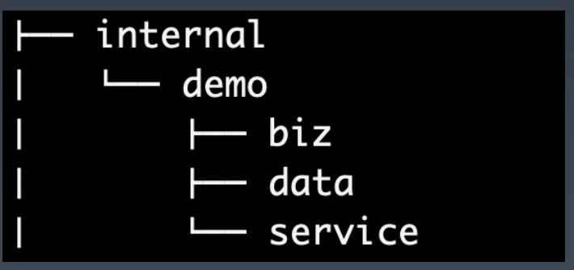
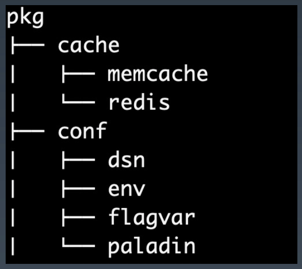
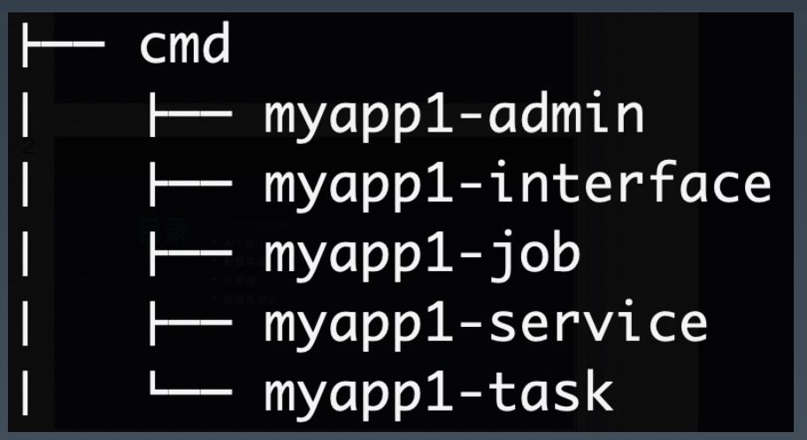
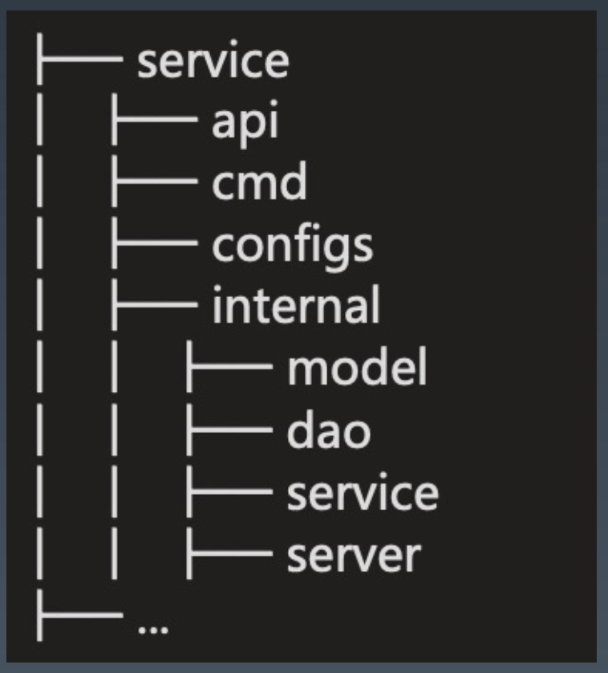
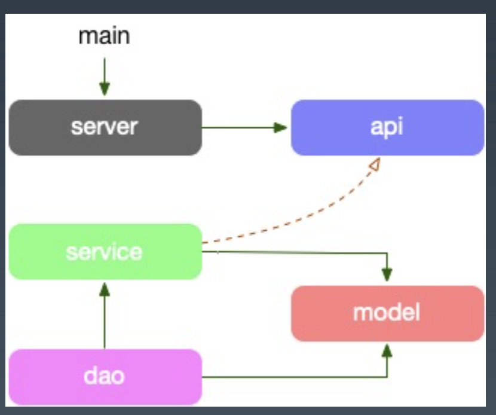
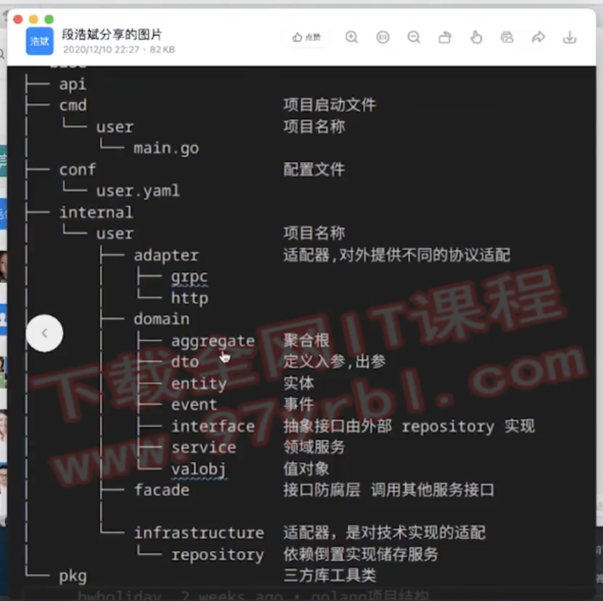

# **工程化实践1**

<br>

# **0. INDEX (工程项目结构)**

- **1. Standard Go Project Layout**

- **2. Kit Project Layout**

- **3. Service Application Project Layout**

- **4. Service Application Project**

- **5. 应用角色分类**

- **6. Service Application Project - v1 (重点)**

<br>

# **1. Standard Go Project Layout**
- https://github.com/golang-standards/project-layout/blob/master/README_zh.md

    > grpc 的 protobuf 可以将传输层和服务层隔离

- 当有更多的人参与这个项目时，你将需要更多的结构，包括需要一个 toolkit 来方便生成项目的模板，尽可能大家统一的工程目录布局。

- `/cmd` 本项目的主干
    
    - 每个应用程序的目录名应该与你想要的可执行文件的名称相匹配(例如，/cmd/myapp)。

    - 不要在这个目录中放置太多代码。
        
        - **如果你认为代码可以导入并在其他项目中使用，那么它应该位于 `/pkg` 目录中**。
        
        - **如果代码不是可重用的，或者你不希望其他人重用它，请将该代码放到 `/internal` 目录中**。

- `/internal` 私有应用程序和库代码。

    - **这是你不希望其他人在其应用程序或库中导入代码**。(请注意，**这个布局模式是由 Go 编译器本身执行的**。有关更多细节，请参阅Go 1.4 release notes) 

        

    - 注意，**你并不局限于顶级 internal 目录**。在项目树的任何级别上都可以有多个内部目录

    - 因为我们习惯把相关的服务，**比如账号服务，内部有 rpc、job、 admin 等，相关的服务整合一起后，需要区分 app (编译出来多个二进制)**。单一的服务 (一个可执行)，可以去掉 /internal/myapp。

- `/pkg` 外部应用程序可以使用的库代码 (例如 /pkg/mypubliclib)

    - /pkg 目录内，可以参考 go 标准库的组织方式，按照功能分类。**/internal/pkg 一般用于项目内的跨多个应用的公共共享代码**，但其作用域仅在单个项目工程内。

        

<br>

# **2. Kit Project Layout**
- 每个公司都应当为不同的微服务建立一个**统一的 kit 工具包项目 (基础库/框架)** 和 app 项目。

- **基础库 kit 为独立项目，公司级建议只有一个**，按照功能目录来拆分会带来不少的管理工作，因此建议合并整合。

    > “To this end, the Kit project is not allowed to have a vendor folder. If any of packages are dependent on 3rd party packages, they must always build against the latest version of those dependences.”
    > --- by Package Oriented Design

- kit 项目必须具备的特点: 

    - 统一 (尽早推进)
    
    - 标准库方式布局
    
    - 高度抽象
    
    - 支持插件

<br>

# **3. Service Application Project Layout**
- 服务端的程序

- `/api` API 协议定义目录
    
    - xxapi.proto protobuf 文件，以及生成的 go 文件。**我们通常把 api 文档直接在 proto 文件中描述**。

- /configs 配置文件模板或默认配置。

- /test 额外的外部测试应用程序和测试数据。
    
    - 你可以随时根据需求构造 /test 目录。对于较大的项目，有一个数据子目录是有意义的。例如，你可以使用 /test/data 或 /test/testdata (如果你需要忽略目录中的内容)。请注意，**Go 还会忽略以“.”或“_”开头的目录或文件 (go 编译会忽略)**，因此在如何命名测试数据目录方面有更大的灵活性。

- 不应该包含：/src
    
    - 有些 Go 项目确实有一个 src 文件夹，但这通常发生在开发人员有 Java 背景，在那里它是一种常见的模式。不要将项目级别 src 目录与 Go 用于其工作空间的 src 目录。
    
    - **go 路径即 first class，路径即 package**

    - go path = workspace，**go path src 工作空间里的东西都会在 src 目录下**，有 go mod 之后可以在任何一个空间 go mod init，不需要 go path

<br>

# **4. Service Application Project**
- **一个 gitlab 的 project 里可以放置多个微服务的 app (类似 monorepo)**。也可以按照 gitlab 的 group 里建立多个 project，每个 project 对应一个 app。

    - 多 app 的方式，**app 目录内的每个微服务按照自己的全局唯一名称**，比如 “account.service.vip” 来建立目录 (**即 app id, 唯一，甚至可以用 grpc 的包名，可以用于服务发现注册**)，如: account/vip/*。

    - **和 app 平级的目录 pkg 存放业务有关的公共库 (非基础框架库)**。如果应用不希望导出这些目录，可以放置到 `myapp/internal/pkg` 中。

<br>

# **5. 应用角色分类**
- 微服务中的 app 服务类型分为 4 类：**interface、 service、job、admin**。
    
    - **`interface`：对外的 BFF 服务，接受来自用户的请求**，比如暴露了 HTTP/gRPC 接口。 (**上面是 api gateway, 面向业务场景定义的服务**)
    
    - **`service`：对内的微服务，仅接受来自内部其他服务或者网关的请求**，比如暴露了gRPC 接口只对内服务。(**面向用户侧**)
    
    - **`admin`：区别于 service，更多是面向运营测的服务**，通常数据权限更高，隔离带来更好的代码级别安全。
    
    - **`job`：流式任务处理的服务**，上游一般依赖 message broker。(**消费 kafka, 订阅 binlog**)
    
    - **`task`：定时任务，类似 cronjob**，部署到 task 托管平台中。(定时任务 xxx-task 等)

        

- **cmd 应用目录负责程序的: 启动、关闭、配置初始化等。**

    - cmd 只应该负责服务的资源初始化、资源注销、以及 http rpc 的监听、初始化日志

- 作业 TODO

    ```go
    // 看看有没有把 context errgroup channel 理解透
    // errgroup 实现一个 http server 和信号处理的代码
    func main() {
        g, ctx := errgroup.WithContext(context.Background())
        svr := http.NewServer()

        // http server
        g.Go(func() error {
            fmt.Println("http")
            go func() {
                <-ctx.Done()
                fmt.Println("http ctx done")
                svr.Shutdown(context.TODO())
            }()
            return svr.Start()
        })

        // signal
        g.Go(func() error {
            exitSignals := []os.Signal{os.Interrupt, syscall.SIGTERM, syscall.SIGQUIT, syscall.SIGTNT}
            sig := make(chan os.Signal, len(exitSignals))
            signal.Notify(sig, exitSignals...)
            for {
                fmt.Println("signal")
                select {
                case <- ctx.Done():
                    fmt.Println("signal ctx done")
                    return ctx.Err()
                case <- sig:
                    // do something
                    return nil
                }
            }
        })

        // inject error
        g.Go(func() error {
            fmt.Println("inject")
            time.Sleep(time.Second)
            fmt.Println("inject finish")
            return errors.New("inject error")
        })

        err := g.Wait() // first error return
        fmt.Println(err)
    }
    ```

<br>

# **6. Service Application Project - v1 (重点)**
## **6.1. 三层架构、目录分层**
> job 和 task 区别：job 一直等着 (kafka) 消费，常驻一直跑；task 定时执行

- 我们老的布局，**app 目录下有 api、cmd、configs、internal 目录**，目录里一般还会放置 README、CHANGELOG、OWNERS。
    
    1. **api：放置 API 定义 (protobuf)，以及对应的生成的 client 代码**，基于 pb 生成的 swagger.json。
    
    2. **configs：放服务所需要的配置文件**，比如 database.yaml、redis.yaml、application.yaml。
    
    3. internal：是为了避免有同业务下有人**跨目录引用了内部的 model、dao 等内部 struct**。
    
    4. **server：放置 HTTP/gRPC 的路由代码，以及 DTO 转换的代码**。

        

<br>

## **6.2. 旧版**
1. `model` 放各种结构体，同 java 的 pojo (铺平的 class 以及 get set)

2. `dao`: mysql, redis (**select query update insert, 面向表，或者面向 redis 的 key**)，数据读写层，数据库和缓存全部在这层统一处理，包括 cache miss 处理。

    > cache miss 逻辑下沉到 dao，这种思想其实也是一种 ddd 的思路

    ```go
    type Girl struct {
        Size int
        Age int
    }

    type testDao struct {
    }

    func (dao *testDao) Query(id) (Girl, error) {
        // mock 数据
        return "XXXXX"
    }

    // service 层
    // 依赖注入，test 时可以 mock 这个 dao
    func NewService(dao Dao) {
        return &Service{dao: Dao}
    }

    type Dao interface {
        Query(id int) (Girl, error)
    }

    func NewDao(db *sql.DB) Dao {
        return &dao{db: db}
    }

    type dao struct {
        db *sql.DB
    }

    func (d *Dao) Query(id int) (Girl, error) {
        // select from .....
    }
    ```

    - **依赖倒置原则**（Dependence Inversion Principle）是程序要依赖于抽象接口，不要依赖于具体实现。

    - **简单的说就是要求对`抽象进行编程`，不要对`实现进行编程`，这样就降低了客户与实现模块间的耦合**。

    - 表达式：***要依赖于抽象，不要依赖于具体***

    - 总结：**依赖倒置原则**

        - A. **高层次的模块不应该依赖于低层次的模块，他们都应该依赖于抽象**。
        
        - B. **抽象不应该依赖于具体，具体应该依赖于抽象**。

    - 示例：server: `http grpc` 监听启动代码

        ```go
        // 为什么 redis 在外面初始化：控制反转 ioc, 依赖注入
        func New(r *redis.Redis, mc *memcache.Memcache, db *sql.DB) (d Dao, cf func(), err error) {
            return newDao(r, mc, db)
        }
        ```

3. `service`：组合各种数据访问来构建业务逻辑。

4. `server`: 放各种监听 http grpc

    - grpc 的生成代码会**生成订阅服务的 client 的调用代码**和服务端的打桩 (interface) 的代码 ???

        ```json
        // pb 两个方法
        server Demo {
            rpc Ping(.google.protobuf.Empty) returns (.google.protobuf.Empty);
            rpc SayHello(HelloReq) returns (.google.protobuf.Empty);
            rpc SayHelloURL(HelloReq) returns (HelloResp) {
                option (google.api.http) = {
                    get: "/kratos-demo/say_hello"
                };
            };
        }
        ```

    - 生成的代码就会包括 client 的调用代码

        ```json
        // 定义的 client interface
        type DemoClient interface {
            Ping(ctx context.Context, in *empty.Empty, opts ...grpc.CallOption) (*empty.Empty, error)
            SayHello(ctx context.Context, in *HelloReq, opts ...grpc.CallOption) (*empty.Empty, error)
            ....
        }
        ```

        ```json
        type DemoServer interface {
            Ping(...) (*empty.Empty, error)
            SayHello(...) (*empty.Empty, error)
            ....
        }
        ```

    - 在 interface 的 server 层就会传入 这个 server

        ```go
        func New(svc pb.DemoServer) (....) {
            ....
            pb.RegisterDemoServer(ws.Server(), svc) // 通过 grpc 的注册，把一个服务和 grpc 的监听关联起来
            ws, err := ws.Start() // 启动
            ....
        }
        ```

    - 依赖 proto 定义的服务作为入参，提供快捷的启动服务全局方法。(grpc 定义好之后不需要手写这么多服务启动代码, server 其实可以去掉，可以通过基础库搞定，参考示例)

        - 示例：`api.pb.go` 已经把 server 的 interface 都实现好了，只需要通过某种机制把实现了 `demoServer interface` 的业务逻辑注入到启动的服务中去，注入的逻辑是基础库实现的。cmd 只处理服务的启动和 shutdown

            ```go
            // go-kratos/service-layout/blob/main/cmd/server/main.go
            func main() {
                // transport server
                httpSrv := httptransport.NewServer(httptransport.WithAddress(":8000"))
                grpcSrv := grpctransport.NewServer(grpctransport.WithAddress(":9000"))

                // register server
                gs := service.NewGreeterService() // 初始化业务逻辑
                helloworld.RegisterGreeterServer(grpcSrv, gs) // 把 grpc 服务与业务逻辑关联起来
                helloworld.RegisterGreeterHttpServer(httpSrv, gs) // 同理

                // application lifecycle
                app := kratos.New()
                app.Append(kratos.Hook{OnStart: httpSrv.Start, onStop: httpSrv.Stop})
                app.Append(kratos.Hook{OnStart: grpcSrv.Start, onStop: grpcSrv.Stop})

                // start and wait for stop signal
                if err := app.Run(); err != nil {
                    log.Printf("startup failed:", err)
                }
            }
            ```

5. `api`：定义了 API proto 文件，和生成的 stub 代码 (打桩)，它生成 的 interface，其实现者在 service 中。

<br>

## **6.3. 之前一个不太好的地方**
- model -> dao -> service -> server
    
    - model 的代码通过 dao 返回到 service, 再返回 server
    
    - **最终通过 json 序列化返回 http restful 接口时返回的就是序列化的 model 结构体**

- **痛点：**

    - model 和表一一对应，若不想序列化返回某个字段，则加 'json: "-"' 忽略

        ```
        若要返回 int64
        Money int64 `json: "money"` (json int64 不行)
        还要加个字段
        MoneyStr string `json: "money_str"` 
        (啥时候处理不知道，dao 还是 service, 展现层（api 层）的数据耦合到了 model)
        ```

- ***引入 grpc 要先定义 message 生成 request response, 间接强迫使用 DTO, DTO 就是为了展现层或者 api 层做传输的数据***

    > DTO (Data Transfer Object)：数据传输对象，这个概念来源于 J2EE 的设计模式。但在这里，**泛指用于`展示层/API 层`与`服务层 (业务逻辑层)` 之间的数据传输对象**。

    - **api 生成 dto, 先到 server 再到 service, 要强制一个 deep copy 转成 service 的代码**
        
    - ***一定要做避免 `api 层展现层`的一些复杂的数据结构耦合底层 model***

- 项目的依赖路径为: `model -> dao -> service -> api`，model struct 串联各个层，直到 api 需要做 **DTO 对象转换**。

<br>

## **6.4. 三层架构**
- ***dao service model 标准三层架构，又称 `layered architecture`，按功能组织代码逻辑***

- 三层架构中的一个点：service 和 model

    - service 业务逻辑层虽然是做业务逻辑的，但是**不能像面向过程代码一样写各种验证逻辑到 service 层**
    
    - 例如要发评论 -> 判断用户的等级、是否拉黑、等一大坨逻辑, 然后再调写 dao 的逻辑。
    **这些 user 对象的验证逻辑不应该平铺到 service 层**，这样 mode 里的 user 除了 get set 就没其他的逻辑了。（**失血模型，一个结构体啥玩意没有，就是一个面向 table 的结构体定义**）

- **贫血模型**：

    ```go
    type Girl struct {}
    // model 里加点这种逻辑
    func (g *Girl) Sexy() bool
    ```

- **充血模型**: model 里甚至包含持久化逻辑 (不推荐)

- ***最好用的还是`三层架构 + 贫血模型`, 组织起来就非常好看了，但是还不够***

- **有没有更好组织代码结构的方式**

    - 似乎在 dto 对象到 model 对象的时候，**model 对象本质上无非是个 do (DO(Domain Object): 领域对象**，就是从现实世界中抽象出来的有形或无形的业务实体，面向业务的。缺乏 DTO -> DO 的对象转换。)

    - **dto 到 do 的转换在 api -> service 时进行**

        

    - **dto 是为 api 传输用的**

<br>

## **6.5. Service Application Project - v2**
- app 目录下有 `api、cmd、configs、internal` 目录

- `internal`: **是为了避免有同业务下有人跨目录引用了内部的 `biz、data、service` 等内部 struct**。
    
- `service`：**实现了 api 定义的服务层**，类似 **DDD 的 `application` 层 (ddd 的应用层就是处理 api 的)**，**处理 DTO (grpc 的 `message response` 叫做 dto) 到 `biz 领域实体`的转换 (DTO -> DO, 这里要做一个 deep copy)**，同时**协同各类 biz 交互，但是`不应处理复杂逻辑`**。

    - `NewShopService` 用订单的用例来初始化 (**ioc 控制反转的一种实现：依赖注入 ，对象初始化在外面处理，方便单元测试**)
        
    - 例如订单需要依赖一个用户的 grpc，**这个 grpc 连接在外面初始化对象然后传入，而不是在内部自己初始化**
    
    - **这样多个地方 usecase 都用到的 grpc 可以复用，不用重复在各个 usecase 内部初始化 grpc 连接**
    
    - 这个就是控制反转，可以看下 `google/wire`
    
        ```go
        // ShopService must be embedded to have forward compatible implementations
        type ShopService struct {
            v1.UnimplementedShopService
            ouc *biz.OrderUsecase
        }

        func NewShopService(ouc *biz.OrderUsecase) v1.ShopService {
            return &ShopService{ouc: ouc}
        }
        ```

    - service 关注的是 grpc 的 api 的实现类，**唯一要做的就是 dto 到 do 的转换**, 然后**搞几个不同的 usecase 组建一个完整的业务逻辑**。
    
    - 这一层的代码不应该有复杂的业务逻辑, **只有协调和编排逻辑，可能需要编排几个不同的业务逻辑层的对象**

        ```go
        // CreateOrder 服务层
        func (svr *ShopService) CreateOrder(ctx context.Context, r *v1.CreateOrderRequest) (*v1.CreateOrderReply, error) {
            // dto -> do deep copy
            o := new(biz.Order) // new 一个业务逻辑层的对象 biz.order (不是 dto, 是个 do)
            o.Item = r.Name

            svr.ouc.Buy(o) // call biz (business)
            return &v1.CreateOrderReply{Message: "ok"}, nil
        }
        ```

        ```json
        // shop.proto
        service Shop {
            rpc CreateOrder (CreateOrderRequest) returns (CreateOrderReply) {}
        }

        message CreateOrderRequest {
            string name = 1;
        }

        message CreateOrderReply {
            string message = 1;
        }

        // 生成的代码 interface
        type ShopServer interface {
            CreateOrder(context.Context, *CreateOrderRequest) (*CreateOrderReply, error)
            mustEmbedUnimplementedShopServer()
        }
        ```

- `biz`：**业务逻辑的组装层，类似 DDD 的 domain 层 (domain 就是要做业务逻辑)**，data 类似 DDD 的 repo，repo 接口在这里定义，使用依赖倒置的原则。

    - 不应该在 model 定义 order, 而是应该放在 biz。**一个业务逻辑的实体，就应该在业务逻辑层**
    
    - **不是一个表的定义，而是一个业务逻辑的定义** (就是个领域对象, dto 要转换成这个对象才能使用)

        ```go
        type Order struct {
            Item string
        }

        type OrderRepo interface {
            SaveOrder(*Order)
        }

    - new 一个业务逻辑层。原来的三层架构, dao 的 interface 放 dao 层，service 的 interface 放 service 层, 因为是按功能组织的, 不是按业务组织的
    
    - **这里持久化 interface 是定义在业务逻辑层。因为只有在写业务逻辑时才知道业务逻辑该怎么写，哪些需要持久化**

    - **不依赖一个实现而是依赖一个抽象，这个叫依赖倒置**
    
        ```go
        func NewOrderUsecase(repo OrderRepo) *OrderUsecase {
            return &OrderUsecase{repo: repo}
        }

        type OrderUsecase struct {
            repo OrderRepo
        }

        func (uc *OrderUsecase) Buy(o *Order) {
            // logic business
            uc.repo.SaveOrder(o)
        }
        ```

- `data`：业务数据访问，包含 cache、db 等封装，**实现了 biz 的 repo 接口**。
    
    - 我们可能会把 data 与 dao 混淆在一起，**data 偏重业务的含义**，**它所要做的是将领域对象重新拿出来**，我们去掉了 DDD 的 infra 层。
    
    - **dao 是面向 mysql 的表，ddd 更倾向于业务**

    - data 实现了上层业务逻辑层定义的 interface
    
- `service` 层是 api 定义的实现层, **他做的是 dto 转化 do, do 是领域对象，里面是贫血逻辑**
    
    - **biz 层应该有业务逻辑时会调 data 持久化，应该有`持久化的接口定义`**
    
    - **data 实现具体的数据该怎么存**

        ```go
        var _ biz.OrderRepo = (*orderRepo)(nil) // 编译时知道这个对象实现了这个 interface 标准库经常见到

        func NewOrderRepo() biz.OrderRepo {
            return new(orderRepo)
        }

        type orderRepo struct{}

        func (or *OrderRepo) SaveOrder(o *biz.Order) {}
        ```

- `PO (Persistent Object)`：持久化对象，**它跟持久层 (通常是关系型数据库) 的数据结构形成一一对应的映射关系**，如果持久层是关系型数据库，那么数据表中的每个字段 (或若干个) 就对应 PO 的一个 (或若干个) 属性。https://github.com/facebook/ent (推荐)
    
    - **data 层 -> ent 对象 (持久化对象)**: 好处：比如不需要密码这个字段，在转化到 data 对象时可以去掉

        - **`po -> do -> dto` 多层的 `deep copy` 转化都可以按需来**

        - do 到 dto 的处理是需要的，do 到 po 要不要处理看用不用 orm 框架

- ***以上为建议的目录分层结构，包含了 ddd 的思想但不完全按它组织***

<br>

## **6.6. lifecycle**
> 做工程化其实就搞定两个东西：**依赖倒置**和**依赖注入(控制反转)**

- 什么是 lifecycle：**main 函数，初始化 `log, mysql, redis, data`, 然后初始化 `biz, service`, 然后启动 `http grpc` 的 `server`, 处理 linux, windows 的信号，然后启动应用**

    ```go
    func main() {
        svr := http.NewServer()
        app := kratos.New()
        app.Append(kratos.Hook{
            OnStart: func(ctx context.Context) error {
                return svr.Start()
            },
            OnStop: func(ctx context.Context) error {
                return svr.Shutdown(ctx)
            },
        })

        if err := app.Run(); err != nil {
            log.Printf("app failed", err)
        }
    }
    ```

- 启动一坨中间失败了其他的怎么释放掉

- 手撸资源的初始化和关闭非常繁琐容易出错

- **使用依赖注入的思路 DI，结合 `google wire`，静态的 go generate 生成静态的代码，可以在很方便诊断和查看**，不是在运行时利用 reflection 实现。

- **把依赖注入的思想，用 wire 工具，就可以把代码很好的组织起来**

    ```go
    type Message string

    type Greeter struct {
        // ...TBD
    }

    type Event struct {
        // ...TBD
    }
    ```

    ```go
    func NewMessage() Message {
        return Message("Hello")
    }
    ```

    ```go
    func NewGreeter(m Message) Greeter {
        return Greeter{Message: m}
    }

    type Greeter struct {
        Message message 
    }
    ```

    ```go
    func main() {
        message := NewMessage()
        greeter := NewGreeter(message)
        event := NewEvent(greeter)

        event.Start()
    }
    ```

    ```go
    // wire.go 签名
    func InitializeEvent() Event {
        // 什么构建，依赖顺序怎么样
        // 非常适合一个服务的 redis mysql data biz service 各种初始化包括中间清理
        // 结合生命周期管理
        // 很方便在 main 中写一个初始化 init 方法
        // 然后 defer 一个资源清理 shutdown 方法
        // 只要 app.run 返回了，资源自动被清理
        wire.Build(NewEvent, NewGreeter, NewMessage)
        return Event{}
    }
    ```

    ```go
    // wire_gen.go
    func InitializeEvent() Event {
        message := NewMessage()
        greeter := NewGreeter(message)
        event := NewEvent(greeter)
        return event
    }
    ```

<br>

## **6.7. 问题**

> 充血模型坚决否定，太难用

> ddd 的门槛很高, 除非做的非常好知道哪些放在领域哪些放在其他地方, ddd 的思想太完美了，对于普通程序员来说很可能乱放, 你的 ddd 就会变形

> 还不如这个模型，既不会搞乱也不会特别复杂

> 贫血模型还是比较好的

- 这里的 service 有点等于 controller, **也有点等于 ddd 的 application**, 叫法不一样思路大差不差

- https://github.com/go-kratos/kratos-layout

- **service 如果包括 pb 的 request object, 怎么兼容不同的 transport, 比如 rpc, http** (可以看看代码) ???
    
    - kratos/transport/http/service.go/RegisterService

- **grpc 的 pb 文件怎么跟 http 绑定上** ???
    
    - kratos/layout/http

- **在 b 站 90% 的项目都只有一个 repo，一个 usecase, 一个 service** (因为微服务拆分之后基本都围绕一个闭环，没必要跟别人共享，共享通过 api 实现), 只有个别项目有多级目录, 因为要考虑微服务整合，多级目录有点类似 ddd 的边界上下文 (domain)

- DDD 项目结构巨复杂，普通的程序员写不好

    

    - adapter -> 一个 service 搞定 (可以屏蔽差异，看看怎么在 kit 库屏蔽差异的)
    
    - facade 接口防腐层 (**的确存在需要 service 编排多个 biz 的业务逻辑，不需要专门建一个目录**)
    
    - infra 直接干掉

    - entity, valobj -> 整合成 biz 的一个领域对象
    
    - domain.service -> biz 的业务逻辑层
    
    - aggregate -> 一个 service 里面调不同的 dao

    - **太学术派了，太复杂, 落地得做 trade off (思想能做到就行)**