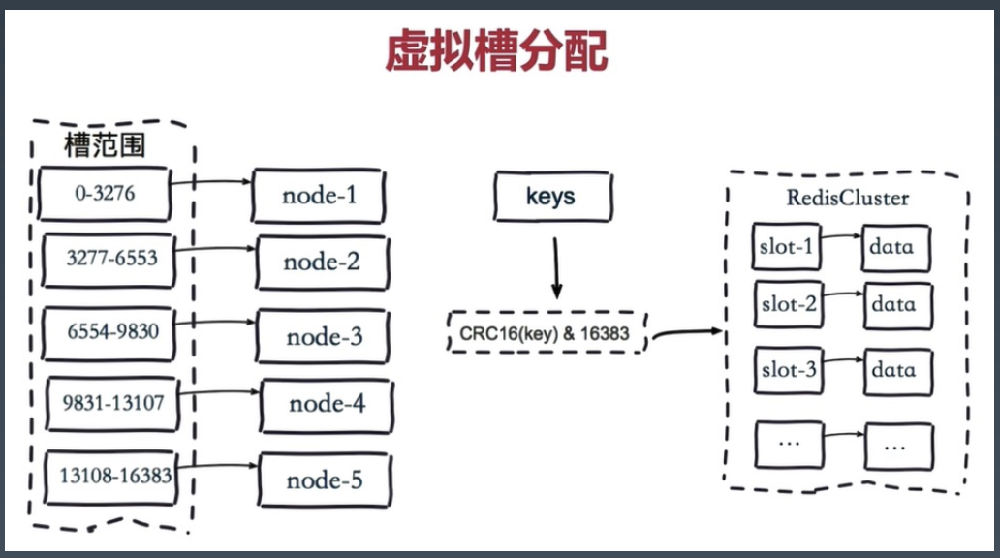
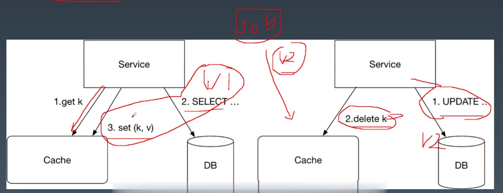
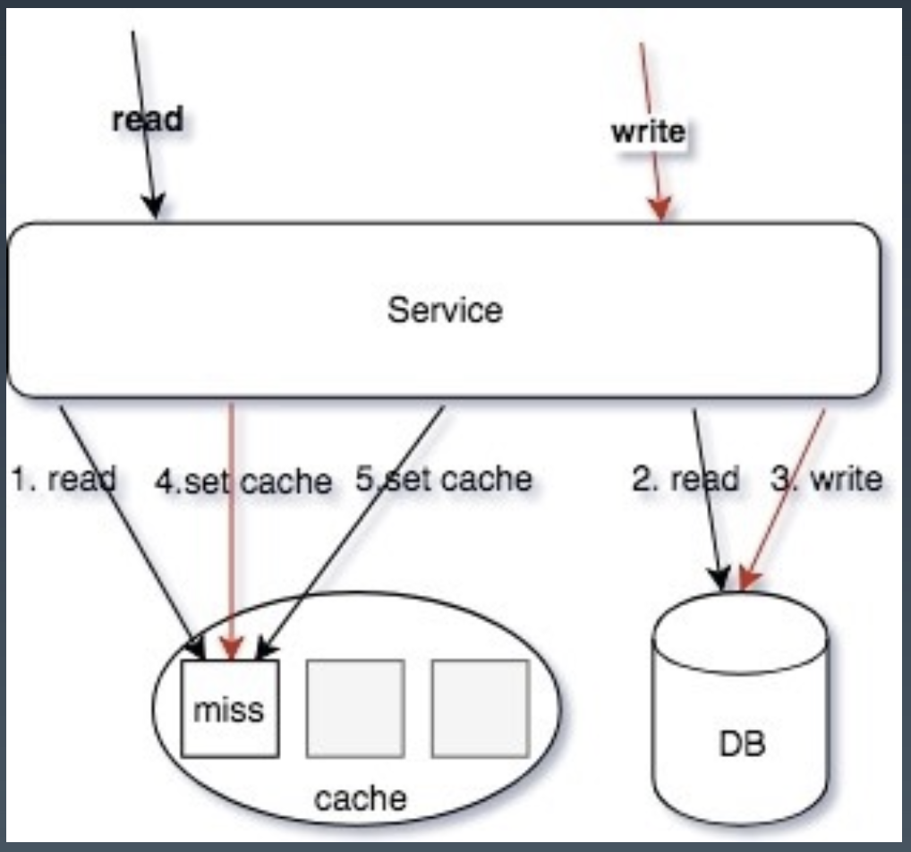
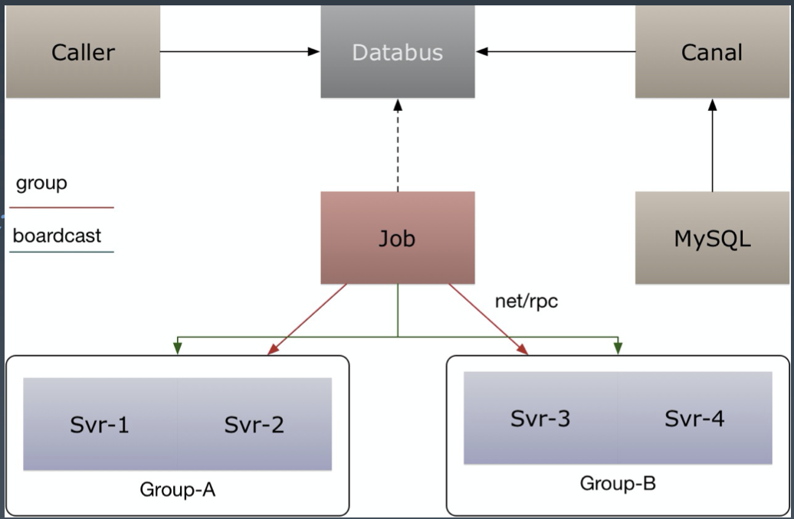

# **分布式缓存&分布式事务1**

 

# **0. INDEX**
- **1. 缓存选型**
    - **1.1. 缓存选型 - memcache**
    - **1.2. 缓存选型 - redis**
    - **1.3. Redis 和 Memcache 最大的区别**
    - **1.4. sharding 常用的方法**
    - **1.5. 缓存选型 - Slot**
- **2. 缓存模式 (套路，姿势)**
    - **2.1. 缓存模式 - 数据一致性**
    - **2.2. 问题**
    - **2.3. 缓存模式 - 多级缓存**
    - **2.4. 缓存模式 - 热点缓存**
    - **2.5. 缓存模式 - 穿透缓存 (之前讲过)**
- **3. 缓存技巧 - 小技巧**
    - **3.1. 缓存技巧 - redis 小技巧**
- **4. 课后问题**

 

# **1. 缓存选型**
##  **1.1. 缓存选型 - memcache**
> - **`缓存 存储 队列`核心中间件，这三个做的好的话任何公司问题都不会太大**

- **使用 memcache 作为`大文本` (redis 不适合存放大文本、大 value) 或者简单的 `kv 结构`使用**。

- **memcache 本身是`多线程`的，需要加锁去访问 cache**

- 以前 redis 是单线程的，近期 `io 线程`进行了分离, 双线程

 

# **1.2. 缓存选型 - redis**
- **redis 有丰富的数据类型，支持`增量方式` (`sorted set` 中已经有了部分数据是可以继续 `zadd` 加的) 的修改部分数据，比如`排行榜，集合，数组`等**。

> - 去看 `redis.io` 指令的技巧 例如怎么用 redis 做`限流`

- **比较常用的方式是使用 redis 作为`数据索引`**，比如评论的列表 ID，播放历史的列表 ID 集合，我们的关系链列表 ID。

- **redis 因为没有使用`内存池`，所以是存在一定的`内存碎片`的**，一般会使用 `jemalloc` 来优化内存分配，需要编译时候使用 jemalloc 库代 替 glib 的 malloc 使用。

> - **为什么 redis 有内存碎片**

 

## **1.3. Redis 和 Memcache 最大的区别**
- **redis `单线程` (新版本`双线程`)，memcache `多线程`**，所以 QPS 可能两者差异不大，但是`吞吐`会有很大的差别

- 比如`大数据 value` 返回的时候，redis qps 会抖动下降的的很厉害，大 key 的大 value 导致 redis 打爆 cpu 100%, 两个原因：
    
    1. value 太大

    2. `zrange` 一次取得条目太多了

    - **导致 cpu 主要耗在`数据条目的检索`和`构建 response 结构体`**，真正耗在 io 的时间非常少, 取数据越久，连接花的时间越久, 即便是`双线程`，**zrange 去条目数量较多的时候在构建 response 或检索的时候虽然 `io 线程`没有 padding, 但是`取数据`的那个线程 padding 了**，因为单线程工作，其他查询进不来 (新版本有不少的改善)。

- 所以建议`纯 kv` 都走 memcache，**比如我们的关系链服务中用了 `hashs` 存储`双向关系`，但是我们也会使用 memcache 挡一层来避免 `hgetall` 导致的吞吐下降问题**。

- 随着 `redis-cluster` 性能提升，memcache 可能会逐渐淘汰

- **`hashs` 适合存关注列表，field 存`用户 ID`，value 存`关系`** (关系列表：判断是好友关系、关注关系)

    - **比如一个场景要获取这个用户`所有关注的人`**, 比如 b 站动态，关注的 up 主发布的东西都要列出来

    - 如果关注的人有上千个，`hgetall` 的 redis 是有一些冲击的，可能导致吞吐下降，**所以 `hgetall zrange(0,-1)` 通常不建议使用, 因为可能获取的数据量非常大，可能有性能影响**

    - 参考了微博关系链的设计，**把 `hgetall` 全量的数据序列化以后回塞到 `memcache`, 双缓存，上面是 memcache, 下面是 redis，再下面是存储**

    - **memcache 用于获取`全部关注`**，value 不是特别大用 redis string 也可以

- 弹幕也是双缓存，**底层是 `redis list`, list 来构建弹幕池，肯定不能 list 全捞出来， 上层是 memcache**

 

## **1.4. sharding 常用的方法**
- 最常用的方法 -- `hash 求余`：**数据分片的 hash 方式也是这个思想，即按照数据的`某一特征` (key) 来计算哈希值，并将哈希值与系统中的节点建立映射关系**，从而将哈希值不同的数据分布到不同的节点上。

- 按照 hash 方式做数据分片，映射关系非常简单；需要管理的元数据也非常之少，**只需要记录节点的数目以及 hash 方式就行了**。

- 但是在加节点和删节点时，**哈希算法就需要考虑`单调性，均衡，抖动, 分散负载平滑`**

    - 当加入或者删除一个节点的时候，大量的数据需要移动。比如在这里增加一个节点 N3，因此 hash 方式变为了 mod 4。
    - 均衡问题：**原始数据的特征值分布不均匀，导致大量的数据集中到一个物理节点上**；第二，对于可修改的记录数据，单条记录的数据变大。

- **参考微信红包的写合并优化：**
    - 在网关层，使用`一致性 hash`，对`红包 id` 进 行分片，命中到某一个`逻辑服务器`处理（然后用`内存锁 mutex` 或 `singleflight` 单飞），**在进程内做`写操作的合并`，减少存储层的`单行锁争用` (否则都是争抢数据库`某行记录的行锁`，数据库的锁冲突，性能会很差)**。

- 但是一致性哈希有缺陷，有可能会导致`数据倾斜`，某一个节点的负载特别高，我认为更好的做法是 **有界负载一致性 hash**。

- 用 redis cluster 的一个原因：一致性 hash 不能满足需求

- **一致性 hash 是将数据按照`特征值`映射到一个首尾相接的 hash 环上，同时也将节点 (按照 IP 地址或者机器名 hash) 映射到这个环上**。

- 对于数据，**从数据在环上的位置开始，顺时针找到的第一个节点即为数据的存储节点**。

- 有界一致性哈希：**根据流量计算应该是在当前节点还是下一个节点，尽可能将相同 key 的命中到一个节点，如果存在最近的节点密集，就顺时针到下一个节点查找**

- https://writings.sh/post/consistent-hashing-algorithms-part-1-the-problem-and-the-concept

- 基本上把一致性哈希各种实现的算法都介绍了一遍, 各种不同的场景都可能用到

 

## **1.5. 缓存选型 - Slot**
- 高级玩法是抽象 slot，基于 Hash 的 Slot Sharding，例如 Redis-Cluster。
 
    

- **redis-cluster 把 16384 槽按照节点数量进行平均分配，由节点进行管理。有点像`二次的 sharding`，先找`槽`，再找`节点`，然后再`写数据`**。

    1. 把 16384 槽按照节点数量进行平均分配，由节点进行管理

    2. 对每个 key 按照 CRC16 规则进行 hash 运算

    3. 把 hash 结果对 16383 进行取余

    4. 把余数发送给 Redis 节点

    5. 节点接收到数据，验证是否在自己管理的槽编号的范围

        - 如果在自己管理的槽编号范围内，则把数据保存到数据槽中，然后返回执行结果

        - 如果在自己管理的槽编号范围外，则会把数据发送给正确的节点，由正确的节点来把数据保存在对应的槽中

- `slot sharding`，`集群运维`，还有 `master slave`，`主从自动切换`，都非常方便 (**当然主从一定不能保证一致的，有可能主写进去的一瞬间从挂掉了，可能会丢一点点数据**)，`master slave + slot sharding` 基本满足需求了。建议直接用 redis cluster

- redis cluster 原理看 ref (核心就是 slot sharding)。https://www.cnblogs.com/williamjie/p/11132211.html

 

# **2. 缓存模式(套路，姿势)**
## **2.1. 缓存模式 - 数据一致性**
- **`Storage` 和 `Cache` 同步更新容易出现数据不一致**。

    - **无论先`写 db` 再 `delete cache` 还是先`操作 cache` 再`写 db` 都有可能不一致**

    - **通常操作是先`操作 db` 再`操作缓存`**

- **模拟 `MySQL Slave` 做`数据复制`，再把消息投递到 Kafka，保证`至少一次消费`**:
    
    1. 同步操作 DB;

    2. 同步操作 Cache; （**如果失败了比如 `del 操作`，又会不一致，而且很麻烦，如果 key `过期时间`比较久，如果没有用户反馈（除非用户投诉），是不可能知道这个 key `什么时候过期`的。大概率会被用户投诉的**）

    3. 利用 Job 消费消息 (消费 mysql binlog)，重新补偿一次缓存操作 (要么 del 成功要么 update 成功)

- 这样保证最终一致。

- **为什么要做 2**：

    - **万一 job 消息队列挂了，或者 binlog 延迟，`缓存时效`得不到保证。既需要`同步操作`又需要`异步消费补偿`操作一次**。(不然可能一刷有数据，再刷就没数据)

- **大部分有 cache 的场景都是这样的写法**，内部每一个 `rpc service` 都对应一个 `job`，这个 job 都会做 cache 清理。

- 这种**固定的模式 binlog 回放写 cache 的操作**可以直接做成中间件，自动做掉。比如 facebook 

- **但是第三步做完还是可能不一致**。

    - Cache Aside 模型中，读缓存 Miss 的回填操作，和修改数据同步更新缓存，包括消息队列的异步补偿缓存，**都无法满足 “Happens Before”**，会存在相互覆盖的情况。(***要满足 happens before 一定要`有时序的谁先谁后`，明确说的清楚***)

- **为什么有了第三步仍然满足不了谁先谁后**

    

    1. v1 get key 产生 cache miss

    2. v1 去 db 里捞，捞到了

    3. v2 并发产生一个 update 行为，要把以前的数据 delete, delete 一个空 key, 因为还没回填

    4. v1 又要把老数据塞进去

    5. 假设再加上 job，job 的数据可能是 v2, 因为是 binlog 的数据, **`job` 和 `v1 set` `谁先谁后`不能保证，因为是两个时空**

        - **有可能 update 成功了 job 立马消费到这个消息，然后也 delete 一个空 key, 这时候 v1 的数据还是被塞进去了，无法满足 happens before**

- 读/写同时操作:

    

    1. 读操作，读缓存，缓存 MISS

    2. 读操作，读 DB，读取到数据

    3. 写操作，更新 DB 数据

    4. **写操作 `SET/DELETE` Cache (可 Job 异步 操作)**

    5. **读操作，`SET` 操作数据回写缓存 (可 Job 异步操作)**

    - 这种交互下，**由于 4 和 5 操作步骤都是`设置缓存`，导致写入的值`互相覆盖`；并且操作的`顺序性不确定`**，从而导致 cache 存在脏缓存的情况。

- 小改变 (读/写同时操作):

    1. 读操作，读缓存，缓存 MISS

    2. 读操作，读 DB，读取到数据

    3. 写操作，更新 DB 数据

    4. **写操作 `SET` Cache (可异步 job 操作，Redis 可以使用 `SETEX` 操作)**

    5. 读操作，**`ADD` 操作数据回写缓存** (**可 Job 异步操作，Redis 可以使用 `SETNX` 操作**)

    - 如果已经存在了，**说明已经有一个优先级更高的`写操作`在里面，key 已经存在，不会产生覆盖, `读的优先级比较低`，不能去覆盖别人**, job 可以用 setex，因为是最终一致的

- **写操作使用 `SET` 操作命令，`覆盖写缓存`; 读操作，使用 `ADD` 操作`回写 MISS 数据`**，从而保证`写操作的最新数据`不会被读操作的`回写数据`覆盖。保证同步操作缓存的操作和补偿操作 (job 消费 binlog) 的最终一致

 

## **2.2. 问题**
- 版本号解决：redis 是没有版本号的，memcache 可以用 cas, **redis 版本号要把它取出来序列化，不好搞**

- job 肯定要有的，**比如操作完 db 程序被 kill 了**

- job 回填失败呢：**`best effort` 努力送达，job 回填里面有些重要的场景是无限重试的，顶多搞个十几二十次都不成功再打个日志**

- **job 一定要兜底来一发**：还有一个小毛病，job 如果延迟了很久，有可能会 binlog 很多数据堆积，如果用 update 的逻辑，用户看到的数据，有可能一会又回退，一会又回到一个正常值，虽然最终一致 (job 最好用 delete, 用 set 的话的确会出现这个问题, 不是很好解决)。(binlog 延迟很少遇到过)

 

## **2.3. 缓存模式 - 多级缓存**

- 用户服务拆成 3 个

    - `account service` 组装 `member` `service` `vip` ...，errgroup 并发发三个 rpc，做个数据组装, **`1:N` 的 rpc 放大, latency 不能满足要求**，**这时候可以做一个`二级缓存`，把之前查出来的数据 cache 一份，miss 以后再去查下面服务** (服务间多级缓存)

> - **服务内多级缓存：`memcache + redis`，弹幕、关系链**

- **job 清理缓存时，不仅清理自己缓存，还要通知 `account service`**

- 最重要是保证多级缓存的一致性:
    
    - **清理的优先级是有要求的，先优先清理下游再上游;** (**若先清理 account, 产生一个 `cache miss`, 然后去读 member，读的数据是 `v1`, 然后去清理 member, 清理掉 `v1`, 这时候数据可能是 `v2`, 然后就读了一个`历史的数据 v1` 到 account 里**)

    - **下游的缓存 expire 要大于上游，里面穿透回源;** (上游 2 小时，下游 4 小时，**否则上游一 `cache miss`，下游一定`穿透`**, 一般是 `x2`，给他两个周期，让他有机会回源)

- 天下大势分久必合，适当的微服务合并也是不错的做法，一旦合并，迭代复杂性一定升高，**再使用 `DDD 思路`以及我们介绍的`目录结构`组织方式，区分不同的 Usecase**，写起来也不是那么不爽

 

## **2.4. 缓存模式 - 热点缓存**
- 对于热点缓存 Key，按照如下思路解决:
    
    - **小表广播**，从 `RemoteCache` 提升为 `LocalCache` 
        
        - (**数据量很小，不怎么更新，起一个 goroutine 定时扫 mysql 把数据全部缓存起来**)，App 定时更新，甚至可以让运营平台支持广播刷新 LocalCache

    - **多 Cluster 支持** 
        
        - (空间换时间的思路, **同一个 key 有`多个副本`, master 有一个副本，slave 有一个副本，多集群又有两个副本**，所以即便有热点，命中到某个 redis，几十万 qps 应该能扛很多很多, 因为 cluster 从节点也可以提供 read only 服务, 账号、稿件集群都有四五套集群，*2 后有很多 redis 节点，即便超热，也很难打死他);

- **建立多个 `Cluster` ，和`微服务`、`存储`等一起组成一个 `Region`。这样相当于是用空间换时间**:
    
- 清理缓存很麻烦

    
    
    - 同一个 key 在每一个 frontend cluster 都可能有一个 copy，这样会带来 consistency 的问题，但是这样能够 降低 latency 和提高 availability。**利用 `MySQL Binlog` 消息 anycast 到不同集群的某个节点清理或者更新缓存**

- **清缓存用 del 比 set 更好, del 操作的的确确是最安全的, `del 没有副作用`，删一次和删两次一样, 但是 `set 1` `set 2` 顺序无法保证时**

    - 当然 job 有兜底，`一下 v2 变 v1, v1 又变 v2`, 有点像 `aba` 的问题, 因为 `job 要有时间的`，**有可能 v2 先写进去，然后 v1 写进去，然后 job 重放一遍又写成 v2, del 就没这个问题**

- **del 的问题：热门主播，老是改房间名，就可能`大量 cache miss 穿透`，虽然做了 singlefly，仍然有风险**。需要做权衡

 

## **2.5. 缓存模式 - 穿透缓存 (之前讲过)**
- **singlefly**
    
    - **对关键字进行`一致性 hash`，使其某一个维度的 key 一定命中某个节点，然后在节点内使用互斥锁，保证归并回源，但是对于`批量查询`无解**;

- **分布式锁 (不建议这样写)**
    
    - **设置一个 `lock key`，有且只有一个人成功，并且返回，交由这个人来执行`回源操作`，其他候选者轮询 cache 这个 lock key**（goroutine sleep 几十毫秒再看看缓存在不在, 不在再去抢锁。不建议这样写），**如果不存在去读数据缓存，`hit 就返回`，`miss 继续抢锁`**;

- 队列 (**评论时讲过, 如果 miss，`single flight` 投到 kafka, 然后 kafka 消费这个 key 做缓存构建, 更复杂也更可靠**)
    
    - 如果 cache miss，交由队列聚合一个 key，来 load 数据回写缓存，对于 miss 当前请求可以使用 single flight 保证回源，如评论架构实现。
    
    - **适合`回源加载数据重`的任务，比如评论 miss 只返回 第一页，但是需要构建完成评论数据索引**。

- lease
    
    - 通过加入 lease 机制，可以很好避免这两个问题，**lease 是 64-bit 的 token，`与客户端请求的 key 绑定`，对于过时设置，在`写入时验证 lease`，可以解决这个问题；对于 thundering herd，`每个 key 10s 分配一次`，当 client 在没有获取到 lease 时，可以`稍微等一下再访问 cache`，这时往往 cache 中已有数据**。(**基础库支持 & 修改 cache 源码**); ------ facebook 论文 scaling memcache at facebook

- 一致性哈希，面试问，ref 五种实现算法, 五种工程中都用得到, 实际能带来很大收益

 

# **3. 缓存技巧 - 小技巧**
- 易读性的前提下，key 设置尽可能小，减少资源的占用，redis value 可以用 int 就不要用 string，对于小于 N 的 value，redis 内部有 shared_object 缓存 (只保存指针，减少内存空间，可以看下 redis 源码，关于 redis shard 缓存优化, (sort set 和 hashs 都有 ziplist 的压缩))。

- 拆分 key。主要是用在 redis 使用 hashes 情况下。同一个 hasheskey 会落到同一个redis 节点，hashes 过大的情况下会导致内存及请求分布的不均匀。考虑对 hash 进行拆分为小的 hash，使得节点内存均匀及避免单节点请求热点。(若某一个 hashs 无比的大，可以考虑 region sharding, 播放历史架构讲过，把 key 平摊到 n 个 hashs 里面去, 可以把热点打掉，同时一个 hashs 过大的话有可能有内存瓶颈的问题，抽奖时也讲过，也是 region sharding，把礼物分到 n 个列表里使用)

- 空缓存设置。**对于部分数据，可能`数据库始终为空`，这时应该设置空缓存，避免每次请求都缓存 miss 直接打到 DB**。

    - (可以存个空缓存，过期时间比较短，比如 10 秒钟, cdn 都会有这种保护，叫 404 保护, cdn 加速到源站，源站告诉他不存在，避免打爆 cdn 到源站的带宽)

- 空缓存保护策略。
    
    - (如果从 0 到无限大无限刷怎么办：两个做法：**1. key 加个特征算法，例如 youtube 的 url，内部有一个`转化算法`，随便枚举的话可能直接说这个 id `不合法 404`，规则不合法, 2. 如果刷接口，特征比较明显，直接封 ip**)

- 读失败后的写缓存策略 (降级后**一般读失败`不触发回写缓存`, 不然网络一抖动，缓存读失败，db 大概率读失败，缓存有可能存在，若抖动触发大量回填，反而雪上加霜**)。

- **序列化使用 `protobuf`，尽可能减少 size。不要用 json**

- 工具化浇水代码 (go generate 例如读缓存没有读 db)

 

## **3.1. 缓存技巧 - redis 小技巧**
- 增量更新一致性：`EXPIRE`、`ZADD/HSET` 等（**先用 expire 再用 zadd hset**），保证索引结构体务必存在的情况下去操作新增数据;

- BITSET: 存储每日登陆用户，单个标记位置 (boolean)，为了避免单个 `BITSET` 过大或者`热点`，需要使用 `region sharding`，比如按照 mid 求余 % 和 /10000，商为 KEY、余数作为 offset;

- List：抽奖的奖池、顶弹幕，用于类似 StackPUSH/POP 操作; (中奖有概率，概率刷掉的人直接返回，命中的人去 list 里 pop，全部去一个 list 有可能产生热点，可以用 `region sharding`，拆 100 个奖池，再用 `hash 算法`搞一搞，按用户 id 求个余)

- Sortedset：翻页、排序、有序的集合，**杜绝 `zrange` 或者 `zrevrange` 返回的集合过大**; (注意 score 是个 double 类型，会溢出)

- Hashs：过小的时候会使用压缩列表、过大的情况容易导致 rehash 内存浪费，也杜绝返回 `hgetall`，**对于小结构体，建议直接使用 `memcache KV`;**

- String：SET 的 EX/NX 等 KV 扩展指令，`SETNX` 可以用于分布式锁、`SETEX` 聚合了 SET+ EXPIRE;

- Sets：类似 Hashs，无 Value，去重等 (或者判断某人是否有某种关系，如果关系只有 0 和 1); 类似 go `map[string]struct{}`

- 尽可能的 PIPELINE 指令，但是避免集合过大;

- 避免超大Value;

 

# **4. 课后问题**
- kratos container/pool 连接池，参考了 database/sql pool 代码

- 2k 的 qps 算不小了

- **大部分业务场景都是用`事务消息`来做的，事务消息是什么呢，就是操作完 db，同时产生一条`消息凭证`，如果这个凭证能被下游另一个`跨服务的业务方消费到`，那么这个事务就是完整的**。但一般是异步的，不是同步的，同步是指两阶段提交，a 成功了 b 成功了接口才返回一定成功了。