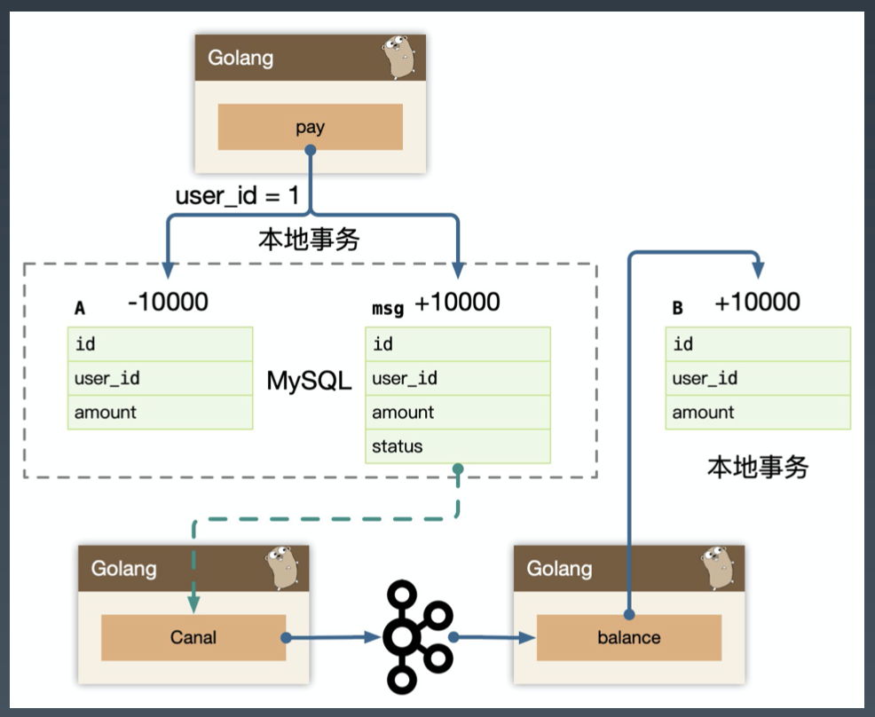
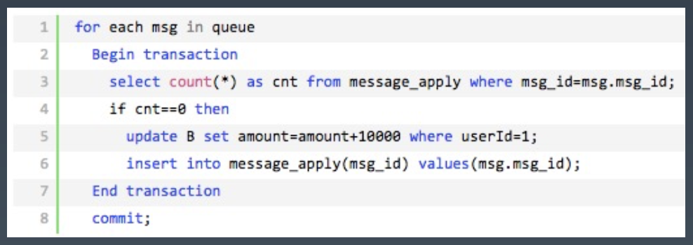

# **分布式缓存&分布式事务2**

<br>

# **0. Index**
- **1. 分布式事务**
    - **1.1. 分布式事务 - 事务消息**
        - **1.1.1. 如何可靠的保存消息凭证?**
    - **1.2. 分布式事务 - Best Effort**
    - **1.3. 分布式事务 - Transactional outbox**
    - **1.4. 分布式事务 - Polling publisher**
    - **1.5. 分布式事务 - Transaction log tailing**
    - **1.6. 分布式事务 - 幂等**
    - **1.7. 分布式事务 - 2PC**
    - **1.8. 分布式事务 - TCC**

<br>

# **1. 分布式事务**
- 讲到事务，又得搬出经典的转账问题了:

    - 支付宝账户表: A (id, user_id, amount) 

    - 余额宝账户表: B (id, user_id, amount)

- 用户的 user_id = 1，从支付宝转帐 1 万块到余额宝分为两个步骤:

    1. 支付宝表扣除 1 万:

        ```sql
        UPDATE A SET amount = amount - 10000
        WHERE user_id = 1;
        ```

    2. 余额宝表增加 1 万:

        ```sql
        UPDATE B SET amount = amount + 10000
        WHERE user_id = 1;
        ```

- 如何保证数据一致性呢?

- 单个数据库，我们保证 `ACID` 使用数据库事务。

- 随着我们系统变大，我们进行了微服务架构的改造，因为每个微服务独占了一个数据库实例，从 user_id = 1 发起的转帐动作，**跨越了两个微服务: `pay` 和 `balance` 服务**。

- 我们需要保证，`跨多个服务`的步骤`数据一致性`:
    
    1. **微服务 pay 的支付宝表扣除 1 万**;

    2. **微服务 balance 的余额宝表增加 1 万**;

- **每个系统都对应一个`独立的数据源`**，且可能位于不同机房，同时调用多个系统的服务很难保证`同时成功`，这就是`跨服务分布式事务`问题。

- **我们系统应该能保证每个服务`自身的 ACID`**，基于这个假设，我们`事务消息`解决分布式事务问题。

> - **一般都是先扣钱，不然先加钱，对方花掉了，然后扣钱的也花掉了，事务就不满足了**

<br>

## **1.1. 分布式事务 - 事务消息**
- 为什么他们要将`付钱`和`取货`两个动作分开呢? 原因很多，其中一个很重要的原因是为了使他们`接待能力增强` (`并发量更高`)。

- 只要这张`小票`在，你最终是能拿到炒肝的。同理转账服务也是如此。

- 当支付宝账户扣除 1 万后，我们只要生成一个`凭证 (消息)` 即可，这个凭证 (消息) 上写着“让余额宝账户增加 1 万”，**只要这个凭证 (消息) 能`可靠保存`**，我们最终是可以拿着这个凭证 (消息) 让余额宝账户增加 1 万的，**即我们能依靠这个凭证 (消息) 完成`最终一致性`**。

<br>

### **1.1.1. 如何可靠的保存消息凭证?**
- 要解决消息可靠存储，我们实际上需要解决的问题是，**本地的 `mysql 存储`和 `message 存储`的一致性问题**。

- 套路：
    
    - Transactional outbox (**事务投递箱，`本地消息表`，message 怎么存**)

    - Polling publisher (从原始生产方去拖这个消息)

    - Transaction log tailing (`binlog` 订阅)
    
    - 2PC Message Queue (利用消息队列的中间件，`两阶段提交`，保证`数据库`和`消息队列`是`二阶段提交`)

- **事务消息一旦被`可靠的持久化`，我们整个分布式事务，变为了`最终一致性`**，消息的消费才能保障最终业务数据的完整性，**所以我们要尽最大努力，把消息送达到下游的业务消费方，称为: `Best Effort`**。

- **只有消息被消费，整个交易才能算是完整完结**。(事务消息属于 best effort 的一种模式)

<br>

## **1.2. 分布式事务 - Best Effort**
- 即尽最大努力交付，主要用于在这样一种场景: **不同的`服务平台`之间的`事务性`保证**。

<br>

## **1.3. 分布式事务 - Transactional outbox**
- `Transactional outbox` 本地消息表，支付宝在完成扣款的同时，同时记录消息数据，**这个`消息数据`与`业务数据`保存在同一数据库实例里** (消息记录表表名为 msg)。

    ```sql
    BEGIN TRANSACTION
        UPDATE A SET amount = amount - 10000 WHERE user_id = 1;
        /*一般支付业务都有流水表，msg 的字段流水表都有*/
        INSERT INTO msg(user_id, amount, status) VALUES (1, 10000, 1); 
    END TRANSACTION 
    COMMIT ;
    ```

- **上述事务能保证只要支付宝账户里被扣了钱，消息一定能保存下来**。**当上述`事务提交成功`后，我们想办法将此消息通知`余额宝`**，余额宝处理成功后发送回复成功消息，支付宝收到回复后删除该条消息数据。

<br>

## **1.4. 分布式事务 - Polling publisher**
- `Polling publisher`，**我们定时的`轮询 msg 表`，把 `status = 1` 的消息统统拿出来消费**，可以按照自增 id 排序，保证顺序消费。**在这里我们独立了一个 `pay_task` 服务，把拖出来的消息 `publish` 给我们消息队列，`balance 服务`自己来消费队列，或者直接 `rpc 发送`给 balance 服务**。

- 实际我们第一个版本的 archive-service (稿件服务) 在使用 CQRS (包括事件投递) 时，就用的这个模型，Pull 的模型，**从`延迟`来说不够好，Pull 太猛对 Database 有一定压力，Pull 频次低了，延迟比较高**。（**拖的模型，`把数据拖回来`，不是特别好**）

<br>

## **1.5. 分布式事务 - Transaction log tailing**
- `Transaction log tailing` (**操作完 message 表一定有一个 `binlog`, `push 的模型`, 订阅完 binlog 的时候立马就可以流式消费掉，消费到之后`投到消息队列`或`直接通知`这个 balance 服务**)

- **上述保存消息的方式 (msg 表) 使得`消息数据`和`业务数据`紧耦合在一起**，从架构上看不够优雅，而且容易诱发其他问题。

- **延迟比较好，而且是比较解耦的，有一些业务场景自带这类 message 表**，比如订单或者交易流水，**可以直接使用这类`流水表`作为 `message 表`使用**，**不一定非要搞 `msg`，耦合的很厉害**

    

- 使用 canal 订阅以后，是实时流式消费数据，**在消费者 balance 或者 balance-job 必须努力送达到（只有 `balance 本地事务操作成功`，才能认为消费成功）**。

<br>

## **1.6. 分布式事务 - 幂等**
- 还有一个很严重的问题就是消息`重复消费`，如果相同的消息被重复消费两次，那么我们余额宝账户将会增加2万而不是1万了。

    - 先取消息，然后再加 10000, 然后再 ack, 若重启，一定会多消费一次，加 20000

    - 先取消息，立马 ack，然后再加 10000，ack 后挂了又会丢消息

> - **要保证`至少一次`消费，`至多一次`消费**

- 解决：

    - **全局唯一ID（消息）+去重表 (看图)**

        

    - **在余额宝这边增加消息`应用状态表 msg_apply`，通俗来说就是个`账本`，用于记录消息的`消费情况`**，每次来一个消息，在真正执行之前，先去消息应用状态表中查询一遍，**如果找到说明是`重复消息`，丢弃即可，如果`没找到才执行`，同时插入到消息`应用状态表`** (同一事务)。

    - 例如：**app store 的`回执是合法的`而且对应的`订单 id 不是已处理的`**，就处理，不然就跳过

<br>

## **1.7. 分布式事务 - 2PC**
- 两阶段提交协议 (Two Phase Commitment Protocol) 中，涉及到两种角色
    
    - **一个事务协调者** (coordinator): 负责协调多个参与者进行事务投票及提交 (回滚)

    - **多个事务参与者** (participants): (支付宝数据库和余额宝数据库) 即本地事务执行者

- 过程：

    1. `start` 开启事务

    2. `prepare` 锁这条记录

    3. 两个参与者是否`都执行成功`

    4. `commit`

- `9 次网络交互`

- **大部分业务用的都是 `binlog`, `transaction log tailing`, 并没有需要同步去操作两个人`同时成功`**

- **2pc 是`同步逻辑`，扣款成功，去查余额，一定有钱在，因为是个同步逻辑, binlog 是`异步逻辑`，大部分场景异步逻辑都是可接受的**

- **`异步逻辑`能不能做到很好的体验？**
    
    - **扣钱扣完了发个消息，`消费者`一旦处理完了 `push 一个消息回来` (callback)，app 收到这个通知之后立马把`状态一刷`, 体验也差不多**

<br>

## **1.8. 分布式事务 - TCC**
- TCC 是 `Try、Confirm、Cancel` 三个词语的缩写，TCC 要求每个分支事务实现三个操作：预处理 Try、确认 Confirm、撤销 Cancel。

- 业务代码中一次都没用过

- 大部分场景完全是靠 mysql 一张表订阅去消费的。
    
    - 有个坏处，大部分场景没什么问题。**但是当一张表搞不到`完整的需要的数据`的时候，又要订阅这张表的时候再 `join` 其他的表或调其他的服务，把数据构建完整了再去消费，非常麻烦**。

- 当时两个解决方法：

    - **比方有三张表，选一张`主表作为订阅表`，再把其他的数据 `join` 出来**
    - 同时订阅这三张表在`内存里做 join`，当这三张表的数据都来了之后逻辑再往下推