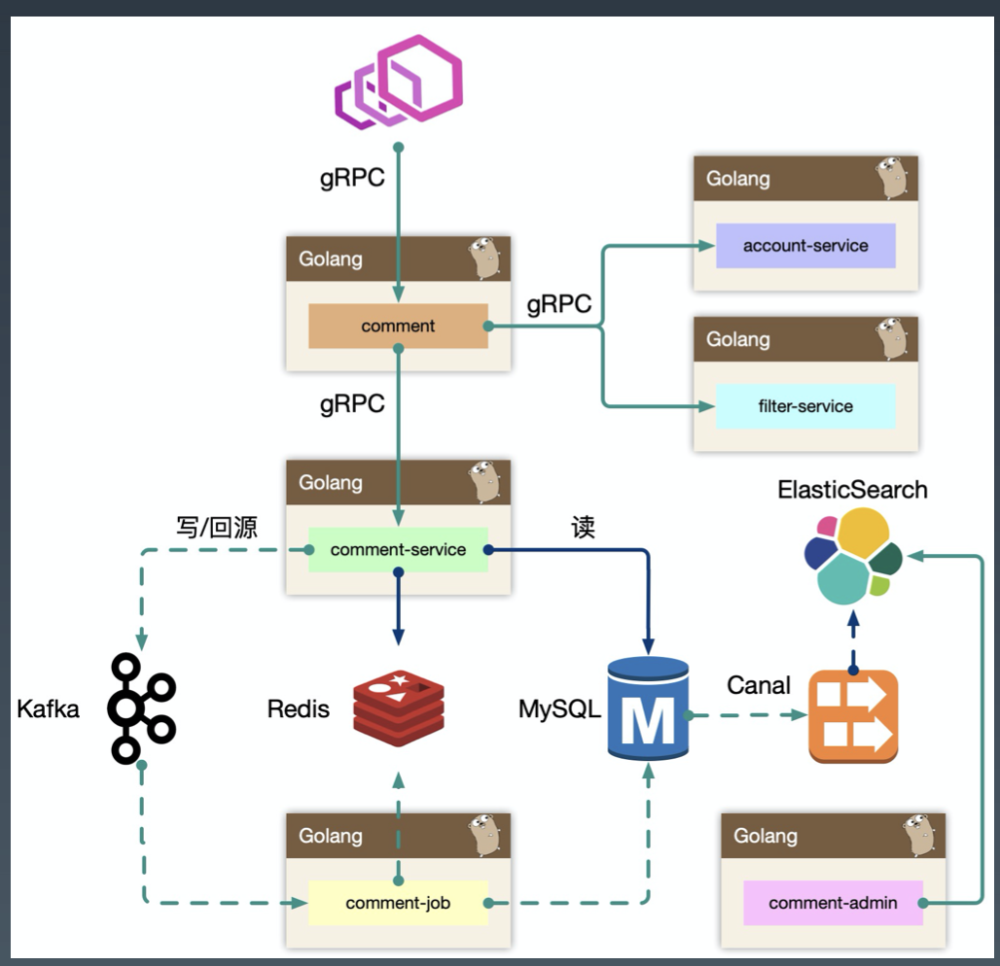
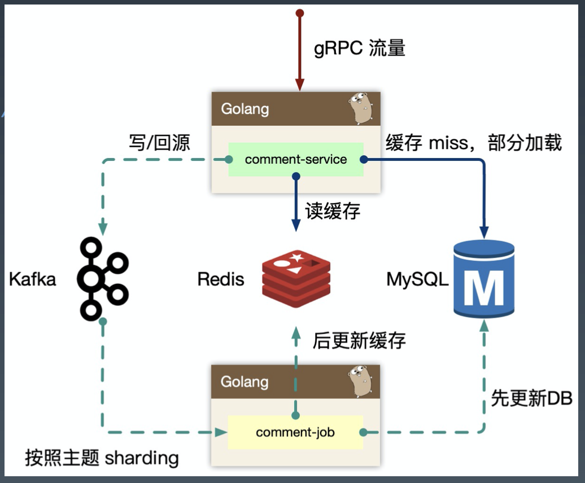
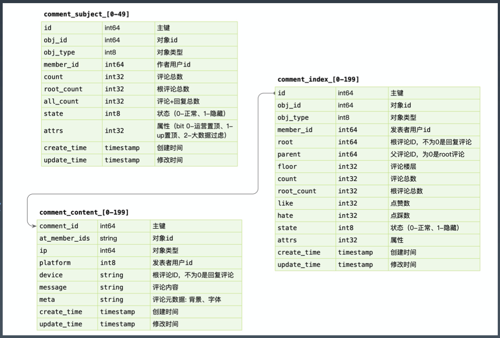

# **评论系统架构设计**

 

# **0. Index**
- **1. 功能模块**
    - **1.1.  架构设计 - 概览**
    - **1.2. 架构设计 - comment-service (读逻辑)**
        - **1.2.1. 缓存不存在再去数据库里捞的一个坑**
        - **1.2.2. 解决办法：**
    - **1.3. 架构设计 - comment-service (写逻辑)**
    - **1.4. 架构设计 - comment-admin**
    - **1.5. 架构设计 - comment**
- **2. 存储设计**

 

# **1. 功能模块**
> - 评论系统，高频的写入和读取
> - 15 年到现在架构基本上没变，都是加一些东西
> - **贫民架构**：**内部的基础设施都不好用，架构就比较重要了**

- **架构设计最重要的就是理解整个产品体系在系统中的定位**。搞清楚系统背后的背景，才能做出最佳的设计和抽象。不要做需求的翻译机，先理解业务背后的本质，事情的初衷。

> - **理解业务的本质，有一些产品 sense**
> - 技术只是基本功，内功要看综合能力

- 评论系统，我们往小里做就是视频评论系统，往大里做就是评论平台，可以接入各种业务形态。
> - 做系统时多问运营产品，把一些通用功能抽象掉，在满足业务前提下，尽量多做抽象

- **功能：**

    - 发布评论:支持回复楼层、楼中楼。

    - 读取评论:按照时间、热度排序。

    - 删除评论:用户删除、作者删除。

    - 管理评论:作者置顶、后台运营管理(搜索、删除、审核等)。

> - **在动手设计前，反复思考，真正编码的时间只有 5%**。想的不清不楚就动手绝对是给自己挖坑
> - 通常做架构的时候先把全局的大的模块画出来，每个服务之间的数据流向
> - jeff dean **设计的好的架构应该可以在一个信封上画出来**
> - **微服务其实就是 `soa` 的一种最佳实践**

 

## **1.1.  架构设计 - 概览**
> - bff 按业务逻辑编排组装不同的服务

- `BFF: comment`

    - 复杂评论业务的服务编排，比如访问`账号服务`进行等级判定，**同时需要在 BFF `面向移动端/WEB 场景`来设计 API**
    
    - 这一层抽象把评论的本身的内容列表处理 (加载、分页、排序等) 进行了隔离，**关注在`业务平台化逻辑`上**。

- `Service: comment-service`

    - 服务层，去平台业务的逻辑，**专注在`评论功能`的 API 实现上**，比如发布、读取、删除等，**关注在`稳定性、可用性`上**
    
    - **这样让上游可以灵活组织逻辑把`基础能力`和`业务能力`剥离**。(**剥离`平台功能`和`读写功能`**, 能够过安全稳定的提供服务的数据, 海量并发的写，海量并发的读)

    

> - 密集的写瓶颈一定是在有状态的那一层
> - 上层如何解决写密集的瓶颈：错峰

- `Job: comment-job`

    - 消息队列的最大用途是消峰处理，

> - 在 mysql 没有很牛逼（像各种公司都有 rds，各种分布式数据库），**通过 job 用一个很贫民的架构也能搞定海量的并发请求**

- **mysql 使用的误区**：

    - 运营后台一般都有很复杂的查询操作。很容易犯的一个大错，就是把 mysql（**mysql 是 oltp 联机事务处理型数据库，面向线上的数据库**）有些人拿他做分析如 group by 求一些报表，其实不合适。
    
    - 有可能用 mysql 做主从，从库提供分析能力。如果是对主库做 group by 比如看今天多少条评论，就是个大查询，整个打过去 mysql 可能就挂了。

    - 搜索经常犯的错：搜索一般都是多条件的，各种条件组合，and, or，**对于 oltp 数据库无论建什么索引都无法搜的很快的, 很难把索引建的好的，因为是各种组合条件的交叉**。mysql 索引是 prefix。abc 索引, 只搜 cb, a 就无法使用，必须是 a, b 同时存在。

    - **解决方法**：用 `canal binlog` 订阅，然后将数据投放到 `elastic`，然后管理后台基于 `elastic` 进行一些搜索的功能，找到`主键`之后再去操作 redis mysql

- 整个评论服务还会依赖一些外部 gRPC 服务，统一的平台业务逻辑在 `comment BFF` 层收敛，这里 `account-service` 主要是账号服务，`filter-service` 是敏感词过滤服务。

> - **架构设计等同于数据设计**，梳理清楚数据的走向和逻辑。尽量避免环形依赖 (a -> b, b -> a 又叫数据的双向请求)、数据双向请求等。

 

## **1.2. 架构设计 - comment-service (读逻辑)**
- **comment-service，专注在评论数据处理** (认真想下 `Separation of Concerns`)。

- 我们一开始是 `comment-service` 和 `comment` 是一层，业务耦合和功能耦合在一起，非常不利于迭代，

- 当然在设计层面可以考虑`目录结构`进行拆分，但是架构层次来说，迭代隔离也是好的。

- `cache aside` 模式, 先读缓 cache，miss 再去 mysql 加载, 非常 easy 的处理缓存的逻辑
> - **缓存里最复杂的还是缓存的一致性处理** (8, 9 课)

- 当缓存抖动时，特别容易引起集群 `thundering herd` 现象，大量的请求会触发 `cache rebuild`，因为使用了预加载，容易导致服务 OOM。

 

### **1.2.1. 缓存不存在再去数据库里捞的一个坑**
- `cache rebuild`: 

    - 一个评论列表有几千几万条评论，cache miss 了去数据库里捞出来, 全量捞出来，利用了 `errgroup` 批量往 redis 里去塞，其实这个`批量回塞`，用户读 redis 时已经有可能是不一致的。**redis 一个列表如果后面的先插入前面的后插入整个顺序就乱了**。
    
    - 但是如果不并行插入 redis, 用 `pipeline` 原子指令，**pipeline 那个集合很大也有可能把 redis 打死**。就只能用一个 for 循环，第一页第二页的搬进去。也会有问题，比如用户一下刷到第十页，正好也搬到第十页，一刷没数据，再刷就有数据了。
    
    - 一个坑：
        
        - 如果一个大批数据 load 进来，如果一个热门评论导致 redis 一抖动 (做系统时不能假设任何组件一定不出问题)，redis一抖动，**很多人就超时，然后就会`去数据库捞数据`**
        
        - 这时候如果回捞回触发两个问题，**一是很多人去回捞数据，然后这些数据都在 `go 进程`里面，这时候内存一定会暴涨，cache 抖动的期间`服务特别容易 oom 掉`**。做大量回捞操作时，无论时批量回塞还是顺序回塞，内存占用都是很高的。
        
        - **又做了一个优化，只捞第一页第二页的数据**。但是如果 redis 抖动，很多人做回捞行为，内存的抖动是非常大的，所以不适合这样做。

    - 换了一个思路：**为什么回填不只填 miss 的那一页呢**。`linux read ahead` 预读：即预读，用户访问了第一页，很有可能访问第二页，**所以缓存会超前加载**，避免频繁 cache miss。
    
    - 但是依然有问题，读第一页很可能读第二页，因此不仅会填第一页，还会填第二页第三页第四页，**填少的话用户读第二页又会 cache miss 又会回捞 mysql 导致 mysql 压力大，填多了有可能 cache 一抖动就 oom**。那怎么办。

 

### **1.2.2. 解决办法：**

- **为什么回源到 kafka**：

    - **如果回源是往 kafka 发一条指令性的 message，指令告诉下游的 `comment job` 上游的 `comment service` 发生了一次 cache miss，然后 job 去做 `rebuild cache`**。这时候顶多是大量的消息涌到 kafka，kafka 一般都能扛住，这时候就可以在 comment job 里面再去 mysql 回捞数据填到 redis。

- **为什么 `comment job` 不会被打死**：

    - 因为 `comment job` 消费 kafka 时是串行消费的，kafka 的模型是有主题 topic 概念的，一个 topic 下面好多 partition，一个 comment job 可能消费一个两个 partition，不会被海量的消息打过来，**而是操作一次再处理下一个消息**。

- **comment job 如何处理重复消息**：

    - 发现重复的 key 就丢弃掉。
    
- 但是 cache miss 后发消息去处理缓存，**当前还是查询 mysql**，虽然 mysql 会有一些压力，但是 job 收到消息后会第一时间重建缓存.

- 最终相当于用一个回源的逻辑来解决 cache miss。

> - **linux 或一些系统，架构设计本身上都是大差不差的**。比如 cache miss 的思路，比如 linux mlock 2G 内存，那这个 2G 内存是不是与物理内存一定产生映射关系呢
> - 什么是`缺页中断`？(**本质上也是一个 cache miss, 其实套路都一样**)

 

## **1.3. 架构设计 - comment-service (写逻辑)**
> - 读的瓶颈一般在 cache 层，写的瓶颈一定在存储层，或者有状态层。

- **为什么 kafka 可以削峰**：
    
    - Kafka 是存在 partition 概念的，可以认为是物理上的一个小队列，一个 topic 是由一组 partition 组成的，所以 Kafka 的吞吐模型 (优势) 理解为: `全局并行，局部串行`的生产消费方式。**为了吞吐牺牲了`全局串行`的能力, 但是某种意义下不需要全局串行**
    
    - 处理方法：对于入队的消息，可以按照 `hash(comment_subject) % N(partitions)` 的方式进行分发。那么某个 partition 中的评论主题的数据一定都在一起，这样方便我们串行消费。

    - **同样的，我们处理回源消息也是类似的思路**。

- 有了这样一个模型，如果 mysql 存在瓶颈，comment job 写 mysql 一定会变慢。变慢以后每一次消费的间隔变长，也意味着吞吐能力下降。一个建议：要判断消息队列下游消费者有没有瓶颈，就看它 cpu 有没有满载。(**满载意味着下游没有瓶颈？**) 

- **消息处理不过来堆积在 kafka，这种现象为`消息反压`**。因为吞吐能力上不去。kafka 是落磁盘的，有堆积能力，最终数据不会丢，**但是是牺牲了当前的`写一致性`, 但是反压是对系统的一种保护**。但是这种情况出现一般比较少。**如果 mysql 出现瓶颈的话，不是很好扩容，还是找到有没有大 sql，或者物理机有没有问题**。

- **`削峰`、`大量使用缓存`在读写比差不多 `10:1` 的情况下一般是能满足的**。这就是架构的能力

- **能不搞 mysql 的 `sharding`, `分库分表`，尽量不要搞**，除非公司能力很强大，有 `sharding` 的能力
    
    - 类似淘宝的 `ttdl` 在`客户端 sharding`, 网易的 `ddb` 支持 `proxy sharding`, 或者阿里的 `rds` 支持 `db proxy sharding`，中间件很强大可以这样搞。**但是如果架构设计的好一般不会遇到这种瓶颈，因为天然知道大概的吞吐情况是什么样的**。

 

## **1.4. 架构设计 - comment-admin**
- **mysql `binlog` 中的数据被 `canal 中间件`流式消费，获取到业务的`原始 CRUD 操作`，需要回放录入到 es 中**，但是 es 中的数据最终是面向运营体系提供服务能力，需要检索的数据维度比较多，在入 es 前需要做一个`异构的 joiner`，把单表变宽预处理好 `join 逻辑`，然后倒入到 es 中。

- 一般来说，运营后台的检索条件都是组合的，**使用 es 的好处是避免依赖 mysql 来做`多条件组合检索`，同时 mysql 毕竟是 oltp 面向线上联机事务处理的**。

- 我们内部运营体系基本都是基于 es 来完成的。

 

## **1.5. 架构设计 - comment**
- **comment 作为 `BFF`，是`面向端`，`面向平台`，`面向业务组合`的服务**。所以平台扩展的能力，我们都在 comment 服务来实现，**方便统一和准入平台，以`统一的接口`形式提供平台化的能力**。

    - 依赖其他 gRPC 服务，**整合`统一平台侧`的逻辑** (比如发布评论用户等级限定)。

    - 直接向端上提供接口，提供数据的读写接口，甚至可以整合端上，提供统一的端上 SDK。

    - **需要对`非核心依赖`的 gRPC 服务进行`降级`**，当这些服务不稳定时。

 

# **2. 存储设计**
> - **贫民架构：不需要很牛的组件，也能写出很靠谱的系统**
> - 所有说 mysql 几十亿就扛不住的，都是不懂 mysql 的。**mysql b-tree 索引，查询看`层数`的，根本不看数据量**，几十亿小 case，单库几百个 g 检索都不是大问题。
> - (mysql 48 核 128 G)
> - 回填缓存不是 `comment service` 做而是 `comment job` 做。因为回填操作占内存, **`comment service` 核心是要处理 rpc 请求**，`comment job` 是一条一条做不会一下内存打爆，**简单实用，贫民架构**
> - 如果没有 canal, **其实就是基于 mysql 的 `m time` 修改时间，定期增量回填到 es**，**不能用 `push` 就用 `pull`，`定期轮询`一下 mysql，根据里面的`修改时间`，回填 es**

- 核心三张表，`comment_subject` 主题表
    
    - **能用 `int8 (1 个字节)` 就不用 `int32(4 个字节)`**

    - count root_count ... 把`数量预存`，不用每次都 `count(*)`, 只需要事务更新一下

    - attrs 属性（类似`权限位 bit 位`）可同时有多种属性

    - 每一张表都会有 `create time` 和 `update time`

    - **每张表都会有`自增主键`**。

        - **mysql 必须内部是`有序`的**，**mysql `写核心的优化`，一定要是`顺序写入` mysql，不要不顺序写，会导致 b tree 因`数据平衡`而分裂**，一个 16K 的 (data page) 页，**`数据乱序写`会导致`数据搬来搬去`，导致`各种 IO`**。主键非常重要

> - **每个索引都会有一个`主键 id` 或 row id (没主键时), 在根据`主键 id` 再查一次 (`bookmark search`)，有成本的**。
> - **主键就是一步到位, `叶子结点整条行记录`**。      

- **`comment_object (0 - 49)` 就是 `sharding` ，预分配，现在都没再拆过**。

- **为什么`索引表`和`评论内容表`分开**：

    - **mysql 一个 `data page 16k`**, 如果一行评论占 8k，两行就 16k，一个 data page 就存两行，**mysql 的`基本 io 单元`是 data page, 一个 io 下去就捞出来两行数据。一百个评论就要一百次 io**。
    
    - 先把索引列表捞出来，一行 index 数据也就 100 个字节不到, 一个 data page 存好多行，**一次 io 就可以捞出几百行 index 表数据出来**, **然后再用`点查(kv)`查需要的字段**

> - **拆了 100 张表如何保证自增 id 不重： `snowflake` 发号器**

- comment_content 与 comment_index 对应，comment_id 对应 content_index 的 ID。**为什么不用自增主键**

    - 因为额外增加一个 `unique index` 做 `comment id`, 与 `comment index` 关联查询时，会有一个类似 `bookmark search` 的过程。**主键递增怎么解决，`发号器`保证递增**。

- **comment content 类似一个 `kv 查询`的场景**，可以不在事务里面，先写 content, 再写 index 和 subject。**因为`纯 kv 内容`的表更适合 `tiKV` `rocks db` 去存**。**`索引`用 mysql 存**。

    - **先写 content 不在事务里面，事务越大阻塞越久**。先写 content 万一失败了，顶多 content 多个 `ghost 数据` (脏数据)。

- **`并发更新` count 先 `select` 再 `update` 时如何保证一致性**：
    - **必须`串行化读`，mysql 事务实现串行化读必须用 `select for update`** (`hold lock` 操作，只有一个人能拿到这个锁)

> - mysql explain 不要出现 `filesort`，**因为 `filesort` 是需要额外在内存里排序，内存空间不够还要搞个 `temple table` 落盘在盘里面排序**。是有成本的。

> - **建索引是 where 后的加 `order by` 后的能去掉 `filesort` 排序符。sql 里只有 `using where using filter` 基本上是比较快的**。