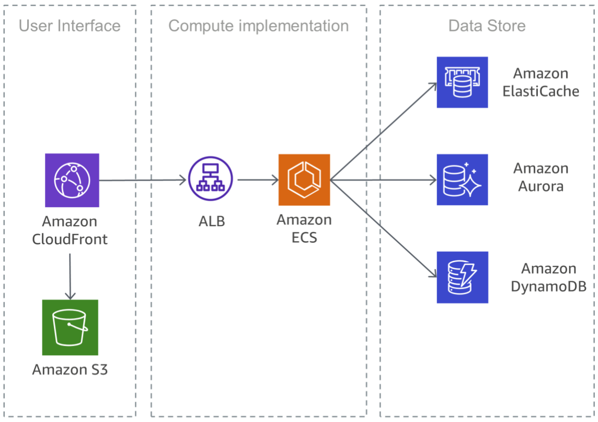

ref: 
- https://explore.skillbuilder.aws/learn/lp/84/developer-learning-plan
- https://d1.awsstatic.com/training-and-certification/ramp-up_guides/Ramp-Up_Guide_Developer.pdf

# **Introduction**
Microservices architectures are not a completely new approach to software engineering, but rather a combination of various successful and proven concepts such as:
- **Agile software development**
- **Service-oriented architectures**
- **API-first design**
- **Continuous integration/continuous delivery (CI/CD)**

Serverless is defined as an operational model by the following tenets:
- **No infrastructure to provision or manage**
- **Automatically scaling by unit of consumption**
- **Pay for value billing model**
- **Built-in availability and fault tolerance**

# **Microservices architecture on AWS**
A typical microservices application on AWS

In many cases, **design patterns of the Twelve-Factor App are used for microservices**.

## **User interface**
Modern web applications often use JavaScript frameworks to implement a single-page application that communicates with a representational state transfer (REST) or RESTful API. 

**Static web content** can be served using `Amazon Simple Storage Service (Amazon S3)` and `Amazon CloudFront`.

## **Microservices**
APIs are the front door of microservices

APIs accept and process calls from clients, and might implement functionality such as **traffic management, request filtering, routing, caching, authentication, and authorization**.

### **Microservices Implementation**
AWS has integrated building blocks that support the development of microservices. Two popular approaches are using `AWS Lambda` and Docker containers with `AWS Fargate`.

`AWS Fargate` is a **serverless compute engine** for containers that works with both `Amazon ECS` and `Amazon EKS`.

A common approach to reduce operational efforts for deployment is container-based deployment. **The learning curve with containers can be steep and you have to think about security fixes for your Docker images and monitoring**. 

`Amazon Elastic Container Service (Amazon ECS)` and `Amazon Elastic Kubernetes Service (Amazon EKS)` eliminate the need to **install, operate, and scale your own cluster management infrastructure**.

With API calls, you can launch and stop Docker-enabled applications, query the complete state of your cluster, and access many familiar features like **security groups, Load Balancing, `Amazon Elastic Block Store (Amazon EBS) volumes`, and `AWS Identity and Access Management (IAM)` roles**.

`Amazon ECS` supports **container placement strategies** and constraints to customize how Amazon ECS places and ends tasks.

`Amazon EKS` runs up-to-date versions of the open-source Kubernetes software, so you can use all the existing plugins and tooling from the Kubernetes community.

Docker images used in `Amazon ECS` and `Amazon EKS` can be stored in `Amazon Elastic Container Registry (Amazon ECR)`. Amazon ECR **eliminates the need to operate and scale the infrastructure required to power your container registry**.

### **Private Links**
`AWS PrivateLink` is a highly available, scalable technology that enables you to **privately connect your virtual private cloud (VPC) to supported AWS services**, services hosted by other AWS accounts (VPC endpoint services), and supported AWS Marketplace partner services.

Private links are a great way to **increase the isolation and security of microservices architecture**. A microservice, for example, could be deployed in a totally separate VPC, fronted by a load balancer, and exposed to other microservices through an AWSPrivateLink endpoint. 

## **Data Store**
The data store is used to persist data needed by microservices. **Popular stores for session data are in-memory caches such as Memcached or Redis.** AWS offers both technologies as part of the managed `Amazon ElastiCache` service.

Putting a cache between application servers and a database is a common mechanism for **reducing the read load on the database**, which, in turn, may **enable resources to be used to support more writes**. Caches can also **improve latency**.

AWS offers six relational database engines (Microsoft SQL Server, Oracle, MySQL, MariaDB, PostgreSQL, and Amazon Aurora) as managed services through `Amazon Relational Database Service (Amazon RDS)`.

**Relational databases**, however, **are not designed for endless scale**, which can make it difficult and time intensive to **apply techniques to support a high number of queries**.

**NoSQL databases** have been designed to **favor scalability, performance, and availability over the consistency of relational databases**. One important element of NoSQL databases is that they typically don’t enforce a strict schema. Data is distributed over partitions that **can be scaled horizontally and is retrieved using partition keys**.

You can use `Amazon DynamoDB` to create a database table that can store and retrieve any amount of data and serve any level of request traffic. DynamoDB delivers single-digit millisecond performance, however, there are certain use cases that require response times in microseconds. 

`Amazon DynamoDB Accelerator (DAX)` provides caching capabilities for accessing data.

DynamoDB also offers an automatic scaling feature to dynamically adjust throughput capacity in response to actual traffic.