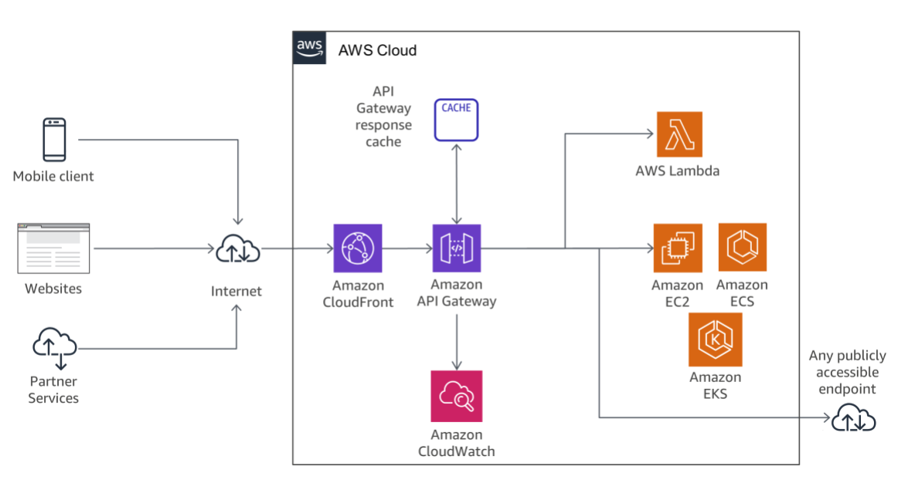
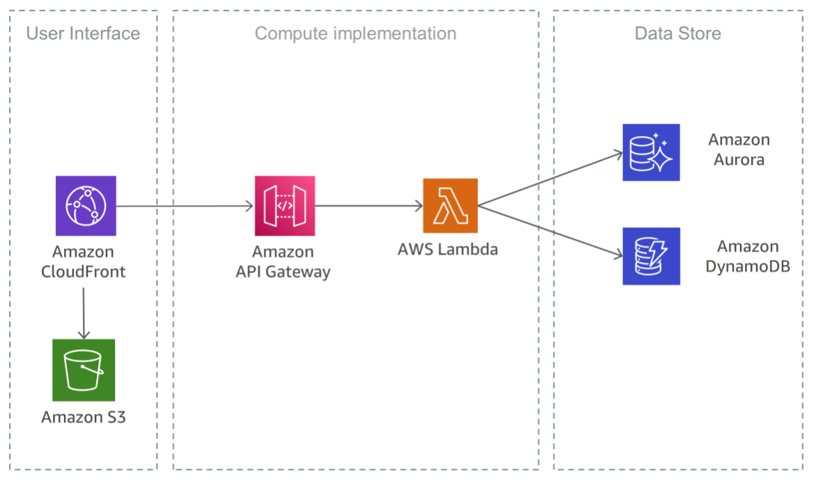
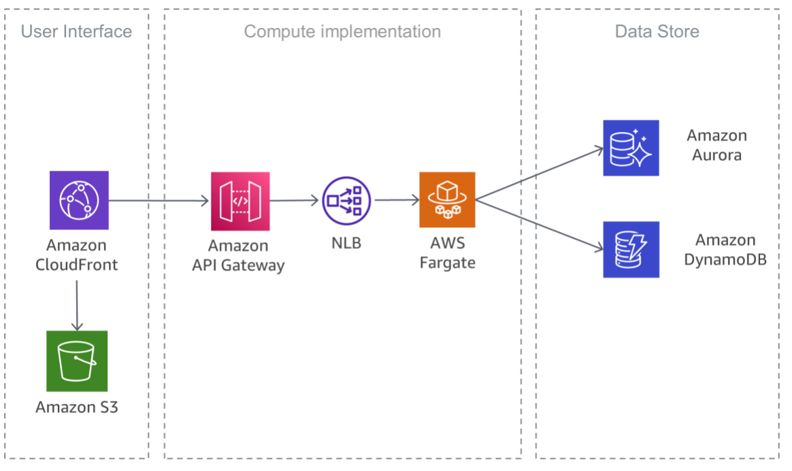

# **Reducing Operational Complexity**
The operational efforts needed to **run, maintain, and monitor microservices** can be further reduced by using a fully serverless architecture.

## **API implementation**
**Architecting, deploying, monitoring, continuously improving, and maintaining** an API can be a time-consuming task. Sometimes different versions of APIs need to be run to assure backward compatibility for all clients. **The different stages of the development cycle (for example, development, testing, and production)** further multiply operational
efforts.

Authorization is a critical feature for all APIs, but it is usually **complex to build and involves repetitive work**.

Other important features and challenges include **throttling requests to protect the backend services, caching API responses, handling request and response transformation, and generating API definitions and documentation** with tools such as Swagger.

`Amazon API Gateway` addresses those challenges and reduces the operational complexity of creating and maintaining RESTful APIs. API Gateway allows you to **create your APIs programmatically by importing Swagger definitions**, using either the AWS API or the AWS Management Console.

The following figure illustrates how API Gateway handles API calls and interacts with other components.

## **Serverless Microservices**
"No server is easier to manage than no server."

Getting rid of servers is a great way to eliminate operational complexity.

The following figure shows the architecture of a serverless microservice with `AWS Lambda` where **the complete service is built out of managed services**, which **eliminates the architectural burden to design for scale and high availability**, and eliminates the **operational efforts of running and monitoring the microservice's underlying infrastructure**.

A similar implementation that is also based on serverless services is shown in the following figure. In this architecture, Docker containers are used with `Fargate`, so it's not necessary to care about the underlying infrastructure. In addition to DynamoDB, `Amazon Aurora Serverless` is used, which is **an on-demand, auto-scaling configuration** for Aurora, where the database will **automatically start up, shut down, and scale capacity up or down** based on your application's needs.

## **Disaster Recovery**
Any data that needs to persist must be stored in a stateful backing service, typically a database.

For a typically microservice architecture, his means that the main focus for disaster recovery should be **on the downstream services that maintain the state of the application**. For example, these can be **file systems, databases, or queues**. When creating a disaster recovery strategy, organizations most commonly plan for the **recovery time objective and recovery point objective**.

**Recovery time objective** is the **maximum acceptable delay** between the interruption of service and restoration of service. 

**Recovery point objective** is the **maximum acceptable amount of time** since the last data recovery point.

### **High availability**
**`Amazon EKS` runs Kubernetes control and data plane instances across multiple `Availability Zones` to ensure high availability**. Amazon EKS automatically detects and replaces unhealthy control planes instances, and it provides automated version upgrades and patching for them. This control plane consists of **at least two API server nodes and three etcd nodes that run across three `Availability Zones` within a region**. Amazon EKS uses the architecture of `AWS Regions` to maintain high availability.

`Amazon ECR` hosts images in a highly available and high-performance architecture, enabling you to reliably **deploy images for container applications across `Availability Zones`**.

`Amazon ECS` is a regional service that simplifies running containers in a highly available manner **across multiple Availability Zones within an `AWS Region`**.

`Amazon Lambda` runs your function in multiple `Availability Zones` to ensure that it is available to process events in case of a service interruption in a single zone.