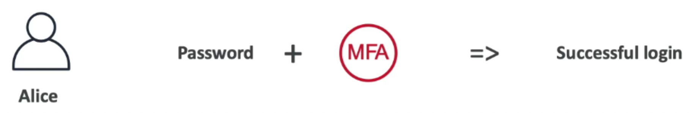

# IAM: Users & Group
- `IAM`: Identity and access management, global service
- `Root` account created by default, shouldn't be used or shared
- `Users` are people within your organization, can be grouped
- `Groups` only contain users, not other groups
- `Users` don't have to belong a group, and user can belong to multiple groups

# IAM Permissions
- Users or Groups can be assigned JSON documents called polices (this is describing in plain English)
    ```json
    {
    "Version": "2012-10-17",
    "Statement": [
        {
        "Effect": "Allow",
        "Action": [
            "directconnect:Describe*",
            "directconnect:List*",
            "ec2:DescribeVpnGateways",
            "ec2:DescribeTransitGateways"
        ],
        "Resource": "*"
        }
    ]
    }
    ```
- These polices define the permissions of users
- Apply the `least privilege principle`: don't give more permissions than a user needs

# IAM Policies Inheritance


# IAM Policies Structure
- Consists of:
    - `Version`: policy language version, always include "2012-10-17"
    - `Id`: an identifier for the policy (optional)
    - `Statement`: one or more individual statements (required)
- Statements consists of:
    - `Sid`: an identifier for the statement (optional)
    - `Effect`: whether the statement allows or denies access (allow, deny)
    - `Principal`: account/user/role to which this policy applied to
    - `Action`: list of actions this policy allows or denies
    - `Resources`: list of resources to which the actions applied to
    - `Condition`: conditions for when this policy is in effect (optional)

    

# Multi Factor Authentication - MFA
- Users have access to your account and can possibly change configurations or delete resources in your AWS account
- **You want to protect your Root Accounts and IAM users**
- MFA = password `you know` + security device `you own`

    

- **Main benefit of MFA:**
    - **if a password is stolen or hacked, the account is not compromised**

# How can users access AWS ?
- To access AWS, you have three options:
    - `AWS Manage Console` (protect by password + MFA)
    - `AWS CLI`: protected by access keys
    - `AWS SDK` - for code: protected by access keys

- `Access Keys` are generated through the `AWS Console`
- `Users` manage their own `Access Keys`
- **Secret Access keys just like password, don't share them**
    - `Access Key ID` ~= username
    - `Secret Access Key` ~= password

# What's the AWS CLI ?
- Enables you to interact with `AWS services` using commands in your command-line shell
- Direct access to the `public APIs of AWS service`
- You can develop scripts to manages your resources
- It's open-source
- Alternative to using `AWS Management Console`

# What's the AWS SDK ?
- AWS software development kit
- Language-specific APIs (set of libraries)
- Enables you to access and manage `AWS services` programmatically
- Embedded within your application

# IAM Roles for Services
- Some AWS services will need to perform actions on your behalf
- **To do so, we will assign `permissions` to AWS services with `IAM Roles`**
- Common roles:
    - EC2 Instance Roles
    - Lambda Function Roles
    - Roles for CloudFormation

# IAM Security Tools
- IAM Credentials Report (account-level)
    - a report that list all your account's users and the status of their various credentials

- IAM Access Advisor (user-level)
    - shows the permissions granted to a user and when those services were last accessed
    - you can use the information to revise your polices

> be inline with the principle of least privilege

- example:
    - user -> stephane -> access advisor
    - **access advisor show me when `some service were last used`, and recent activity**
    - **maybe make sense for me to `remove these permissions from this user` because this user is not using these services**

# IAM Guidelines & Best Practices
- Don't use the root account except for AWS account setup
- One `physical user` = `one AWS user`
- **`Assign users to groups` and `assign permissions to groups` to make sure that security is managed at the `group level`**
- Create and use `Roles` for giving permissions to `AWS Services`
- Audit permissions of your account with the `IAM Credential Report`
- **Never share IAM users & Access Keys**

# IAM Section - Summary
- `Users`: mapped to physical user, has a password for AWS Console
- `Groups`: contains users only
- `Policies`: JSON document that outlines permissions for users or groups
- `Roles`: for EC2 instances or AWS services
    - **Use roles to give permission to an AWS service to do something else on another AWS service**
- `Security`: MFA + Password Policy
- `Access Keys`: access AWS using the CLI or SDK
- `Audit`: IAM Credential Report & IAM Access Advisor
    - **Audit your iam dashboard: create a credential report to get some information about all your users, or if you wanted to audit a specific user in iam, use access advisor to see if a user has been using their permissions recently**
