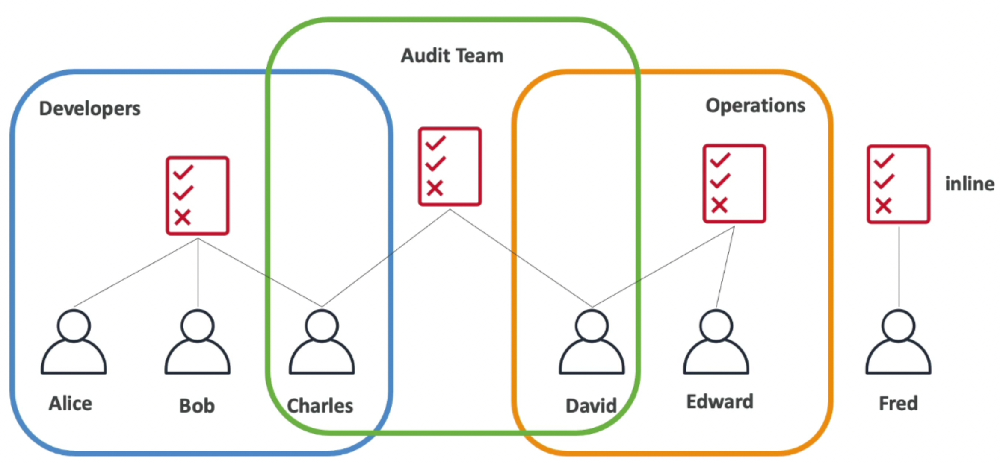
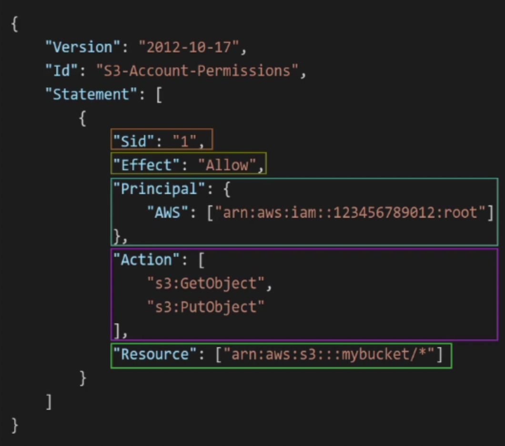

# IAM: Users & Group
- `IAM`: Identity and access management, global service
- `Root` account created by default, shouldn't be used or shared
- `Users` are people within your organization, can be grouped
- `Groups` only contain users, not other groups
- `Users` don't have to belong a group, and user can belong to multiple groups

# IAM Permissions
- Users or Groups can be assigned JSON documents called polices (this is describing in plain English)
    ```json
    {
    "Version": "2012-10-17",
    "Statement": [
        {
        "Effect": "Allow",
        "Action": [
            "directconnect:Describe*",
            "directconnect:List*",
            "ec2:DescribeVpnGateways",
            "ec2:DescribeTransitGateways"
        ],
        "Resource": "*"
        }
    ]
    }
    ```
- These polices define the permissions of users
- Apply the `least privilege principle`: don't give more permissions than a user needs

# IAM Policies Inheritance


# IAM Policies Structure
- Consists of:
    - Version: policy language version, always include "2012-10-17"
    - Id: an identifier for the policy (optional)
    - Statement: one or more individual statements (required)
- Statements consists of:
    - Sid: an identifier for the statement (optional)
    - Effect: whether the statement allows or denies access (allow, deny)
    - Principal: account/user/role to which this policy applied to
    - Action: list of actions this policy allows or denies
    - Resources: list of resources to which the actions applied to
    - Condition: conditions for when this policy is in effect (optional)

