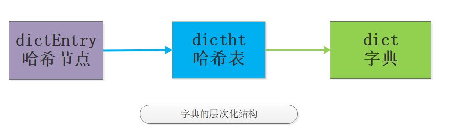

# **dict 字典内部**

> 参考1: https://mp.weixin.qq.com/s/f9N13fnyTtnu2D5sKZiu9w  
> 参考2: https://juejin.im/entry/6844903433665773576

- **dict 是一个用于维护 key 和 value 映射关系的数据结构**，与很多语言中的 Map 或 dictionary 类似。

- **Redis 的一个 database 中所有 ```key``` 到 ```value``` 的映射**，就是使用一个 **dict** 来维护的。不过，这只是它在 Redis 中的一个用途而已。

- **dict 是 Redis 服务器中出现```最为频繁```的复合型数据结构**，
    - 除了 hash 结构的数据会用到字典外，整个 Redis 数据库的**所有 key 和 value 也组成了一个全局字典**

    - 还有**带过期时间的 key 集合**也是一个字典

    - **zset** 集合中存储 **```value``` 和 ```score``` 值的映射关系**也是通过 dict 结构实现，Redis 配合使用 dict 和 skiplist 来共同维护一个 **sorted set**

- **dict 本质上是为了解决算法中的查找问题**，一般查找问题的解法分为两个大类：
    - 一个是基于各种**平衡树**，

    - 一个是基于**哈希表**。
    
- **我们平常使用的各种 Map 或 dictionary，大都是基于哈希表实现的**。
    - 在不**要求数据有序存储**，且能保持**较低的哈希值冲突概率**的前提下，基于哈希表的查找性能能做到非常高效，**接近 O(1)**，而且实现简单。

- **在 Redis 中，dict 也是一个基于```哈希表```的算法**。
    - 和传统的哈希算法类似，它采用某个哈希函数从 key 计算得到在哈希表中的位置，采用拉链法解决冲突，并在装载因子**超过预定值时自动扩展内存**，引发重哈希。

    - Redis 的 dict 实现最显著的一个特点，就在于它的**重哈希**。它采用了一种称为**增量式重哈希**的方法，**在需要扩展内存时避免一次性对所有 ```key``` 进行重哈希，而是将重哈希操作分散到对于 ```dict``` 的各个增删改查的操作中去**。

    - 这种方法能做到每次只对一小部分 key 进行重哈希，而每次重哈希之间不影响 dict 的操作。

    - dict 之所以这样设计，是为了**避免重哈希期间单个请求的响应时间剧烈增加**，这与前面提到的 **“快速响应时间”** 的设计原则是相符的。

<br>

## **I. dict 的数据结构定义**

```C
//哈希节点结构
typedef struct dictEntry {
    void *key;
    union {
        void *val;
        uint64_t u64;
        int64_t s64;
        double d;
    } v;
    struct dictEntry *next;
} dictEntry;

//封装的是字典的操作函数指针
typedef struct dictType {
    uint64_t (*hashFunction)(const void *key);
    void *(*keyDup)(void *privdata, const void *key);
    void *(*valDup)(void *privdata, const void *obj);
    int (*keyCompare)(void *privdata, const void *key1, const void *key2);
    void (*keyDestructor)(void *privdata, void *key);
    void (*valDestructor)(void *privdata, void *obj);
} dictType;

/* This is our hash table structure. Every dictionary has two of this as we
 * implement incremental rehashing, for the old to the new table. */
//哈希表结构 该部分是理解字典的关键
typedef struct dictht {
    dictEntry **table;
    unsigned long size;
    unsigned long sizemask;
    unsigned long used;
} dictht;

//字典结构
typedef struct dict {
    dictType *type;
    void *privdata;
    dictht ht[2];
    long rehashidx; /* rehashing not in progress if rehashidx == -1 */
    unsigned long iterators; /* number of iterators currently running */
} dict;
```

- 字典是个层次非常明显的数据类型，如图：

    

- 结合上面的代码和结构图，可以很清楚地看出 dict 的结构。一个 **dict** 由如下若干项组成：
    - 一个**指向 ```dictType``` 结构的指针**（type）。它通过自定义的方式使得 dict 的 key 和 value 能够存储任何类型的数据。

    - 一个**私有数据指针**（privdata）。由调用者在创建 dict 的时候传进来。私有数据指针（privdata）就是**在 dictType 的某些操作被调用时会传回给调用者**。

    - **两个哈希表**（ht[2]）。**只有在重哈希的过程中，```ht[0]```和```ht[1]```才都有效**。**而在平常情况下，```只有 ht[0] 有效```，```ht[1] 里面没有任何数据```。上图表示的就是重哈希进行到中间某一步时的情况**。

    - 当前**重哈希索引**（rehashidx）。**如果 ```rehashidx = -1```，表示当前没有在重哈希过程中；否则，表示当前正在进行重哈希**，且它的值记录了**当前重哈希进行到哪一步了**。

    - 当前正在进行遍历的 iterator 的个数。这不是我们现在讨论的重点，暂时忽略。

- **dictType** 结构包含若干函数指针，用于 dict 的调用者对涉及 key 和 value 的各种操作进行自定义。这些操作包含：
    - ```hashFunction```，对 key 进行**哈希值计算**的哈希算法。

    - ```keyDup``` 和 ```valDup```，分别定义 key 和 value 的**拷贝函数**，用于**在需要的时候对 key 和 value 进行深拷贝**，而不仅仅是传递对象指针。

    - ```keyCompare```，定义两个 key 的**比较操作**，在**根据 key 进行查找**时会用到。

    - ```keyDestructor``` 和 ```valDestructor```，分别定义**对 key 和 value 的析构函数**。

- 需要详细察看的是 **dictht** 结构。它定义一个**哈希表的结构**，由如下若干项组成：
    - 一个 dictEntry 指针数组（table）。**key 的哈希值最终映射到这个数组的某个位置上**（对应一个 bucket）。如果多个 key 映射到同一个位置，就发生了冲突，那么就拉出一个 **dictEntry 链表**。

    - **size**：**标识 dictEntry 指针数组的长度**。它总是2的指数。

    - **sizemask**：用于**将哈希值映射到 table 的位置索引**。它的值等于 (size-1)，比如7, 15, 31, 63，等等，也就是用二进制表示的各个 bit 全1的数字。每个 key 先经过 hashFunction 计算得到一个哈希值，然后**计算 (哈希值 & sizemask) 得到在 table 上的位置**。相当于计算取余 (哈希值 % size)。

    - **used**：记录 dict 中**现有的数据个数**。它与 size 的比值就是**装载因子**（load factor）。**这个比值越大，哈希值冲突概率越高**。

- ```dictEntry``` 结构中**包含 k, v 和指向链表下一项的 next 指针**。
    - k 是 void 指针，这意味着它可以指向任何类型。

    - v 是个 union，当它的值是 uint64_t、int64_t 或 double 类型时，就不再需要额外的存储，这有利于减少内存碎片。当然，v 也可以是 void 指针，以便能存储任何类型的数据。

- C 语言的好处在于定义必须是由最底层向外的，因此我们可以看到一个明显的层次变化，于是笔者又画一图来展现具体的层次概念：

    