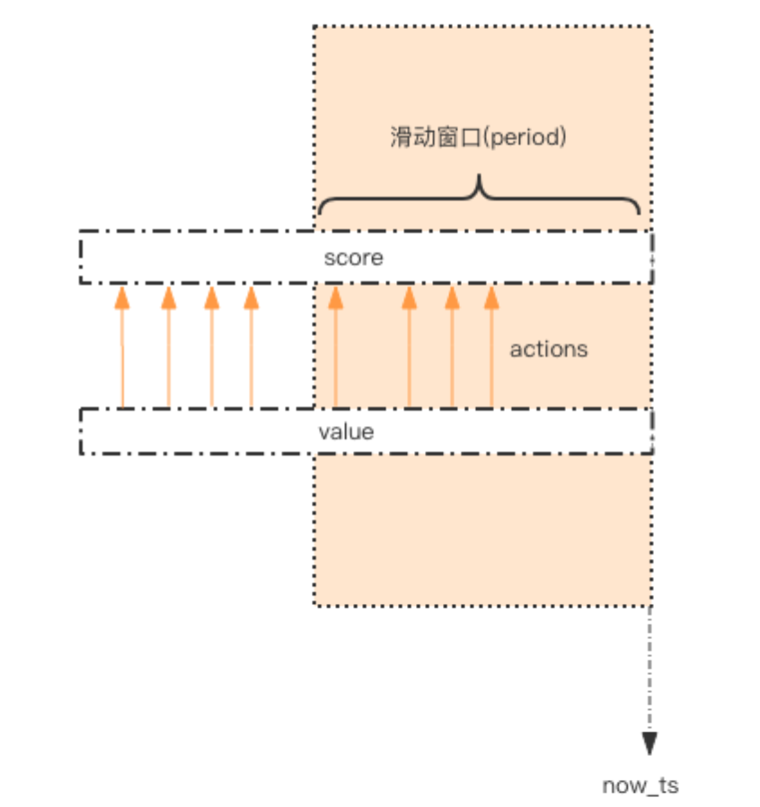

# **简单限流**

- 限流的作用除了**控制流量**，还有一个是用于**控制用户行为，避免垃圾请求**。比如在 UGC 社区，用户的**发帖、回复、点赞**等行为都要严格受控，一般要限定某行为在规定时间内允许的次数，超过了次数就是非法行为。

<br>

## **1. 如何使用 Redis 来实现简单限流策略？**
- 首先我们来看一个常见的简单的限流策略。**系统要限定用户的```某个行为```在```指定的时间```里只能允许发生 N 次**，如何使用 Redis 的数据结构来实现这个限流的功能？

- 我们先定义这个接口，理解这个接口的定义。
    ```python
    # 指定用户 user_id 的某个行为 action_key 在特定的时间内 period 只允许发生一定的次数 max_count
    def is_action_allowed(user_id, action_key, period, max_count):
        return True
    # 调用这个接口 , 一分钟内只允许最多回复 5 个帖子
    can_reply = is_action_allowed("laoqian", "reply", 60, 5) 
    if can_reply:
        do_reply() 
    else:
        raise ActionThresholdOverflow()
    ```

- **解决方案**：
    - 这个限流需求中存在一个**滑动时间窗口**
        - **```zset``` 数据结构的 ```score``` 值**，可以通过 score 来圈出这个时间窗口来。
        
        - **而且只需要保留这个时间窗口，窗口之外的数据都可以砍掉**。
        
        - **那这个 ```zset``` 的 ```value``` 填什么比较合适呢？它只需要保证```唯一性```即可**，用 uuid 会比较浪费空间，可以用毫秒时间戳。

        

        - 如图所示，**用一个 ```zset``` 结构记录用户的行为历史，每一个行为都会作为 zset 中的一个 ```key``` 保存下来。```同一个用户同一种行为```用一个 zset 记录**。

        - 为节省内存，我们只需要保留时间窗口内的行为记录，**同时如果用户是冷用户，```滑动时间窗口内的行为是空记录```，那么这个 zset 就可以从内存中移除**，不再占用空间。

        - **通过统计```滑动窗口内的行为数量```与阈值 ```max_count``` 进行比较就可以得出当前的行为是否允许**。用代码表示如下：

        ```python
        import time 
        import redis
        
        client = redis.StrictRedis()
        def is_action_allowed(user_id, action_key, period, max_count): 
            key = 'hist:%s:%s' % (user_id, action_key)
            now_ts = int(time.time() * 1000) # 毫秒时间戳
            with client.pipeline() as pipe: # client 是 StrictRedis 实例

                # 记录行为
                pipe.zadd(key, now_ts, now_ts) # value 和 score 都使用毫秒时间戳 

                # 移除时间窗口之前的行为记录，剩下的都是时间窗口内的 
                pipe.zremrangebyscore(key, 0, now_ts - period * 1000)

                # 获取窗口内的行为数量
                pipe.zcard(key)

                # 设置 zset 过期时间，避免冷用户持续占用内存 
                # 过期时间应该等于时间窗口的长度，再多宽限 1s 
                pipe.expire(key, period + 1)

                # 批量执行
                _, _, current_count, _ = pipe.execute()

            # 比较数量是否超标
            return current_count <= max_count
        ```

        - java 版：

        ```java
        public class SimpleRateLimiter {
            private Jedis jedis;
            public SimpleRateLimiter(Jedis jedis) {
                this.jedis = jedis; 
            }

            public boolean isActionAllowed(String userId, String actionKey, int period, int maxCount) { 
                String key = String.format("hist:%s:%s", userId, actionKey);
                long nowTs = System.currentTimeMillis();
                Pipeline pipe = jedis.pipelined();
                pipe.multi();
                pipe.zadd(key, nowTs, "" + nowTs); 
                pipe.zremrangeByScore(key, 0, nowTs - period * 1000); 
                Response<Long> count = pipe.zcard(key); 
                pipe.expire(key, period + 1);
                pipe.exec();
                pipe.close();
                return count.get() <= maxCount;
            }

            public static void main(String[] args) {
                Jedis jedis = new Jedis();
                SimpleRateLimiter limiter = new SimpleRateLimiter(jedis); 
                for(int i=0;i<20;i++) {
                    System.out.println(limiter.isActionAllowed("laoqian", "reply", 60, 5)); 
                }
            }
        }
        ```

    - **zset 集合中```只有 score 值非常重要```，value 值没有特别的意义，只需要保证它是```唯一的```就可以了**。

    - **因为这几个连续的 Redis 操作都是```针对同一个 key``` 的，使用 ```pipeline``` 可以显著提升 Redis 存取效率**。
    
    - 但这种方案也有缺点，因为它要**记录时间窗口内所有的行为记录**，**如果这个量很大，比如限定 60s 内操作不得超过 100w 次这样的参数，它是不适合做这样的限流的**，因为会**消耗大量的存储空间**。

