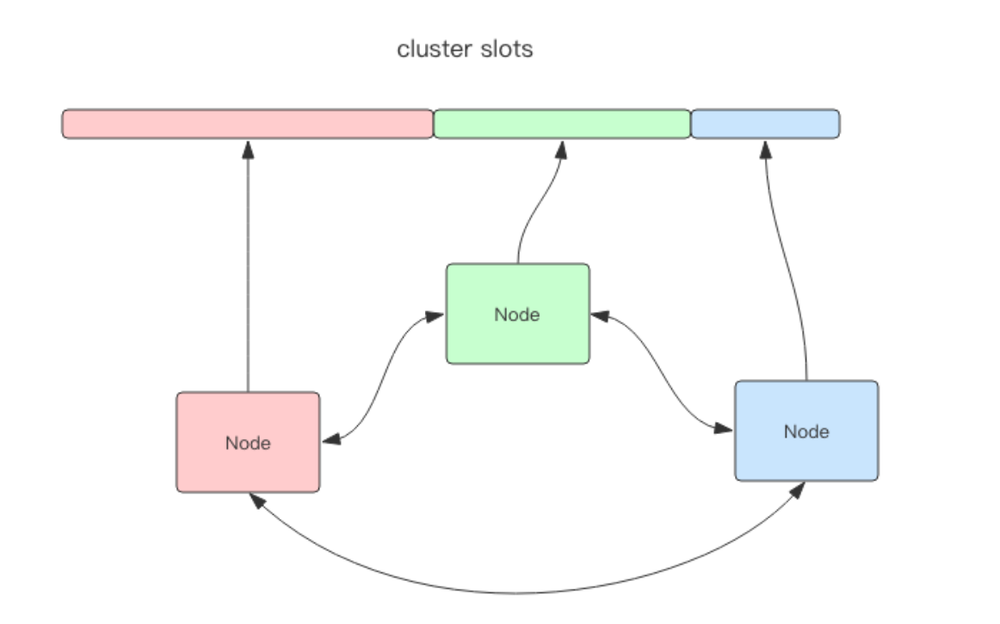

# **Cluster**

- **Cluster 是```去中心化```的**，如图所示，该集群有三个 Redis 节点组成，**每个节点负责整个集群的一部分数据，每个节点负责的数据多少可能不一样**。

    

- **这三个节点相互连接组成一个`对等的集群`**，**它们之间通过一种特殊的二进制协议相互交互集群信息**。
    - Redis Cluster 将所有数据划分为 ```16384``` 的 slots，每个节点负责其中一部分槽位。**```槽位的信息```存储于每个节点中**。

    - **当 Redis Cluster 的客户端来连接集群时，它也会得到一份```集群的槽位配置信息```**。这样当 客户端要查找某个 key 时，可以直接定位到目标节点。

    - **客户端为了可以直接`定位某个具体的 key` 所在的节点，它就需要```缓存槽位相关信息```**，这样才可以准确快速地定位到相应的节点。**同时因为槽位的信息可能会存在客户端与服务器不 一致的情况**，**还需要`纠正机制`来实现槽位信息的校验调整**。

    - 另外，**Redis Cluster 的每个节点会将`集群的配置信息持久化`到配置文件中**，所以必须**确保配置文件是可写的**，而且尽量不要依靠人工修改配置文件。

<br>

## **1. 槽位定位算法**
- **Cluster 默认会对 key 值使用 ```crc32``` 算法进行 hash 得到一个整数值**，然后**用这个整数值对 ```16384``` 进行取模来得到具体槽位**。

- **Cluster 还允许用户```强制某个 key 挂在特定槽位```上，通过在 key 字符串里面嵌入 ```tag``` 标记，这就可以强制 ```key 所挂在的槽位等于 tag 所在的槽位```**。

<br>

## **2. 跳转**
- 当客户端向一个错误的节点发出了指令，该节点会发现指令的 **key 所在的槽位并不归自己管理**，这时它会**向客户端发送一个特殊的`跳转指令`携带目标操作的节点地址**，告诉客户端去连这个节点去获取数据。

    ```bash
    GET x
    -MOVED 3999 127.0.0.1:6381
    ```

- **```MOVED``` 指令的第一个参数 ```3999``` 是 key 对应的槽位编号，后面是目标节点地址**。MOVED 指令前面有一个减号，**表示该指令是一个`错误消息`**。

- 客户端收到 MOVED 指令后，要**立即纠正本地的`槽位映射表`**。后续**所有 key 将使用新的槽位映射表**。

<br>

## **3. 迁移**
- **Redis Cluster 提供了工具 ```redis-trib``` 可以让运维人员手动调整槽位的分配情况**，它使用 Ruby 语言进行开发，通过组合各种原生的 Redis Cluster 指令来实现。

<br>

## **4. 容错**
- **Redis Cluster 可以为每个`主节点`设置若干个`从节点`**，单主节点故障时，**集群会自动将其中某个从节点提升为`主节点`**。

- **如果某个主节点`没有从节点`，那么当它发生故障时，集群将完全处于`不可用状态`**。

- **不过 Redis 也提供了一个参数 ```cluster-require-full-coverage``` 可以允许`部分节点故障`，其它节点还可以`继续提供对外访问`**。

<br>

## **5. 网络抖动**
- 真实世界的机房网络往往并不是风平浪静的，它们经常会发生各种各样的小问题。

- 为解决这种问题，Redis Cluster 提供了一种选项 ```cluster-node-timeout```，**表示当某个节点持续 `timeout` 的时间失联时，才可以认定该节点出现故障，需要进行`主从切换`**。**如果没有这个选项，网络抖动会导致`主从频繁切换`（`数据的重新复制`）**。

- **还有另外一个选项 ```cluster-slave-validity-factor``` 作为倍乘系数来放大这个超时时间来宽松容错的紧急程度**。
    - **如果这个系数为零，那么主从切换是`不会抗拒网络抖动的`**。
    
    - **如果这个系数大于 1，它就成了主从切换的`松弛系数`**。

<br>

## **6. 可能下线（PFAIL-Possibly Fail）与确定下线（Fail）**
- 因为 Redis Cluster 是去中心化的，**一个节点认为某个节点失联了并不代表所有的节点都认为它失联了**。**所以集群还得经过一次```协商的过程```，只有当大多数节点都认定了某个节点失联了，集群才认为该节点需要进行```主从切换```来容错**。

- **Redis 集群节点采用 ```Gossip``` 协议来广播自己的状态以及自己对整个集群认知的改变**。比如一个节点**发现某个节点失联了（PFail），它会将这条信息向```整个集群广播```**，其它节点也就可以收到这点失联信息。

- **如果一个节点收到了某个```节点失联的数量（PFail Count）```已经达到了集群的大多数，就可以标记该节点为```确定下线状态（Fail）```**，然后向整个集群广播，强迫其它节点也接收该节点已经下线的事实，并立即对该失联节点进行主从切换。

<br>

## **7. 槽位迁移感知**
- **如果 Cluster 中某个槽位正在迁移或者已经迁移完了，client 如何能感知到槽位的变化呢**？客户端保存了槽位和节点的映射关系表，它需要即时得到更新，才可以正常地将某条指令发到正确的节点中。

- 我们前面提到 Cluster 有两个特殊的 error 指令，一个是 ```moved```，一个是 ```asking```。

- **第一个 ```moved``` 是用来纠正槽位的**。
    - 如果指令发送到了错误的节点，该节点发现对应的指令槽位不归自己管理，**会将目标节点的地址同 ```moved``` 指令回复给客户端通知客户端去目标节点去访问**。
    
    - **这个时候客户端就会刷新自己的`槽位关系表`**，然后重试指令，**后续所有打在`该槽位的指令`都会转到`目标节点`**。

- **第二个 ```asking``` 指令和 ```moved``` 不一样，它是用来```临时纠正槽位的```**。

    1. **如果当前槽位正处于迁移中，指令会先被发送到槽位所在的旧节点**
        - 如果旧节点存在数据，就直接返回结果
        
        - 如果不存在，**那么它可能真的不存在也可能在迁移目标节点上**。
    
    2. 所以旧节点会通知客户端**去新节点尝试一下拿数据**，看看新节点有没有。
    
    3. 这时候就会给客户端**返回一个``` asking error``` 携带上目标节点的地址**。
        - **客户端收到这个 ```asking error``` 后，就会去目标节点去尝试**。
        
        - 客户端不会刷新槽位映射关系表，因为它只是临时纠正该指令的槽位信息，不影响后续指令。

<br>

### **7.1. 重试 2 次**
- **```moved``` 和 ```asking``` 指令都是`重试指令`，客户端会因为这两个指令`多重试一次`**。

- **客户端重试 2 次的情况是存在的**：

    - **比如一条指令被发送到错误的节点，这个节点会先给你一个 ```moved``` 错误告知你去另外一个节点重试**。
    
    - 所以客户端就去另外一个节点重试了，**结果刚好这个时候运维人员要对这个槽位进行迁移操作，于是给客户端回复了一个 ```asking``` 指令告知客户端去目标节点去重试指令**。
    
    - 所以这里客户端重试了 2 次。

<br>

### **7.2. 重试多次**
- 在某些特殊情况下，客户端甚至会重试多次。正是因为存在多次重试的情况，**所以客户端的源码里在执行指令时都会有一个循环，然后会设置一个```最大重试次数```**。**当重试次数超过这个值时，客户端会直接向业务层抛出异常**。

<br>

## **8. 集群变更感知**
- **当服务器`节点变更`时，客户端应该即时得到通知以`实时刷新自己的节点关系表`。那客户端是如何得到通知的呢**？这里要分 2 种情况:

    1. **目标节点挂掉了**
        - **客户端会抛出一个 ```ConnectionError```，紧接着会随机挑一个节点来重试，这时被重试的节点会通过 ```moved error``` 告知目标槽位被分配到的新的节点地址**。

    2. **运维手动修改了集群信息，将 `master` 切换到其它节点，并将旧的 `master` 移除集群**。
        - **这时打在旧节点上的指令会收到一个 ```ClusterDown``` 的错误**，**告知当前节点所在集群不可用（```当前节点已经被孤立了```，它不再属于之前的集群）**。
        
        - **这时客户端就会关闭所有的连接，`清空槽位映射关系表`，然后向上层抛错。待下一条指令过来时，就会`重新尝试初始化节点信息`**。