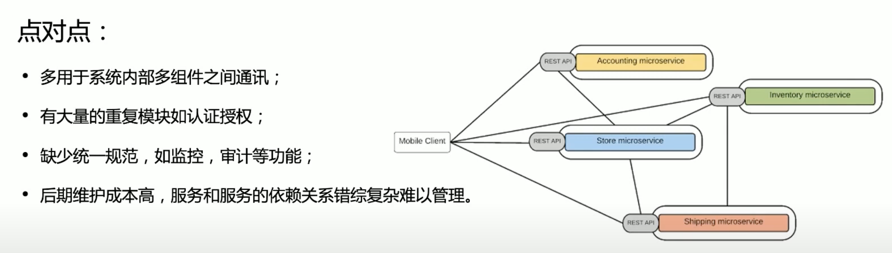
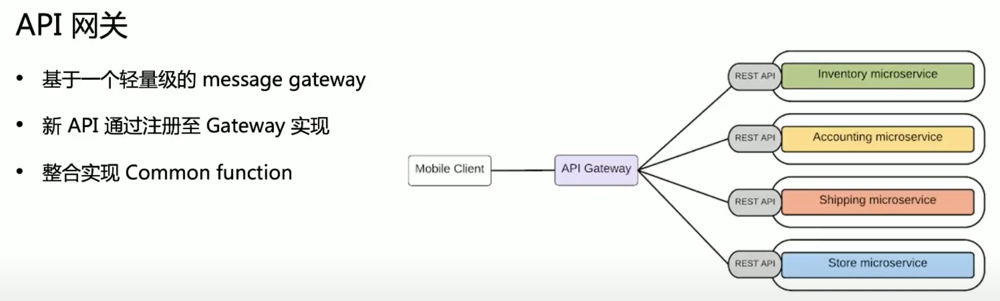

# **Docker 核心技术**
## **1. 从系统架构谈起**
- ibm 推出 soa 架构，把一个大的新系统解耦，然后子系统和子系统之间通过网络调用，去互相交互

- soa 架构又提出了一个概念 esb，**企业服务总线**
    - ESB 是 SOA (面向服务的架构) 的基本组件，它是二十世纪九十年代后期出现的架构。 
    
    - SOA 定义了**通过服务接口来复用软件组件**的方法。 此类接口会使用通用的通信标准，这些标准能够快速合并到新应用程序中，而不必每次都执行深度集成

    - 组件和组件的调用是要经由这个 esb 的，作为一个企业集中的服务总线，**所有的服务调用都从他这儿走**，最后这个就成了个单体架构了, soa 后来就凉掉了

- 微服务：基于轻量级的网络调用，**可以理解成是 soa 的一种最佳实践**
    
    - 讲究服务和服务之间是走轻量级协议的，比如 rest
    
    - 推崇把服务尽量打小、打散，让不同的开发业务部门去负责不同的子系统，这样就会有专业的人为一个业务完整的生命周期负责，包括开发、需求实现、运维

- 这种架构面临的挑战：**大量的网络调用，一个物理机部署了上百个微服务，可能互相影响**

- 解决：**虚拟化技术，虚机，业务代码部署到虚机**

<br>

### **1.1. 微服务间通讯**
- 散列的，没有中心点

    

    

- **kubernetes 的 api server 本身就是个网关**

<br>

## **2. 理解 Docker**
- 容器技术基于很早就存在的 name space 技术 和 cgroup 技术

### **2.1. 为什么要用 Docker**
- 更高效地利用系统资源
- 更快速的启动时间
- 一致的运行环境
- 持续交付和部署
- 更轻松地迁移
- 更轻松地维护和扩展
- ...

<br>

- 虚拟机占资源，因为要**虚拟一个操作系统**
- **容器技术基于 namespace 和 cgroup，不需要很多的资源来加载一个操作系统**
- 在测试环境能运行的程序在其他环境一定也能运行

### **2.2. Dockerfile**
- dockerfile 就是一行一行的代码，可以指定基础镜像，可以设置环境变量，可以设 label，可以把主机的某个文件加到容器镜像里面的某个地方，可以暴露某个端口，可以设置运行时跑哪个命令

- 新看一个容器时就是去看他的 dockerfile，**dockerfile 就是容器镜像的源代码**

- docker build: **把 dockerfile 转化为 docker image**

<br>

### **2.2. Docker 通过什么技术来实现轻量级隔离的**
#### **2.2.1. 容器标准**
- Open Container Initiative (OCI)
    - 轻量级开放式管理组织 (项目)
- OCI 主要定义两个规范
    - Runtime Specification
        - **文件系统包如何解压至硬盘，共运行时运行**
    - Image Specification
        - **如何通过构建系统打包，生成镜像清单(Manifest)、文件系统序列化文件、镜像配置**

<br>

- 运行时规范, 定义的是 image 如何解压到硬盘上面，如何运行起来，运行时如何隔离是 runtime 规定, 但是隔离依托的是 `namespace` 和 `cgroup` 技术，这两个技术其实和 docker 没有关系, docker runtime 这边其实没有太新的东西

- docker 创新主要在第二部分

> - docker 那套生态打不过 kubernetes 的

<br>

#### **2.2.2. 容器主要特性**
- 安全性
- 隔离性
- 便携性
- 可配额

<br>

#### **2.2.3. Namespace**
- `Linux Namespace` 是一种 `Linux Kernel` 提供的资源隔离方案:
    - 系统可以为进程分配不同的 Namespace
    - 并保证不同的 Namespace **资源独立分配、进程彼此隔离**，即不同的 Namespace 下的进程互不干扰 

> - **namespace 将一个东西塞到一个隔离的环境去运行**

<br>

#### **2.2.4. 关于 namespace 的常用操作**
- 查看当前系统的 namespace:

    ```bash
    lsns –t <type>
    ```

- 查看某进程的 namespace:

    ```bash
    ls -la /proc/<pid>/ns/
    ```

- 进入某 namespace 运行命令:

    ```bash
    nsenter -t <pid> -n ip addr
    ```

<br>

#### **2.2.5. Cgroups**
- Cgroups (Control Groups) 是 Linux 下用于**对一个或一组进程进行`资源控制`和`监控`的机制**;

- **可以对诸如 `CPU 使用时间`、`内存`、`磁盘 I/O` 等进程所需的资源进行限制**;

- 不同资源的具体管理工作由相应的 Cgroup 子系统 (Subsystem) 来实现;

- 针对不同类型的资源限制，只要将限制策略在不同的的子系统上进行关联即可;

- Cgroups 在不同的系统资源管理子系统中以层级树 (Hierarchy) 的方式来组织管理：每个 Cgroup 都可以 包含其他的子 Cgroup，因此子 Cgroup 能使用的资源除了受本 Cgroup 配置的资源参数限制，还受到父 Cgroup 设置的资源限制。

- Cgroups 实现了对资源的`配额和度量`  
    - `blkio`: 这个子系统设置限制`每个块设备的输入输出控制`。例如：磁盘，光盘以及 USB 等等
    - `CPU`: 这个子系统使用调度程序为 Cgroup 任务提供 `CPU 的访问`
    - `cpuacct`: 产生 Cgroup 任务的 `CPU 资源报告`
    - `cpuset`: 如果是`多核心的 CPU`，这个子系统会为 Cgroup 任务分配`单独的 CPU 和内存`
    - `devices`: 允许或拒绝 Cgroup 任务`对设备的访问`

> - **docker 技术就是 `cgroup`，启动时用多少 cpu 给你控死掉**

