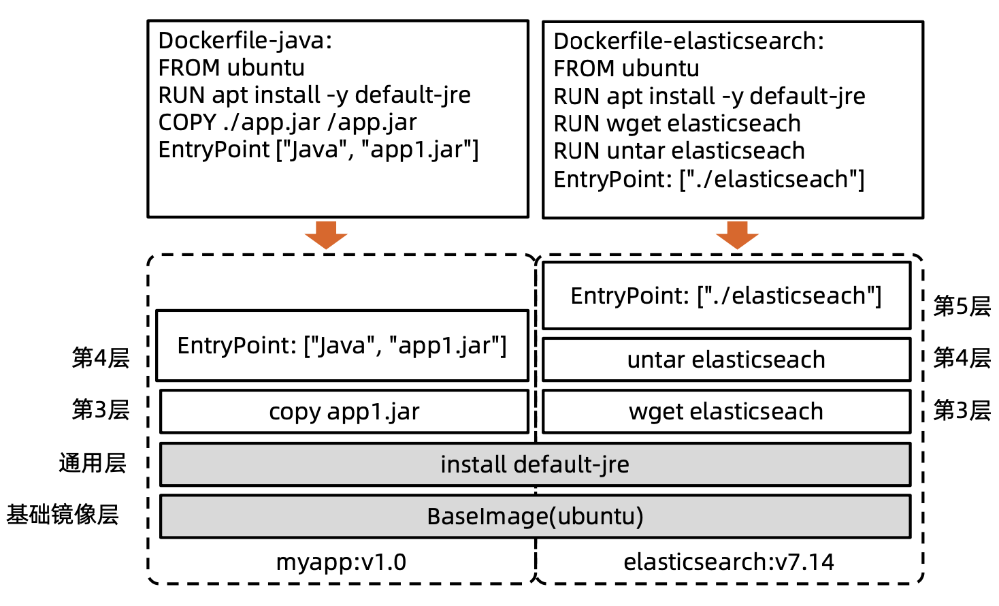
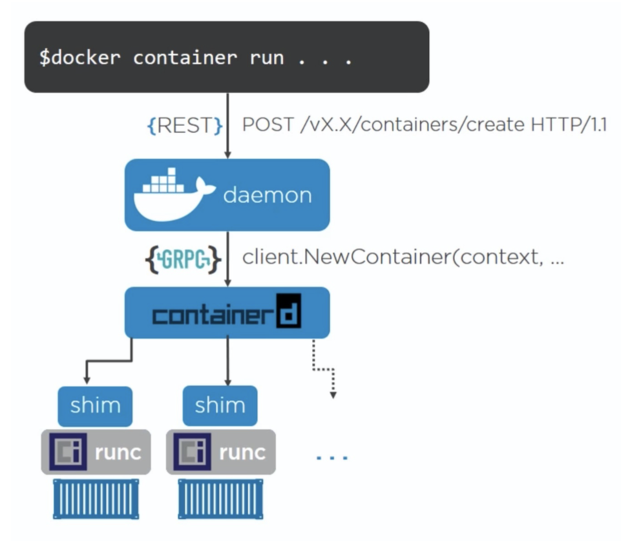
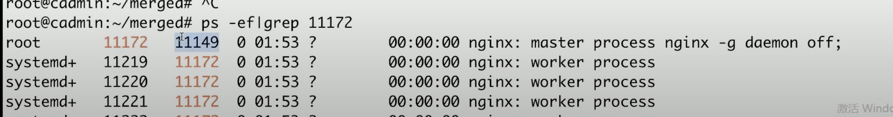
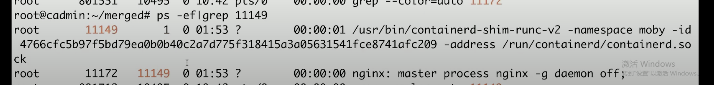

# **Docker 核心技术**
## **1. 从系统架构谈起**
- ibm 推出 soa 架构，把一个大的新系统解耦，然后子系统和子系统之间通过网络调用，去互相交互

- soa 架构又提出了一个概念 esb，**企业服务总线**
    - ESB 是 SOA (面向服务的架构) 的基本组件，它是二十世纪九十年代后期出现的架构。 
    
    - SOA 定义了**通过服务接口来复用软件组件**的方法。 此类接口会使用通用的通信标准，这些标准能够快速合并到新应用程序中，而不必每次都执行深度集成

    - 组件和组件的调用是要经由这个 esb 的，作为一个企业集中的服务总线，**所有的服务调用都从他这儿走**，最后这个就成了个单体架构了, soa 后来就凉掉了

- 微服务：基于轻量级的网络调用，**可以理解成是 soa 的一种最佳实践**
    
    - 讲究服务和服务之间是走轻量级协议的，比如 rest
    
    - 推崇把服务尽量打小、打散，让不同的开发业务部门去负责不同的子系统，这样就会有专业的人为一个业务完整的生命周期负责，包括开发、需求实现、运维

- 这种架构面临的挑战：**大量的网络调用，一个物理机部署了上百个微服务，可能互相影响**

- 解决：**虚拟化技术，虚机，业务代码部署到虚机**

<br>

### **1.1. 微服务间通讯**
- 散列的，没有中心点

    

    

- **kubernetes 的 api server 本身就是个网关**

<br>

## **2. 理解 Docker**
- 容器技术基于很早就存在的 name space 技术和 cgroup 技术

### **2.1. 为什么要用 Docker**
- 更高效地利用系统资源
- 更快速的启动时间
- 一致的运行环境
- 持续交付和部署
- 更轻松地迁移
- 更轻松地维护和扩展
- ...

<br>

- 虚拟机占资源，因为要**虚拟一个操作系统**
- **容器技术基于 namespace 和 cgroup，不需要很多的资源来加载一个操作系统**
- 在测试环境能运行的程序在其他环境一定也能运行

### **2.2. Dockerfile**
- dockerfile 就是一行一行的代码，可以指定基础镜像，可以设置环境变量，可以设 label，可以把主机的某个文件加到容器镜像里面的某个地方，可以暴露某个端口，可以设置运行时跑哪个命令

- 新看一个容器时就是去看他的 dockerfile，**dockerfile 就是容器镜像的源代码**

- docker build: **把 dockerfile 转化为 docker image**

<br>

### **2.2. Docker 通过什么技术来实现轻量级隔离的**
#### **2.2.1. 容器标准**
- Open Container Initiative (OCI)
    - 轻量级开放式管理组织 (项目)
- OCI 主要定义两个规范
    - Runtime Specification
        - **文件系统包如何解压至硬盘，共运行时运行**
    - Image Specification
        - **如何通过构建系统打包，生成镜像清单(Manifest)、文件系统序列化文件、镜像配置**

<br>

- 运行时规范, 定义的是 image 如何解压到硬盘上面，如何运行起来，运行时如何隔离是 runtime 规定, 但是隔离依托的是 `namespace` 和 `cgroup` 技术，这两个技术其实和 docker 没有关系, docker runtime 这边其实没有太新的东西

- docker 创新主要在第二部分

> - docker 那套生态打不过 kubernetes 的

<br>

#### **2.2.2. 容器主要特性**
- 安全性
- 隔离性
- 便携性
- 可配额

<br>

#### **2.2.3. Namespace**
- `Linux Namespace` 是一种 `Linux Kernel` 提供的资源隔离方案:
    - 系统可以为进程分配不同的 Namespace
    - 并保证不同的 Namespace **资源独立分配、进程彼此隔离**，即不同的 Namespace 下的进程互不干扰 

> - **namespace 将一个东西塞到一个隔离的环境去运行**

<br>

#### **2.2.4. 关于 namespace 的常用操作**
- 查看当前系统的 namespace:

    ```bash
    lsns –t <type>
    ```

- 查看某进程的 namespace:

    ```bash
    ls -la /proc/<pid>/ns/
    ```

- 进入某 namespace 运行命令:

    ```bash
    nsenter -t <pid> -n ip addr
    ```

<br>

#### **2.2.5. Cgroups**
- Cgroups (Control Groups) 是 Linux 下用于**对一个或一组进程进行`资源控制`和`监控`的机制**;

- **可以对诸如 `CPU 使用时间`、`内存`、`磁盘 I/O` 等进程所需的资源进行限制**;

- 不同资源的具体管理工作由相应的 Cgroup 子系统 (Subsystem) 来实现;

- 针对不同类型的资源限制，只要将限制策略在不同的的子系统上进行关联即可;

- Cgroups 在不同的系统资源管理子系统中以层级树 (Hierarchy) 的方式来组织管理：每个 Cgroup 都可以 包含其他的子 Cgroup，因此子 Cgroup 能使用的资源除了受本 Cgroup 配置的资源参数限制，还受到父 Cgroup 设置的资源限制。

- Cgroups 实现了对资源的`配额和度量`  
    - `blkio`: 这个子系统设置限制`每个块设备的输入输出控制`。例如：磁盘，光盘以及 USB 等等
    - `CPU`: 这个子系统使用调度程序为 Cgroup 任务提供 `CPU 的访问`
    - `cpuacct`: 产生 Cgroup 任务的 `CPU 资源报告`
    - `cpuset`: 如果是`多核心的 CPU`，这个子系统会为 Cgroup 任务分配`单独的 CPU 和内存`
    - `devices`: 允许或拒绝 Cgroup 任务`对设备的访问`

> - **docker 技术就是 `cgroup`，启动时用多少 cpu 给你控死掉**

<br>

### **2.3. 文件系统**
- 容器的文件系统是怎么做的
  - docker 就是把一些旧的技术整合到一起，像 namespace，cgroup
- docker 的创新点在哪里？是在 runtime 还是在文件系统？
  - docker 的创新点在`文件系统`

#### **2.3.1. Union FS (联合文件系统)**
- 将不同目录挂载到同一个虚拟文件系统下 (unite several directories into a single virtual filesystem) 的文件系统 

> - 所有的进程跑在容器里，其实就是通过 `namespace` 和 `cgroup` 作了隔离
> - 要为这些进程模拟文件系统，就要帮他们组织这些进程能看得见的文件系统
> - 所谓联合文件系统就是为容器进程准备多个目录, 可以把多个目录联合到一起放到一个目录，这个目录打包成容器进程的文件系统，那么这个就是容器进程的 `root fs`
> - 这就是容器文件系统本质的原理
> - 文件系统既不属于 namespace 也不属于 cgroup

### **2.4. 容器镜像**
- docker file 的每一条指令其实对应的都是`一个容器镜像的层`

    

- docker 非常巧妙的一个部分：
    - 首先支持 docker file，让你可以指定用什么脚本来构建镜像
    - 对每一个指令，构建一个镜像层，每个镜像层会有一个 checksum，判断指令中的两个 image 是不是一致，那么他的 checksum 也是一样的
    - 对于 docker 来说，这个镜像层是`复用`的
    - 无论多少个 from image 真正拉取镜像的只有一个
    - devops 文件分发：以前文件分发没有 docker 技术时，都是起一个 file server，源代码 jar 包放上去，若有 1000 个节点要部署，每个节点都要把 jar 包拷下来，很复杂
    - docker 把这个过程规范化了，构建镜像的时候已经分层了
    - 若已知 jar 包在第三层，其实只需要把 app1 那一层换了就行, 然后重新构建这个 docker 镜像
    - 拉取镜像时会判断这个 4 层的镜像，分别判断每一层 checksum 变化，基础和通用层没变化就不需要拉取
    - 只拉取三四层就行
    - 虽然给他的指令是拉取 ubuntu，实际只是做了一个`增量分发`
    - 解决了`文件分发`的问题，统一化了

### **2.5. Docker 的文件系统**

- 典型的 Linux 文件系统组成:
    - Bootfs(boot file system)
        - Bootloader - 引导加载 kernel，
        - Kernel - 当 kernel 被加载到内存中后 umount bootfs。
    - rootfs (root file system)
        - /dev，/proc，/bin，/etc 等标准目录和文件。
        - 对于不同的 linux 发行版, bootfs 基本是一致的， 但 rootfs 会有差别。

### **2.6. Docker 启动**
- Linux
    - 在启动后，首先将 rootfs 设置为 readonly, 进行一系列检查, 然后将其切换为 "readwrite" 供用户使用。

- Docker 启动
    - 初始化时也是将 rootfs 以 readonly 方式加载并检查，然而接下来利用 union mount 的方式将一个 readwrite 文件系统挂载在 readonly 的 rootfs 之上;
    - 并且允许再次将下层的 FS(file system) 设定为 readonly 并且向上叠加。
    - 这样一组 readonly 和一个 writeable 的结构构成一个 container 的运行时态, 每一个 FS 被称作一个 FS 层。

### **2.7. OCI 容器标准**
> - docker 商业公司，迭代很快，把自己的产品和容器技术都把的很紧
> - kubernete 是后来者如何打破僵局呢，就定规范
> - oci 就是当时背景下出现的

- Open Container Initiative
    - OCI 组织于 2015 年创建，是一个致力于定义容器镜像标准和运行时标准的开放式组织。
    - OCI 定义了`镜像标准` (Runtime Specification)、`运行时标准` (Image Specification) 和`分发标准` (Distribution Specification)
        - 镜像标准定义应用如何`打包`
        - 运行时标准定义如何`解压应用包并运行`
        - 分发标准定义如何`分发容器镜像`

> - 反正容器要做的就两件事情：`运行时规范` (namespace 怎么划分，cgroup 怎么去限制资源) 和`镜像规范`（镜像怎么打包），`分发标准` (怎么分发镜像)

### **2.8. Docker 引擎架构**
- linux 的任何进程都是父进程 fork 出来的，linux 里都是有一个进程树的
- docker 设计初期不像现在这样，`docker daemon` 是主进程，任何的 conttainer 进程都是 docker daemon fork 出来的
- 这样是有问题的，docker 本身要重启要升级的时相当于父进程是要销毁的，父进程销毁了子进程怎么办，所以会出现 docker 一升级所有的应用就出问题的情况
- `containerd` 为了解决这个问题就做了一个概念 `docker shim` （container shim）
- shim 是什么呢，containerd 只是一个单独的 daemon，所有他 fork 出来的子进程，他的父进程不会是 containerd，把这个关系解绑了，为每一个容器进程构建了一个 shim 作为他的 parent，shim 的父进程是 `systemd`
- 这样 containerd 重启的时候所有的应用进程是不受影响的 (containerd 最早的一个很大的优势)

    

- 容器进程 nginx，他的父进程是 11149

    

- 11149 他的父进程是 1，进程名叫 ...shim...

    

- 也就是真正的`用户态进程`和 `containerd` 的 `daemon` 的进程是没有任何关系的 

- containerd 无论怎么升级，应用是解绑了的，不受影响

- 现在 docker 也用了containerd