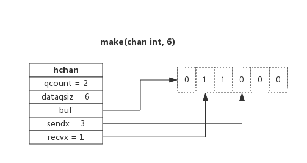

# **CHANNEL**

- **channel 是 Golang 在语言层面提供的 ```goroutine``` 间的通信方式**，比 Unix 管道更易用也更轻便。**channel 主要用于进程内各 ```goroutine 间通信```**，

- **如果需要`跨进程通信`，建议使用`分布式系统`的方法来解决**。

<br>

# **问题 1**
- **对已经关闭的的 chan 进行读写**，会怎么样？为什么？

<br>

## **答**
- **读`已经关闭`的 chan 能一直读到东西**，但是读到的内容根据**通道内关闭前是否有元素而不同**。

    - 如果 chan 关闭前，**buffer 内有元素还未读**
        - **会正确读到 chan 内的值**
        
        - **且返回的第二个 bool 值（是否读成功）为 ```true```**。

    - 如果 chan 关闭前，**buffer 内有元素已经被读完，chan 内无值**
        - **接下来所有接收的值都会```非阻塞直接成功```，返回 ```channel 元素的零值```**
        
        - **但是第二个 bool 值一直为 ```false```**。

    - **写已经关闭的 chan 会 panic**

<br>

## **举例**
- **写已经关闭的 chan**

    

    - **注意这个 ```send on closed channel```，待会会提到**。

- **读已经关闭的 chan**

    

<br>

## **多问一句**
- **为什么写已经关闭的 chan 就会 panic 呢？**

    ```go
    func chansend(c *hchan, ep unsafe.Pointer, block bool, callerpc uintptr) bool {
        lock(&c.lock)

        if c.closed != 0 {
            unlock(&c.lock)
            panic(plainError("send on closed channel"))
        }
    }
    ```

    - **当 ```c.closed != 0``` 则为通道关闭，此时执行写，源码提示直接 `panic`，输出的内容就是上面提到的 `"send on closed channel"`**。

- **为什么读已关闭的 chan 会一直能读到值？**

    ```go
    func chanrecv(c *hchan, ep unsafe.Pointer, block bool) (selected, received bool) {
        ...
        lock(&c.lock)

        // 当 channel 被关闭，且缓存为空时
        // ep 是指 val, ok := <-c 里的 val 的值
        if c.closed != 0 && c.qcount == 0 {
            if raceenabled {
                raceacquire(c.raceaddr())
            }
            unlock(&c.lock)
            // 如果接收值的地址不为空，那接收值将获得是一个该类型的零值
            // typedmemclr 会根据类型清理相应地址的内存
            // 这就解释了为什么关闭的 channel 会返回对应类型的零值
            if ep != nil {
                typedmemclr(c.elemtype, ep)
            }
            // 返回两个参数，selected，received
            // 第二个参数就是 val, ok := <- c 里的 ok
            // 也就解释了为什么读已关闭的 channel 会一直返回 false
            return true, false
        }

        // 如果等待发送队列 sendq 不为空，且没有缓冲区，直接从 sendq 中取出 G，把 G 中数据读出，最后把 G 唤醒，结束读取过程
        if sg := c.sendq.dequeue(); sg != nil {
            // Found a waiting sender. If buffer is size 0, receive value
            // directly from sender. Otherwise, receive from head of queue
            // and add sender's value to the tail of the queue (both map to
            // the same buffer slot because the queue is full).
            recv(c, sg, ep, func() { unlock(&c.lock) }, 3)
            return true, true
        }
        ...
    }
    ```

    - **```c.closed != 0 && c.qcount == 0``` 指通道已经关闭，且缓存为空的情况下（已经读完了之前写到通道里的值）**

    - **如果接收值的地址 `ep 不为空`**
        - **那接收值将获得是一个`该类型的零值`**

        - ```typedmemclr``` 会根据类型清理相应地址的内存

        - 这就解释了上面代码为什么关闭的 chan 会返回对应类型的零值

<br>

# **问题 2**
- **对未初始化的的 chan 进行读写**，会怎么样？为什么？

<br>

## **答**
- **读写未初始化的 chan 都会阻塞**。

<br>

## **举例**
- **写未初始化的 chan**

    ```go
    package main
    // 写未初始化的chan
    func main() {
        var c chan int
        c <- 1
    }
    ```

    ```bash
    fatal error: all goroutines are asleep - deadlock!

    goroutine 1 [chan send (nil chan)]:
    main.main()
        /Users/neo/tmp/go.go:5 +0x36
    exit status 2
    ```

    - **注意这个 ```chan send (nil chan)```，待会会提到**。

- **读未初始化的 chan**

    ```go
    package main
    import "fmt"
    // 读未初始化的chan
    func main() {
        var c chan int
        num, ok := <-c
        fmt.Printf("读chan的协程结束, num=%v, ok=%v\n", num, ok)
    }
    ```

    ```bash
    fatal error: all goroutines are asleep - deadlock!

    goroutine 1 [chan receive (nil chan)]:
    main.main()
        /Users/neo/tmp/go.go:6 +0x46
    exit status 2
    ```

    - **注意这个 ```chan receive (nil chan)```，待会也会提到**。

<br>

## **多问一句**
- **为什么对未初始化的 chan 就会阻塞呢？**

    - **对于写的情况**

        ```go
        // src/runtime/chan.go
        func chansend(c *hchan, ep unsafe.Pointer, block bool, callerpc uintptr) bool {
            if c == nil {
                if !block {
                    return false
                }
                // gopark: Puts the current goroutine into a waiting state and calls unlockf.
                gopark(nil, nil, waitReasonChanSendNilChan, traceEvGoStop, 2)
                throw("unreachable")
            }
        }
        ...
        ```

        - **未初始化的 chan 此时是等于 nil，当它`不能阻塞`的情况下，直接返回 false，表示写 chan 失败**

        - **当 chan `能阻塞`的情况下，则直接阻塞 `gopark(nil, nil, waitReasonChanSendNilChan, traceEvGoStop, 2)`，然后调用 `throw(s string)` 抛出错误，其中 `waitReasonChanSendNilChan` 就是刚刚提到的报错 "chan send (nil chan)"**

    - **对于读的情况**

        ```go
        // src/runtime/chan.go
        func chanrecv(c *hchan, ep unsafe.Pointer, block bool) (selected, received bool) {
            // raceenabled: don't need to check ep, as it is always on the stack
            // or is new memory allocated by reflect.

            if debugChan {
                print("chanrecv: chan=", c, "\n")
            }

            if c == nil {
                if !block {
                    return
                }
                // gopark: Puts the current goroutine into a waiting state and calls unlockf
                gopark(nil, nil, waitReasonChanReceiveNilChan, traceEvGoStop, 2)
                throw("unreachable")
            }
        }
        ...
        ```
        
        - **未初始化的 chan 此时是等于 nil，当它`不能阻塞`的情况下，直接返回 false，表示读 chan 失败**
        
        - **当 chan `能阻塞`的情况下，则直接阻塞 `gopark(nil, nil, waitReasonChanReceiveNilChan, traceEvGoStop, 2)`, 然后调用 `throw(s string)` 抛出错误，其中 `waitReasonChanReceiveNilChan` 就是刚刚提到的报错 "chan receive (nil chan)"**

<br>

# **1. chan 数据结构**
- **```src/runtime/chan.go:hchan``` 定义了 channel 的数据结构**：

    ```go
    type hchan struct {
        qcount   uint           // 当前队列中剩余元素个数
        dataqsiz uint           // 环形队列长度，即可以存放的元素个数
        buf      unsafe.Pointer // 环形队列指针
        elemsize uint16         // 每个元素的大小
        closed   uint32            // 标识关闭状态
        elemtype *_type         // 元素类型
        sendx    uint           // 队列下标，指示元素写入时存放到队列中的位置
        recvx    uint           // 队列下标，指示元素从队列的该位置读出
        recvq    waitq          // 等待读消息的goroutine队列
        sendq    waitq          // 等待写消息的goroutine队列
        lock mutex              // 互斥锁，chan不允许并发读写
    }
    ```
    
- 从数据结构可以看出 channel 由**队列、类型信息、goroutine 等待队列**组成，下面分别说明其原理。

<br>

## **1.1. 环形队列**
- **chan 内部实现了一个`环形队列`作为其`缓冲区`**，**队列的长度是`创建 chan` 时指定的**。

- 下图展示了一个可缓存 6 个元素的 channel 示意图：
    - **```dataqsiz``` 指示了队列长度为 6，即可缓存 6 个元素**；

    - **```buf``` 指向队列的内存，队列中还剩余两个元素**；

    - **```qcount``` 表示队列中还有两个元素**；

    - **```sendx``` 指示后续写入的数据存储的位置，取值 [0, 6)**；

    - **```recvx``` 指示从该位置读取数据, 取值 [0, 6)**；

    

<br>

## **1.2. 等待队列**
- **从 channel `读数据`，如果 channel ```缓冲区为空或者没有缓冲区```，当前 goroutine 会被```阻塞```**。

- **向 channel `写数据`，如果 channel ```缓冲区已满或者没有缓冲区```，当前 goroutine 会被```阻塞```**。

- **被阻塞的 goroutine 将会挂在 ```channel 的等待队列中```**：
    - **因`读阻塞`的 goroutine 会被```向 channel 写入数据```的 goroutine 唤醒**；

    - **因`写阻塞`的 goroutine 会被```从 channel 读数据```的 goroutine 唤醒**；

- 下图展示了一个**没有缓冲区的 channel**，有几个 goroutine 阻塞等待读数据：

    

- 注意，**一般情况下 ```recvq``` 和 ```sendq``` 至少有一个为空**。只有一个例外，那就是同一个 goroutine 使用 select 语句向 channel **一边写数据，一边读数据**。

<br>

## **1.3. 类型信息**
- **```一个 channel 只能传递一种类型的值```，类型信息存储在 ```hchan``` 数据结构中**。

    - **```elemtype``` 代表`类型`，用于数据传递过程中的`赋值`**；

    - **```elemsize``` 代表`类型大小`，用于在 buf 中定位`元素位置`**。

<br>

## **1.4. 锁**
- **一个 channel 同时仅允许被一个 goroutine 读写**，为简单起见，本章后续部分说明读写过程时不再涉及加锁和解锁。

<br>

# **2. channel 读写**
## **2.1. 创建 channel**
- **创建 channel 的过程实际上是初始化 `hchan` 结构**。

- **其中`类型信息`和`缓冲区长度`由 `make` 语句传入，`buf` 的大小则与`元素大小`和`缓冲区长度`共同决定**。

- 创建 channel 的伪代码如下所示：

    ```go
    func makechan(t *chantype, size int) *hchan {
        var c *hchan
        c = new(hchan)
        c.buf = malloc(元素类型大小*size)
        c.elemsize = 元素类型大小
        c.elemtype = 元素类型
        c.dataqsiz = size
        return c
    }
    ```

<br>

## **2.2. 向 channel 写数据**
- **向一个 channel 中写数据简单过程如下**：

    1. **如果```等待接收队列 recvq``` 不为空**
        
        - **说明```缓冲区中没有数据或者没有缓冲区```**

        - **此时直接从 `recvq` 取出 G，并把数据写入，最后把该 G 唤醒，结束发送过程**；

    2. **如果缓冲区中有空余位置**

        - 将数据写入缓冲区，结束发送过程；

    3. **如果缓冲区中没有空余位置**
        
        - **将待发送数据写入 G，将当前 G 加入 ```sendq```，进入睡眠，等待被读 goroutine 唤醒**；

- 简单流程图如下：

    

<br>

## **2.3. 从 channel 读数据**
- 从一个 channel 读数据简单过程如下：

    1. **如果```等待发送队列 sendq``` 不为空，且没有缓冲区**

        - **直接从 sendq 中取出 G**，把 G 中数据读出，最后把 G 唤醒，结束读取过程；

    2. **如果等待发送队列 sendq 不为空**

        - 此时说明**缓冲区已满**，从缓冲区中首部读出数据，把 G 中数据写入缓冲区尾部，把 G 唤醒，结束读取过程；

    3. **如果缓冲区中有数据**

        - 则**从缓冲区取出数据**，结束读取过程；

    4. 将当前 goroutine 加入 ```recvq```，**进入睡眠，等待被写 goroutine 唤醒**；

- 简单流程图如下：

    

<br>

## **2.4. 关闭 channel**
- 关闭 channel 时会**把 ```recvq``` 中的 G 全部唤醒
    - **本该写入 G 的数据位置为 nil。把 ```sendq``` 中的 G 全部唤醒，但这些 G 会 panic**。

- 除此之外，**panic 出现的常见场景还有**：

    1. **关闭值为 nil 的 channel**

    2. **关闭已经被关闭的 channel**

    3. **向已经关闭的 channel 写数据**

<br>

# **3. 常见用法**
## **3.1. 单向 channel**
- 顾名思义，**单向 channel 指只能用于```发送或接收```数据**，实际上也**没有单向 channel**。

- 我们知道 channel 可以通过参数传递，**所谓单向 channel 只是对 channel 的一种使用限制**，这跟 C 语言使用 `const 修饰函数参数为只读`是一个道理。

    ```go
    func readChan(chanName <-chan int) // 通过形参限定函数内部只能从 channel 中读取数据
    
    func writeChan(chanName chan<- int) // 通过形参限定函数内部只能向 channel 中写入数据
    ```

- 一个简单的示例程序如下：
    ```go
    func readChan(chanName <-chan int) {
        <- chanName
    }

    func writeChan(chanName chan<- int) {
        chanName <- 1
    }

    func main() {
        var mychan = make(chan int, 10)
        writeChan(mychan)
        readChan(mychan)
    }
    ```

- mychan 是个正常的 channel，**而 ```readChan()``` 参数限制了传入的 channel 只能用来读，```writeChan()``` 参数限制了传入的 channel 只能用来写**。

<br>

## **3.2. select**
- **使用 select 可以监控多 channel**，比如监控多个 channel，**当其中某一个 channel 有数据时，就从其读出数据**。

- 一个简单的示例程序如下：

    - 程序中创建两个 channel：chan1 和 chan2。

    - 函数 ```addNumberToChan()``` 函数会向两个 channel 中周期性写入数据。

    - **通过 select 可以监控两个 channel，任意一个可读时就从其中读出数据**。

        ```go
        // 示例 1
        package main
        import (
            "fmt"
            "time"
        )

        func addNumberToChan(chanName chan int) {
            for {
                chanName <- 1
                time.Sleep(1 * time.Second)
            }
        }

        func main() {
            var chan1 = make(chan int, 10)
            var chan2 = make(chan int, 10)

            go addNumberToChan(chan1)
            go addNumberToChan(chan2)

            for {
                select {
                case e := <- chan1 :
                    fmt.Printf("Get element from chan1: %d\n", e)

                case e := <- chan2 :
                    fmt.Printf("Get element from chan2: %d\n", e)

                default:
                    fmt.Printf("No element in chan1 and chan2.\n")
                    time.Sleep(1 * time.Second)
                }
            }
        }
        ```

    - 程序输出如下：

        ```bash
        Get element from chan1: 1
        Get element from chan2: 1
        No element in chan1 and chan2.
        Get element from chan2: 1
        Get element from chan1: 1
        No element in chan1 and chan2.
        Get element from chan2: 1
        Get element from chan1: 1
        No element in chan1 and chan2.
        ```

        ```go
        // 示例 2
        select {
	    case <-done:
		    break
            
	    case err := <-fail:
		    if err != nil {
			    return 0, errors.Wrap(op, err)
		    }
	    }
        ```

- 从输出可见，从 channel 中读出数据的顺序是随机的

    - **事实上 select 语句的多个 case 执行顺序是随机的**，关于 select 的实现原理会有专门章节分析。

- 通过这个示例想说的是：
    - **select 的 case 语句读 channel 不会阻塞，尽管 channel 中没有数据**。
    
    - **这是由于 case 语句编译后调用读 channel 时会明确传入不阻塞的参数，此时读不到数据时```不会将当前 goroutine 加入到等待队列```，而是```直接返回```**。

<br>

## **3.3. range**
- **通过 range 可以持续从 channel 中读出数据**，好像在遍历一个数组一样，**当 channel 中没有数据时会```阻塞```当前 goroutine，与读 channel 时阻塞处理机制一样**。

    ```go
    func chanRange(chanName chan int) {
        for e := range chanName {
            fmt.Printf("Get element from chan: %d\n", e)
        }
    }
    ```

- 注意：
    - **如果向此 channel 写数据的 `goroutine 退出`时，系统检测到这种情况后会 `panic`，否则 range 将会永久阻塞**。

