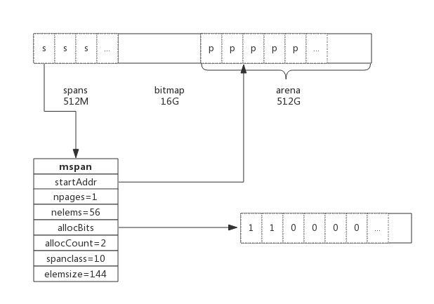

# **内存分配原理**

- Golang 中实现了内存分配器，**简单的说就是维护一块大的`全局内存`，每个线程（Golang 中为 P）维护一块小的`私有内存`，`私有内存`不足再从`全局`申请**。

- 另外，内存分配与 GC（垃圾回收）关系密切，所以了解 GC 前有必要了解内存分配的原理。

<br>

# **1. 基础概念**
- 为了方便自主管理内存，做法便是**先向系统申请一块内存，然后将内存切割成小块，通过一定的内存分配算法管理内存**。

- 以 64 位系统为例，Golang 程序启动时会向系统申请的内存如下图所示：

    

- 预申请的内存划分为 **spans、bitmap、arena** 三部分。

- **其中 ```arena 即为所谓的堆区```，应用中需要的内存从这里分配**。其中 **spans 和 bitmap 是为了管理 arena 区而存在的**。

- arena 的大小为 512G，**为了方便管理把 arena 区域划分成一个个的 page**（图中 P），每个 page 为 8KB，一共有 512GB/8KB 个页；

- **spans 区域存放 span 的指针**，每个指针对应一个 page，所以 span 区域的大小为 ```(512GB/8KB) * 指针大小(8byte) = 512M```。

- **bitmap 区域大小也是通过 arena 计算出来**，不过主要用于 GC。

<br>

## **1.1. span**
- **span 是用于```管理 arena 页```的关键数据结构，每个 span 中包含 1 个或多个连续页**

- 为了满足小对象分配，span 中的一页会划分更小的粒度，而对于大对象比如超过页大小，则通过多页实现。

<br>

### **1.1.1. class**
- **跟据对象大小，划分了一系列 class，每个 class 都代表一个固定大小的对象，以及每个 span 的大小**。如下表所示：

    ```go
    // class  bytes/obj  bytes/span  objects  waste bytes
    //     1          8        8192     1024            0
    //     2         16        8192      512            0
    //     3         32        8192      256            0
    //     4         48        8192      170           32
    //     5         64        8192      128            0
    //     6         80        8192      102           32
    //     7         96        8192       85           32
    ...
    ```

- 上表中每列含义如下：

    - class：**class ID，每个 ```span``` 结构中都有一个 class ID, 表示该 span ```可处理的对象类型```**

    - bytes/obj：**该 class 代表对象的字节数**

    - bytes/span：每个 span 占用堆的字节数，也即```页数*页大小```

    - objects：每个 span 可分配的对象个数，也即```（bytes/spans）/（bytes/obj）```

    - waste bytes：每个 span 产生的内存碎片，也即```（bytes/spans）%（bytes/obj）```

- 上表可见最大的对象是 32K 大小，超过 32K 大小的由特殊的 class 表示，该 class ID 为 0，每个 class 只包含一个对象。

<br>

### **1.1.2. span 数据结构**
- **span 是内存管理的基本单位**

- 每个 span 用于管理特定的 class 对象, 跟据对象大小，span 将一个或多个页拆分成多个块进行管理。

- ```src/runtime/mheap.go:mspan``` 定义了其数据结构：

    ```go
    type mspan struct {
        next *mspan            // 链表前向指针，用于将 span 链接起来
        prev *mspan            // 链表前向指针，用于将 span 链接起来
        startAddr uintptr // 起始地址，也即所管理页的地址
        npages    uintptr // 管理的页数
        nelems uintptr // 块个数，也即有多少个块可供分配
        allocBits  *gcBits // 分配位图，每一位代表一个块是否已分配
        allocCount  uint16     // 已分配块的个数
        spanclass   spanClass  // class 表中的 class ID
        elemsize    uintptr    // class 表中的对象大小，也即块大小
    }
    ```

- 以 class 10 为例，span 和管理的内存如下图所示：

    

- spanclass 为 10，参照 class 表可得出 npages = 1，nelems = 56，elemsize 为144。其中 startAddr 是在 span 初始化时就指定了某个页的地址。allocBits 指向一个位图，每位代表一个块是否被分配，本例中有两个块已经被分配，其 allocCount 也为 2。

- next 和 prev 用于将多个 span 链接起来，这有利于管理多个 span，接下来会进行说明。

<br>

## **1.2. cache**
- 有了管理内存的基本单位 span，还要有个数据结构来管理 span，这个数据结构叫 ```mcentral```

- 各线程需要内存时从 ```mcentral``` 管理的 span 中申请内存，为了**避免多线程申请内存时不断的加锁，Golang 为每个线程分配了 ```span 的缓存```，这个缓存即是 cache**。

- ```src/runtime/mcache.go:mcache```定义了 cache 的数据结构：

    ```go
    type mcache struct {
        alloc [67*2]*mspan // 按 class 分组的 mspan 列表
    }
    ```

- **alloc 为 mspan 的指针数组，数组大小为 class 总数的2倍**。

- 数组中每个元素代表了一种 class 类型的 span 列表，每种 class 类型都有两组 span 列表

    - 第一组列表中所表示的对象中包含了指针
    
    - 第二组列表中所表示的对象不含有指针，这么做是为了提高 GC 扫描性能，对于不包含指针的 span 列表，没必要去扫描。