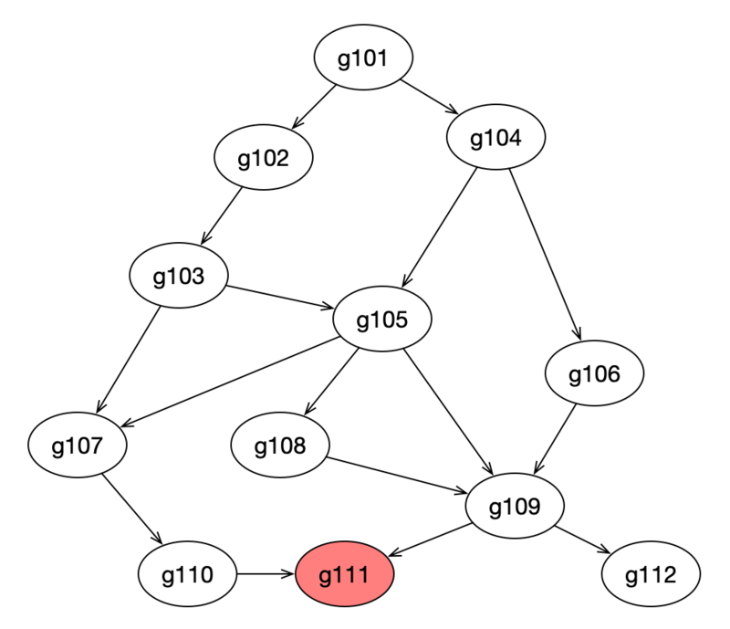

# **内存泄漏**

- **go 是一门自己 gc 的语言，大概两分钟会 gc 一次**。如果有内存泄漏，无非就是两种情况。

    - **有 goroutine 泄漏**

        - goroutine “飞”了，zombie goroutine 没有结束，这个时候在**这个 goroutine 上分配的内存对象将一直被这个僵尸 goroutine 引用着**，进而导致 gc 无法回收这类对象，内存泄漏。

    - **有一些全局（或者生命周期和程序本身运行周期一样长的）的数据结构意外的挂住了本该释放的对象**
    
        - 虽然 goroutine 已经退出了，但是这些对象并没有从这类数据结构中删除，导致对象一直被引用，无法被回收。

<br>

## **1. 排除掉 goroutine 泄漏**
- 首先，我利用压测工具对 server 进行100个 websocket 连接，模拟用户行为，然后关闭连接。

- 打开浏览器查看 goroutine 数量，**发现新起的 goroutine 全部已经销毁**，没有观察到有泄漏的 goroutine，因此排除此情况。

<br>

## **2. 怎么用 heap 发现内存问题**
- **使用 `pprof` 的 `heap` 能够获取程序运行时的内存信息**

- 在程序平稳运行的情况下，每个一段时间使用 heap 获取内存的 profile，然后使用 base 能够对比两个 profile 文件的差别，就像 diff 命令一样显示出增加和减少的变化。

<br>

## **3. heap “不能” 定位内存泄露**
- **heap 能显示内存的分配情况，以及哪行代码占用了多少内存，我们能轻易的找到占用内存最多的地方，如果这个`地方的数值还在不断增大`，基本可以认定这里就是内存泄露的位置**。

- 曾想按图索骥，从内存泄露的位置，**根据`调用栈`向上查找**，总能找到内存泄露的原因，**这种方案看起来是不错的，但实施起来却找不到内存泄露的原因**，结果是事半功倍。

- **原因在于一个 Go 程序，其中有`大量的 goroutine`，这其中的调用关系也许有点复杂，也许内存泄露是在某个三方包里**。

- 举个栗子，比如下面这幅图，每个椭圆代表 1 个 goroutine，其中的数字为编号，箭头代表调用关系。heap profile 显示 g111（最下方标红节点）这个协程的代码出现了泄露，**任何一个从 g101 到 g111 的调用路径都可能造成了 g111 的内存泄露**，有 2 类可能：

    1. 该 goroutine 只调用了少数几次，但消耗了大量的内存，说明每个 goroutine 调用都消耗了不少内存，内存泄露的原因基本就在该协程内部。

    2. 该 goroutine 的调用次数非常多，虽然每个协程调用过程中消耗的内存不多，但该调用路径上，协程数量巨大，造成消耗大量的内存，并且这些 goroutine 由于某种原因无法退出，占用的内存不会释放，内存泄露的原因在到 g111 调用路径上某段代码实现有问题，造成创建了大量的 g111。

- 第 2 种情况，就是 goroutine 泄露，这是通过 heap 无法发现的，**所以 heap 在定位内存泄露这件事上，发挥的作用不大**。

    

<br>

## **4. goroutine 泄露怎么导致内存泄露**
### **4.1. 什么是 goroutine 泄露**
- **如果你启动了 1 个 goroutine，但并没有符合预期的退出，直到程序结束，此 goroutine 才退出**，这种情况就是 goroutine 泄露。

- 提前思考：什么会导致 goroutine 无法退出/阻塞？

<br>

### **4.2. goroutine 泄露怎么导致内存泄露**
- 每个 goroutine 占用 2KB 内存，泄露 1 百万 goroutine 至少泄露 ```2KB * 1000000 = 2GB``` 内存，为什么说至少呢？

- goroutine 执行过程中还存在一些变量，**如果这些变量指向堆内存中的内存，GC 会认为这些内存仍在使用，不会对其进行回收**，这些内存谁都无法使用，造成了内存泄露。

- 所以 goroutine 泄露有 2 种方式造成内存泄露：

    1. **goroutine 本身的```栈```所占用的空间造成内存泄露**。

    2. **goroutine 中的变量所占用的```堆```内存导致堆内存泄露**，这一部分是能通过 ```heap profile``` 体现出来的。

- **Dave 在文章 ```High Performance Go Workshop``` 中也提到了，如果不知道`何时停止`一个 goroutine，这个 goroutine 就是潜在的内存泄露**：

    > **7.1.1 Know when to stop a goroutine**
    >
    > If you don’t know the answer, that’s a potential memory leak as the goroutine will pin its stack’s memory on the heap, as well as any heap allocated variables reachable from the stack.

<br>

### **4.3. 怎么确定是 goroutine 泄露引发的内存泄露**
- 掌握了前面的 pprof 命令行的基本用法，很快就可以确认是否是 goroutine 泄露导致内存泄露，如果你不记得了，马上回去看一下 go pprof 基本知识。

- **判断依据：**
    - 在节点正常运行的情况下，隔一段时间获取 goroutine 的数量，如果后面获取的那次，某些 goroutine 比前一次多，**如果多获取几次，是```持续增长```的，就极有可能是 goroutine 泄露**。

<br>

## **5. 总结**
### **5.1. goroutine 泄露的本质**
- **goroutine 泄露的本质是 channel 阻塞**，无法继续向下执行，导致此 goroutine 关联的内存都无法释放，进一步造成内存泄露。

<br>

### **5.2. goroutine 泄露的发现和定位**
- 利用好 ```go pprof``` 获取 goroutine profile 文件，然后利用 3 个命令 ```top、traces、list``` 定位内存泄露的原因。

<br>

### **5.3. goroutine 泄露的场景**
- 泄露的场景不仅限于以下两类，但**因 `channel` 相关的泄露是最多的**。

    1. **channel 的读或者写**：

        1. **无缓冲 channel 的阻塞通常是写操作因为没有读而阻塞**

        2. **有缓冲的 channel 因为缓冲区满了，写操作阻塞**

        3. **期待从 channel 读数据，结果没有 goroutine 写**

    2. **select 操作**
        
        - **select 里也是 `channel` 操作，如果所有 case 上的操作阻塞，goroutine 也无法继续执行**。

<br>

### **5.4. 编码 goroutine 泄露的建议**

- 为避免 goroutine 泄露造成内存泄露，启动 goroutine 前要思考清楚：

    1. **goroutine `如何退出`**？

    2. **是否会有`阻塞`造成无法退出？如果有，那么这个路径是否会`创建大量的 goroutine`**？
