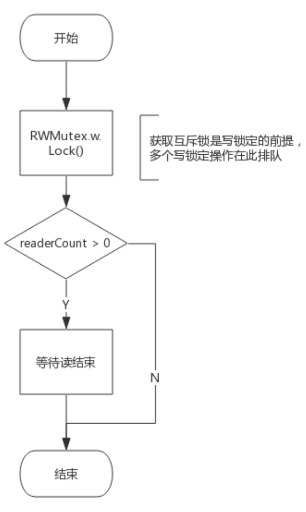
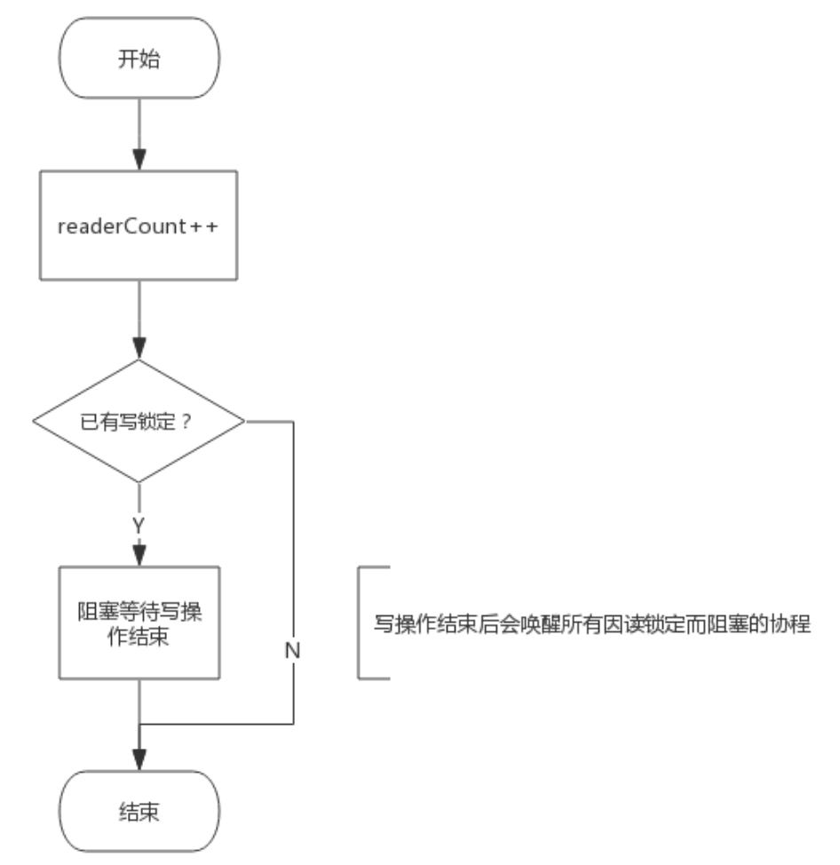
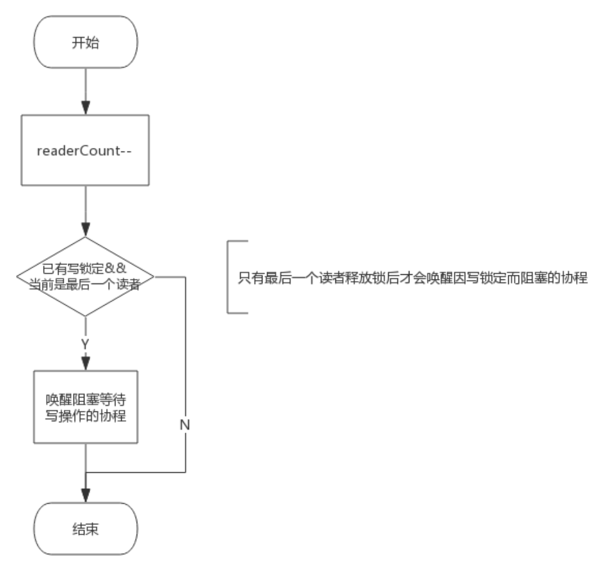

# **RWMUTEX**

<br>

- 读写锁 RWMutex，可以说是 Mutex 的一个改进版，在某些场景下可以发挥更加灵活的控制能力，比如：**读取数据频率远远大于写数据频率的场景**。

- 例如，**程序中写操作少而读操作多**

    - 如果执行过程是 1 次写然后 N 次读的话，使用 Mutex，**这个过程将是串行的**，因为需要持有 Mutex 后才可以操作。
    
    - 如果使用读写锁，**多个`读操作`可以`同时持有锁`，并发能力将大大提升**。

- 实现读写锁需要解决如下几个问题：

    1. **写锁需要阻塞写锁**：**一个协程拥有`写锁`时，其他协程`写锁定`需要阻塞**

    2. **写锁需要阻塞读锁**：**一个协程拥有`写锁`时，其他协程`读锁定`需要阻塞**

    3. **读锁需要阻塞写锁**：**一个协程拥有`读锁`时，其他协程`写锁定`需要阻塞**

    4. **读锁不能阻塞读锁**：**一个协程拥有`读锁`时，其他协程也可以拥有`读锁`**

- 读写锁基于 Mutex 实现，实现源码非常简单和简洁，又有一定的技巧在里面。

<br>

# **1. 读写锁数据结构**
## **1.1. 类型定义**
- 源码包 `src/sync/rwmutex.go:RWMutex` 定义了读写锁数据结构：

    ```go
    type RWMutex struct {
        w           Mutex  // 用于控制多个写锁，获得写锁首先要获取该锁，如果有一个写锁在进行，那么再到来的写锁将会阻塞于此
        writerSem   uint32 // 写阻塞等待的信号量，最后一个读者释放锁时会释放信号量
        readerSem   uint32 // 读阻塞的协程等待的信号量，持有写锁的协程释放锁后会释放信号量
        readerCount int32  // 记录读者个数
        readerWait  int32  // 记录写阻塞时读者个数
    }
    ```

- **由以上数据结构可见，读写锁内部仍有一个互斥锁，用于将`两个写操作`隔离开来，其他的几个都用于`隔离读操作和写操作`。**

<br>

## **1.2. 接口定义**
- RWMutex 提供 4 个简单的接口来提供服务：

    1. **`RLock()`：读锁定**

    2. **`RUnlock()`：解除读锁定**

    3. **`Lock()`：写锁定，与 Mutex 完全一致**

    4. **`Unlock()`：解除写锁定，与 Mutex 完全一致**

<br>

### **1.2.1. Lock() 实现逻辑**
- **`写锁定`操作需要做两件事：**

    - **获取互斥锁**

    - **阻塞等待`所有读操作结束`（如果有的话）**

- 所以 `func (rw *RWMutex) Lock()` 接口实现流程如下图所示：

    

<br>

## **1.2.2. Unlock() 实现逻辑**
- 解除写锁定要做两件事：

    - 唤醒因**读锁定而被阻塞的协程**（如果有的话）

    - **解除互斥锁**

- 所以 ``func (rw *RWMutex) Unlock()`` 接口实现流程如下图所示：

    

<br>

## **1.2.3. RLock() 实现逻辑**
- 读锁定需要做两件事：

    - **增加`读操作计数`，即 `readerCount++`**

    - **阻塞等待`写操作`结束** (如果有的话)

- 所以 `func (rw *RWMutex) RLock()` 接口实现流程如下图所示：

    

<br>

## **1.2.4. RUnlock() 实现逻辑**
- 解除读锁定需要做两件事：

    - **减少读操作计数，即 `readerCount—-`**

    - 唤醒**等待`写操作`的协程**（如果有的话）

- 所以 `func (rw *RWMutex) RUnlock()` 接口实现流程如下图所示：

    

- 注意：
    
    - 即便有协程阻塞等待写操作，并不是所有的解除读锁定操作都会唤醒该协程，而是**最后一个解除读锁定的协程才会释放信号量将该协程唤醒**
    
    - 因为**只有当所有读操作的协程释放锁后才可以唤醒协程**。

<br>

# **2. 场景分析**
## **2.1. 写操作是如何阻止写操作的**
- **读写锁包含一个`互斥锁` (Mutex)，写锁定必须要先获取该互斥锁**

- 如果互斥锁已被协程 A 获取（或者协程 A 在阻塞等待读结束），意味着协程 A 获取了互斥锁，那么**协程 B 只能阻塞等待该互斥锁**。

- 所以，**写操作依赖`互斥锁`阻止其他的写操作**。

<br>

## **2.2. 写操作是如何阻止读操作的**
- **这个是读写锁实现中最精华的技巧**。

    - **`RWMutex.readerCount` 是个整型值，用于表示读者数量**

    - **不考虑写操作的情况下，每次`读锁定将该值 +1`，每次`解除读锁定将该值 -1`**

    - **所以 `readerCount` 取值为 `[0, N]`，N 为读者个数，实际上最大可支持 `2^30` 个并发读者**。

    - **当写锁定进行时，会先将 `readerCount` 减去 `2^30`，从而 `readerCount` 变成了负值**
    
    - 此时再有读锁定到来时**检测到 `readerCount` 为负值**，便知道有写操作在进行，只好阻塞等待。
    
    - 而真实的读操作个数并不会丢失，只需要将 `readerCount` 加上 `2^30` 即可获得。

- 所以，**写操作`将 readerCount 变成负值`来阻止读操作的**。

<br>

## **2.3. 读操作是如何阻止写操作的**
- **读锁定会先将 `RWMutext.readerCount` 加 1**，此时**写操作到来时发现读者数量不为 0**，会**阻塞等待所有读操作结束**。

- 所以，**读操作`通过 readerCount`来阻止写操作的**。

<br>

## **2.4. 为什么写锁定不会被饿死**
- **写操作要等待读操作结束后**才可以获得锁

    - 写操作等待期间**可能还有新的读操作持续到来**

    - 如果**写操作等待所有读操作结束**，很可能被饿死。

- 然而，通过 `RWMutex.readerWait` 可完美解决这个问题。

    - 写操作到来时，**会把 `RWMutex.readerCount` 值拷贝到 `RWMutex.readerWait` 中，用于标记排在写操作前面的`读者个数`**。

    - 前面的读操作结束后，除了会递减 `RWMutex.readerCount`，**还会递减 `RWMutex.readerWait` 值，当 `RWMutex.readerWait` 值变为 0 时`唤醒写操作`**。

    - 所以以，**写操作就相当于把一段连续的读操作划分成两部分**
        
        - **前面的`读操作`结束后唤醒`写操作`**
        
        - **`写操作`结束后唤醒后面的`读操作`**。
        
    - 如下图所示：

        

