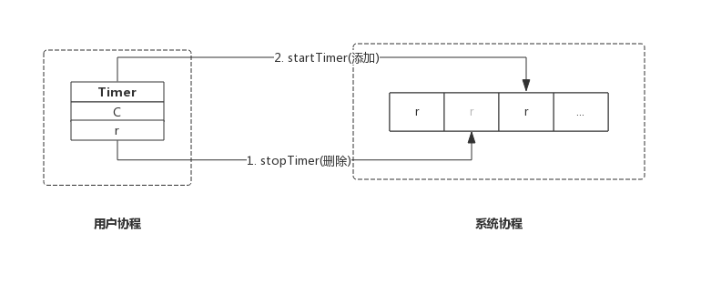

# **TIMER**

> 参考：https://www.bookstack.cn/read/GoExpertProgramming/chapter09-9.1.1-timer_quick_start.md  
> 参考：https://www.bookstack.cn/read/GoExpertProgramming/chapter09-9.1.2-timer_principle.md

<br>

# **1. 快速开始**
- Timer 实际上是一种单一事件的定时器，即经过指定的时间后触发一个事件

- **这个事件通过其本身提供的 channel 进行通知**。

- 之所以叫单一事件，**是因为 Timer 只执行一次就结束**，这也是 Timer 与 Ticker 的最重要的区别之一。

- 通过 ```timer.NewTimer(d Duration)``` 可以创建一个 timer，参数即**等待的时间，时间到来后立即触发一个事件**。

- 源码包 ```src/time/sleep.go:Timer``` 定义了 Timer 数据结构：

    ```go
    type Timer struct { // Timer代表一次定时，时间到来后仅发生一个事件。
        C <-chan Time
        r runtimeTimer
    }
    ```

- **Timer 对外仅暴露一个 `channel`**，指定的时间到来时就往该 channel 中写入系统时间，也即一个事件。

- 本节我们介绍 Timer 的几个使用场景，同时再介绍其对外呈现的方法。

<br>

# **2. 使用场景**
## **2.1. 设定超时时间**
- 有时我们希望从一个管道中读取数据，在管道中没有数据时，我们**不想让程序永远阻塞在管道中，而是设定一个超时时间，在此时间段中如果管道中还是没有数据到来，则判定为超时**。

- Go源码包中有大量类似的用法，比如从一个连接中等待数据，其简单的用法如下代码所示：

    ```go
    func WaitChannel(conn <-chan string) bool {
        timer := time.NewTimer(1 * time.Second)

        select {
        case <- conn:
            timer.Stop()
            return true

        case <- timer.C: // 超时
            println("WaitChannel timeout!")
            return false
        }
    }
    ```

- WaitChannel 作用就是检测指定的管道中是否有数据到来，通过 select 语句轮询 conn 和 timer.C 两个管道

- timer 会在 1s 后向 timer.C 写入数据，如果 1s 内 conn 还没有数据，则会判断为超时。

<br>

## **2.2. 延迟执行某个方法**
- 有时我们希望某个方法在今后的某个时刻执行，如下代码所示：

    ```go
    func DelayFunction() {
        timer := time.NewTimer(5 * time.Second)

        select {
        case <- timer.C:
            log.Println("Delayed 5s, start to do something.")
        }
    }
    ```

- **```DelayFunction()``` 会一直等待 timer 的事件到来才会执行后面的方法(打印)**。

<br>

# **3. Timer对外接口**
## **3.1. 创建定时器**
- 使用方法 ```func NewTimer(d Duration) *Timer``` 指定一个时间即可创建一个 Timer，Timer 一经创建便开始计时，不需要额外的启动命令。

- 实际上，**创建 Timer 意味着把一个计时任务交给`系统守护协程`，该协程管理着所有的 Timer**

- **当 Timer 的时间到达后向 Timer 的管道中发送当前的时间作为事件**。详细的实现原理我们后面会单独介绍。

<br>

## **3.2. 停止定时器**
- Timer 创建后可以随时停止，停止计时器的方法是：

    ```go
    func (t *Timer) Stop() bool
    ```

- **其返回值代表定时器有没有超时**：

    - true: **定时器超时前停止**，后续不会再有事件发送；

    - false: **定时器超时后停止**；

- 实际上，**停止计时器意味着通知`系统守护协程`移除该定时器**。详细的实现原理我们后面单独介绍。

<br>

## **3.3. 重置定时器**
- **已过期的定时器或者已停止的定时器**，可以通过重置动作重新激活，重置方法如下：

    ```go
    func (t *Timer) Reset(d Duration) bool
    ```

- **重置的动作实质上是先停掉定时器，再启动。其返回值也即停掉计时器的返回值**。

- 需要注意的是，重置定时器虽然可以用于修改还未超时的定时器，**但正确的使用方式还是针对已过期的定时器或已被停止的定时器**，同时其返回值也不可靠，返回值存在的价值仅仅是与前面版本兼容。

- 实际上，**重置定时器意味着通知系统`守护协程`移除该定时器，重新设定时间后，再把定时器交给`守护协程`**。详细的实现原理我们后面单独介绍。

<br>

# **4. 简单接口**
- 前面介绍了 Timer 的标准接口，time 包同时还提供了一些简单的方法，在特定的场景下可以简化代码。

## **4.1. After()**
- 有时我们**就是想等指定的时间，没有需求提前停止定时器，也没有需求复用该定时器**，那么可以使用**匿名的定时器**。

- ```func After(d Duration) <-chan Time``` 方法创建一个定时器，并返回定时器的管道，如下代码所示：

    ```go
    func AfterDemo() {
        log.Println(time.Now())
        <- time.After(1 * time.Second)
        log.Println(time.Now())
    }
    ```

- ```AfterDemo()``` 两条打印时间间隔为1s，实际还是一个定时器，但代码变得更简洁。

<br>

## **4.2.AfterFunc()**
- 前面我们例子中讲到延迟一个方法的调用，实际上通过 AfterFunc 可以更简洁。AfterFunc 的原型为：

    ```go
    func AfterFunc(d Duration, f func()) *Timer
    ```

- 该方法在指定时间到来后会执行函数 f。例如：

    ```go
    func AfterFuncDemo() {
        log.Println("AfterFuncDemo start: ", time.Now())
        time.AfterFunc(1 * time.Second, func() {
            log.Println("AfterFuncDemo end: ", time.Now())
        })
        time.Sleep(2 * time.Second) // 等待协程退出
    }
    ```

- ```AfterFuncDemo()``` 中先打印一个时间，然后使用 AfterFunc 启动一个定器，并指定定时器结束时执行一个方法打印结束时间。

- 与上面的例子所不同的是，**```time.AfterFunc()``` 是异步执行的，所以需要在函数最后 sleep 等待指定的协程退出**，否则可能函数结束时协程还未执行。

<br>

## **4.3. 总结**
- 本节简单介绍了 Timer 的常见使用场景和接口，后面的章节再介绍 Ticker、以及二者的实际细节。

- Timer内容总结如下：

    - ```time.NewTimer(d)``` 创建一个 Timer;

    - ```timer.Stop()``` 停掉当前 Timer;

    - ```timer.Reset(d)``` 重置当前 Timer;

<br>

# **5. 实现原理**
- 本节我们从 Timer 数据结构入手，结合源码分析 Timer 的实现原理。

- 很多人想当然的以为，启动一个 Timer 意味着启动了一个协程，这个协程会等待 Timer 到期，然后向 Timer 的管道中发送当前时间。

- 实际上，**每个 Go 应用程序都有一个协程专门负责管理所有的 Timer**，**这个协程负责监控 Timer 是否过期，过期后执行一个预定义的动作，这个动作对于 Timer 而言就是发送当前时间到管道中**。

<br>

## **5.1. 数据结构**
### **5.1.1. Timer**
- 源码包 ```src/time/sleep.go:Timer``` 定义了其数据结构：

    ```go
    type Timer struct {
        C <-chan Time
        r runtimeTimer
    }
    ```

- Timer 只有两个成员

    - C: **管道，上层应用跟据此管道接收事件**；

    - r: **runtime 定时器，该定时器即系统管理的定时器，对上层应用不可见**；

- 这里应该按照层次来理解 Timer 数据结构，**Timer.C 即面向 Timer 用户的，Timer.r 是面向底层的定时器实现**。

<br>

### **5.1.2. runtimeTimer**
- 前面我们说过，**创建一个 Timer 实质上是把一个定时任务交给专门的协程进行监控**，这个任务的载体便是```runtimeTimer```

- 简单的讲，**每创建一个 Timer 意味着创建一个 runtimeTimer变量**，然后把它交给系统进行监控。

- **我们通过设置 runtimeTimer 过期后的行为来达到定时的目的**。

- 源码包 ```src/time/sleep.go:runtimeTimer``` 定义了其数据结构：

    ```go
    type runtimeTimer struct {
        tb uintptr                          // 存储当前定时器的数组地址
        i  int                              // 存储当前定时器的数组下标
        when   int64                        // 当前定时器触发时间
        period int64                        // 当前定时器周期触发间隔
        f      func(interface{}, uintptr)   // 定时器触发时执行的函数
        arg    interface{}                  // 定时器触发时执行函数传递的参数一
        seq    uintptr                      // 定时器触发时执行函数传递的参数二(该参数只在网络收发场景下使用)
    }
    ```

- 其成员如下：

    - tb: 系统底层存储 runtimeTimer 的数组地址；

    - i: 当前 runtimeTimer 在 tb 数组中的下标；

    - when: 定时器触发事件的时间；

    - period: 定时器周期性触发间隔（对于 Timer 来说，此值恒为 0）；

    - f: 定时器触发时执行的回调函数，回调函数接收两个参数；

        - arg: 定时器触发时执行回调函数的参数一；
        
        - seq: 定时器触发时执行回调函数的参数二（Timer并不使用该参数）；

<br>

## **5.2. 实现原理**
- 一个进程中的多个 Timer 都由底层的一个协程来管理，为了描述方便我们把这个协程称为系统协程。

- 我们想在后面的章节中单独介绍系统协程工作机制，本节，我们先简单介绍其工作过程。

- 系统协程把 runtimeTimer 存放在数组中，并按照 **when** 字段对所有的 runtimeTimer 进行堆排序，定时器触发时执行 runtimeTimer 中的预定义函数 **f**，即完成了一次定时任务。

<br>

### **5.2.1. 创建 Timer**
- 我们来看创建 Timer 的实现，非常简单：

    ```go
    func NewTimer(d Duration) *Timer {
        c := make(chan Time, 1)  // 创建一个管道
        t := &Timer{ // 构造Timer数据结构
            C: c,               // 新创建的管道
            r: runtimeTimer{
                when: when(d),  // 触发时间
                f:    sendTime, // 触发后执行函数sendTime
                arg:  c,        // 触发后执行函数sendTime时附带的参数
            },
        }
        startTimer(&t.r) // 此处启动定时器，只是把runtimeTimer放到系统协程的堆中，由系统协程维护
        return t
    }
    ```

- ```NewTimer()``` 只是构造了一个 Timer，**然后把 Timer.r 通过 ```startTimer()``` 交给系统协程维护**。

- 其中 ```when()``` 方法是**计算下一次定时器触发的绝对时间**，即当前时间 +NewTimer() 参数 d。

- 其中 **sendTime() 方法便是定时器触发时的动作**：

    ```go
    func sendTime(c interface{}, seq uintptr) {
        select {
        case c.(chan Time) <- Now():
        default:
        }
    }
    ```

- sendTime 接收一个管道作为参数，**其主要任务是向管道中写入当前时间**。

- 创建 Timer 时生成的管道**含有一个缓冲区（make(chan Time, 1)）**，**所以 Timer 触发时向管道写入时间永远不会阻塞**，sendTime 写完即退出。

- 之所以 ```sendTime()``` 使用 select 并搭配一个空的 default 分支，是因为后面所要讲的 Ticker 也复用 ```sendTime()```，**Ticker 触发时也会向管道中写入时间，但无法保证之前的数据已被取走，所以使用 select 并搭配一个空的 default 分支，确保 ```sendTime()``` 不会阻塞**，Ticker 触发时，**如果管道中还有值，则本次不再向管道中写入时间，本次触发的事件直接丢弃**。

- ```startTimer(&t.r)``` 的具体实现在 runtime 包，**其主要作用是把 runtimeTimer 写入到系统协程的数组中，并启动系统协程（如果系统协程还未开始运行的话）**。更详细的内容，待后面讲解系统协程时再介绍。

- 综上，创建一个 Timer 示意图如下：

    

<br>

### **5.2.2. 停止Timer**
- 停止 Timer，**只是简单的把 Timer 从`系统协程`中移除**。函数主要实现如下：

    ```go
    func (t *Timer) Stop() bool {
        return stopTimer(&t.r)
    }
    ```

- **```stopTimer()``` 即通知系统协程把该 Timer 移除，即不再监控**。**系统协程只是移除 Timer 并不会关闭管道**，以避免用户协程读取错误。

- 系统协程监控 Timer 是否需要触发，Timer 触发后，系统协程会删除该 Timer。所以在 ```Stop()``` 执行时有两种情况：

    - **Timer 还未触发，系统协程已经删除该 Timer，Stop() 返回 false**；

    - **Timer 已经触发，系统协程还未删除该 Timer，Stop() 返回 true**;

- 综上，停止一个 Timer 示意图如下：

    

<br>

### **5.2.3. 重置 Timer**
- **重置 Timer 时会先 timer 先从系统协程中删除，修改新的时间后重新添加到系统协程中**。

- 重置函数主要实现如下所示：

    ```go
    func (t *Timer) Reset(d Duration) bool {
        w := when(d)
        active := stopTimer(&t.r)
        t.r.when = w
        startTimer(&t.r)
        return active
    }
    ```

- **其返回值与 ```Stop()``` 保持一致，即如果 Timer 成功停止，则返回 true，如果 Timer 已经触发，则返回 false**。

- 重置一个 Timer 示意图如下：

    

- **由于新加的 Timer 时间很可能变化，所以其在系统协程的位置也会发生变化**。

- 需要注意的是，按照官方说明，**Reset() 应该作用于已经停掉的 Timer 或者已经触发的 Timer，按照这个约定其返回值将总是返回 false**，之所以仍然保留是为了保持向前兼容，使用老版本 Go 编写的应用不需要因为 Go 升级而修改代码。

- 如果不按照此约定使用 Reset()，**有可能遇到 Reset() 和 Timer 触发同时执行的情况，此时有可能会收到两个事件**，从而对应用程序造成一些负面影响，使用时一定要注意。

<br>

## **5.3. 总结**
- **NewTimer() 创建一个新的 Timer 交给系统协程监控**；

- **Stop() 通知系统协程删除指定的 Timer**;

- **Reset() 通知系统协程删除指定的 Timer 并再添加一个新的 Timer**；