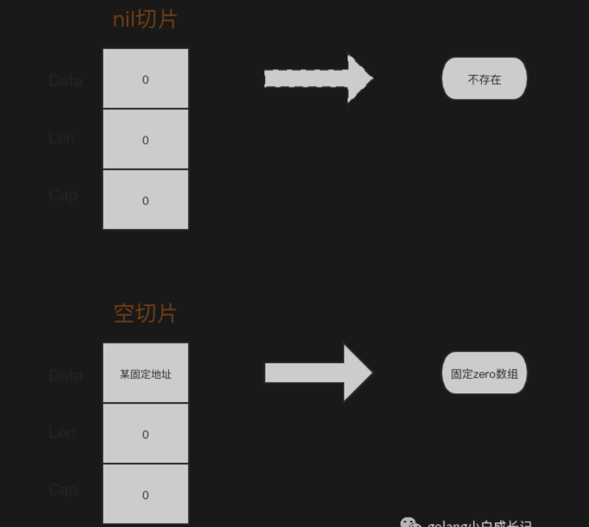
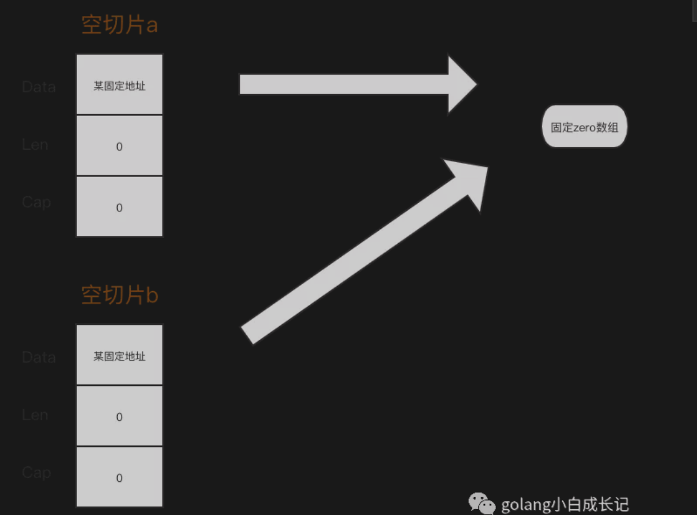

# **nil 切片和空切片一不一样**

<br>

## **问题**
- nil 切片和空切片指向的地址一样吗？这个代码会输出什么？

    ```go
    package main
    import (
        "fmt"
        "reflect"
        "unsafe"
    )

    func main() {
        var s1 []int
        s2 := make([]int,0)
        s4 := make([]int,0)

        fmt.Printf("s1 pointer:%+v, s2 pointer:%+v, s4 pointer:%+v, \n", *(*reflect.SliceHeader)(unsafe.Pointer(&s1)),*(*reflect.SliceHeader)(unsafe.Pointer(&s2)),*(*reflect.SliceHeader)(unsafe.Pointer(&s4)))

        fmt.Printf("%v\n", (*(*reflect.SliceHeader)(unsafe.Pointer(&s1))).Data==(*(*reflect.SliceHeader)(unsafe.Pointer(&s2))).Data)

        fmt.Printf("%v\n", (*(*reflect.SliceHeader)(unsafe.Pointer(&s2))).Data==(*(*reflect.SliceHeader)(unsafe.Pointer(&s4))).Data)
    }
    ```

<br>

## **怎么答**
- **nil 切片和空切片`指向的地址`不一样。nil 空切片引用数组指针地址为 0（无指向任何实际地址）**

- **空切片的引用数组`指针地址是有`的，且`固定为一个值`**

<br>

## **解释**
- 之前在前面的文章里提到过切片的数据结构为

    ```go
    type SliceHeader struct {
        Data uintptr  // 引用数组指针地址
        Len  int     // 切片的目前使用长度
        Cap  int     // 切片的容量
    }
    ```

- **nil 切片和空切片最大的区别在于指向的`数组引用地址`是不一样的**。

    

- **所有的空切片指向的数组引用地址都是一样的**

    
