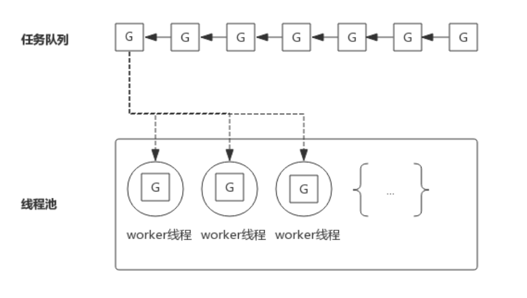
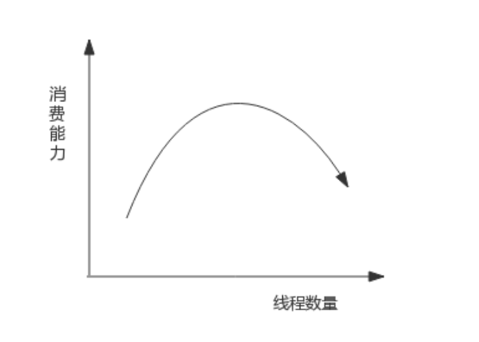

# **协程的概念**

> - 康威定律：“设计系统的架构受制于产生这些设计的组织的沟通结构。”  
> 
> - 即系统的设计本质上反映了企业的组织结构，系统各个模块间的接口也反映了企业各个部门之间的信息流动和合作方式。  
> 
> - “支持协程的语言很多，比如 Python、Perl，但是没有哪个语言能像 go 一样把协程支持的如此优雅，**go 在语言层面直接提供对`协程的支持`成为 `goroutine`**。”

 

# **1. 基本概念**
## **1.1. 进程**
- **进程是`应用程序的启动实例`**

- **每个进程都有自己`独立的内存空间`**

- **不同进程通过`进程间的通信方式`来通信**

 

## **1.2. 线程**
- **`线程`从属于`进程`**

- **每个进程`至少包含一个线程`**

- **线程是 `cpu 调度`的基本单位**

- **多个线程之间可以`共享进程的资源`并通过共享内存等`线程间的通信方式`来通信**

 

## **1.3. 协程**
- **协程可以理解为`轻量级的线程`**，与线程相比

    - **协程`不受操作系统调度`，协程调度器`由用户应用程序`提供**，协程调度器按照调度策略把协程调度到线程中运行。

- **go 应用程序的`协程调度器`由 `runtime` 包提供，用户使用 `go 关键字`即可创建协程**，即语言层面支持协程的含义。

 

# **2. 协程的优势**
- 我们知道，**在高并发应用中频繁创建线程会造成不必要的开销**，所以有了线程池。

    - 线程池中预先保存一定数量的线程，**而新任务将不再以创建线程的方式去执行**，而是**将任务发布到任务队列**
    
    - **线程池中的线程不断的从任务队列中取出任务并执行**，可以有效的减少线程创建和销毁所带来的开销。

- 下图展示一个典型的线程池：

    

- 为了方便下面的叙述，我们把任务队列中的每一个任务称作 G，**而 G 往往代表一个`函数`**。

- **线程池中的线程 `worker 线程`不断的从任务队列中取出任务并执行**。

- **而 `worker 线程`的调度则交给操作系统进行调度**。

- **如果 worker 线程执行的 G 任务中发生系统调用**：

    - 则操作系统会**将该线程置为阻塞状态**，也意味着该线程在怠工
    
    - 也意味着**消费任务队列的 worker 线程变少了**，也就是说**线程池消费任务队列的能力变弱了**。

- 如果任务队列中的大部分任务都会进行系统调用，则会让这种状态恶化，大部分 worker 线程进入阻塞状态，从而**任务队列中的任务产生堆积**。

- 解决这个问题的一个思路就是重新审视线程池中线程的数量

    - **增加线程池中线程数量**可以一定程度上提高消费能力，但随着线程数量增多，**由于过多线程争抢 CPU，消费能力会有上限，甚至出现消费能力下降**。 如下图所示：

        

    - 过多的线程会导致上下文切换的开销增大，**而工作在`用户态`的协程能大大减少上下文切换的开销**。

        - **协程调度器把可运行的协程逐个`调度到线程中`执行，同时及时把阻塞的协程`调度出线程`，从而有效的避免线程的频繁切换，达到了`使用少量线程实现高并发`的效果**。

        - **`多个协程`分享操作系统分给`线程的时间片`，从而达到充分利用 cpu 运算力的目的**，协程调度器则决定了协程运行的顺序。线程运行调度器指定的协程，但每一时刻只能运行一个协程。