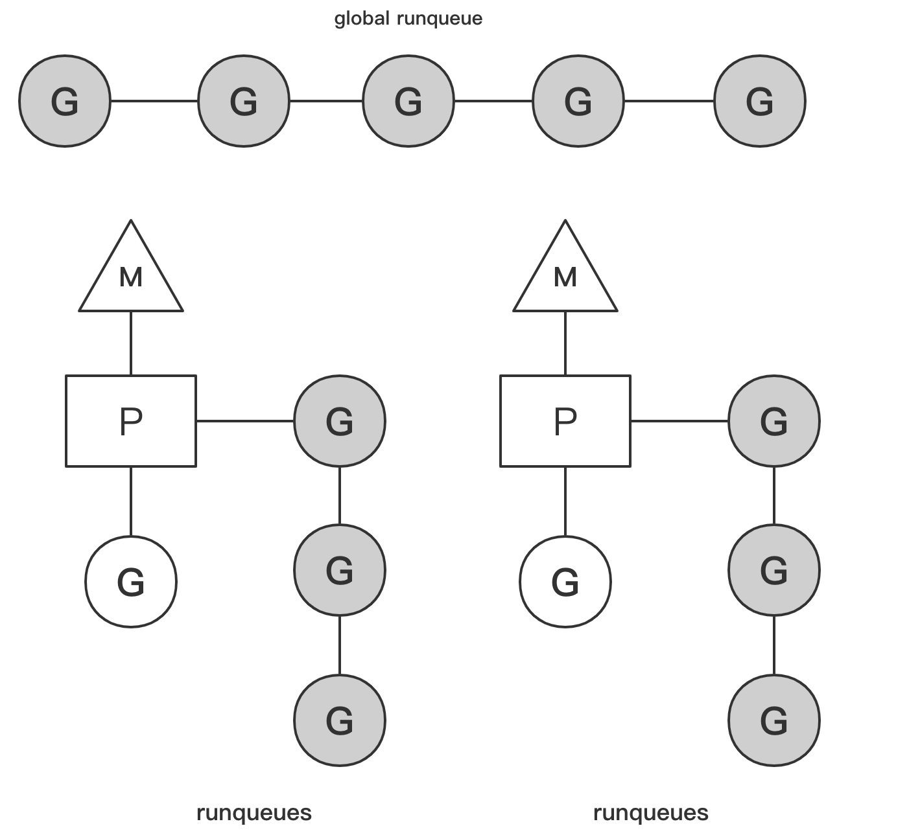

# **调度模型**

# **1. 线程模型**
- **线程可分为`用户线程`和`内核线程`**
    - **`用户线程`由`用户创建、同步、销毁`**
    
    - **`内核线程`则由`内核`来管理**

- **根据`用户线程管理方式`的不同，分为三种线程模型**

    - **一种是 `N:1` 模型，即 `N 个用户线程`运行在 `1 个内核线程`中**

        - 优点是用户线程上下文切换快
        
        - 缺点是无法充分利用 `cpu 多核`的算力。

    - **另一种是 `1:1` 模型，即每个用户线程对应一个内核线程**
    
        - 优点是充分利用 `cpu 的算力`
        
        - 缺点是线程上下文切换较慢。

    - **go 实现的是 `M:N 模型`，即前两种模型的组合，`M 个用户线程`（`协程`）运行在 `N 个线程`中**

        - 优点是充分利用 `cpu 的算力`，且上下文切换快
        
        - 缺点是该模型的调度算法较为复杂。

<br>

# **2. go 调度器基础**
- go 协程调度模型中包含三个关键实体：

    - **`M（Machine）`：`工作线程`，由操作系统调度**。

    - **`P（Processor）`：`处理器`（Go 中定义的一个摡念，不是指 CPU），包含运行 Go 代码的必要资源，也有调度 goroutine 的能力**。

    - **`G（Goroutine）`：即 `Go 协程`**，每个 go 关键字都会创建一个协程。

- **M 必须拥有 P 才可以执行 G 中的代码**

- 跟系统中的其他线程一样，M 也会被系统调用阻塞。

- **P 的个数在程序启动时决定，默认情况下等同于 cpu 的核数**，可以使用环境变量 GOMAXPROCS 或在程序中使用 runtime.GOMAXPROCS() 方法指定 P 的个数。

- 使用环境变量：

    ```bash
    export GOMAXPROCS = 80
    ```

- 程序中设置：

    ```go
    runtime.GOMAXPROCS(80)
    ```

- M 的个数通常稍大于 P 的个数，因为除了运行 go 代码，runtime 包还有其他内置任务需要处理。

- 一个简单的调度器模型如图所示。

    

- **上图中包括两个工作线程 M，每个 M 持有一个处理器 P，并且每一个 M 中由一个协程 G 在运行**。

- 灰色背景的协程正在等待被调度，它们位于被称为 runqueue 的队列中。

- 每个处理器 P 中拥有一个 runqueues 队列，此外还有一个全局的 runqueues 队列，由多个处理器共享。

- 早期的调度器实现中只包含全局的 runqueues，多个处理器 P 通过互斥锁来调度队列中的协程
    
    - 在多 cpu 或多核的环境中，多个处理器需要经常争抢锁来调度全局队列中的协程，严重影响并发效率。
    
    - 后来引入局部的 runqueues，每个处理器 P 访问自己的 runqueues 不需要枷锁，提高了效率。

- 一般来说，处理器 P 中的协程 G 额外再创建的协程会加入本地的 runqueues 中
    
    - 但如果本地的队列已满，或者阻塞的协程被唤醒，则协程会被放入全局的 runqueues 中
    
    - 处理器 P 除了调度本地的 runqueue 中的协程，还会周期性的从全局 runqueue 中摘取协程来调度。

