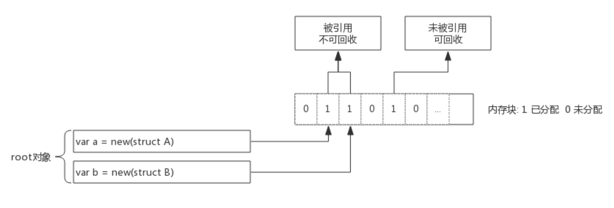
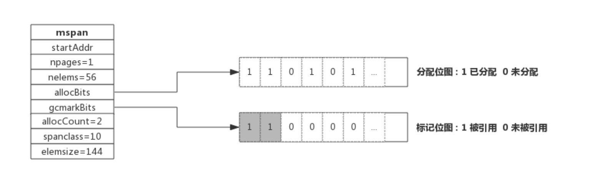
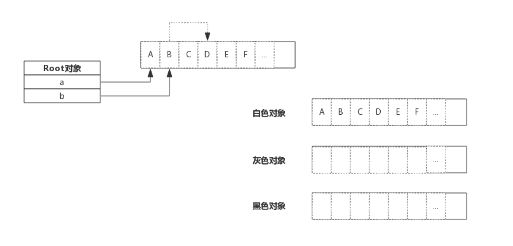
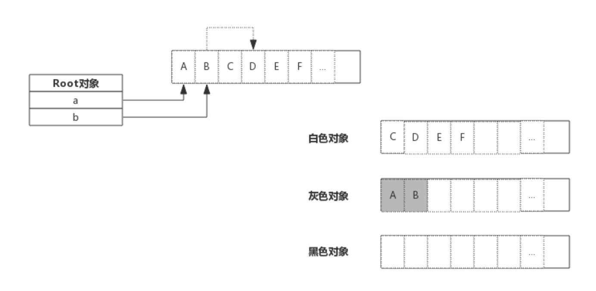
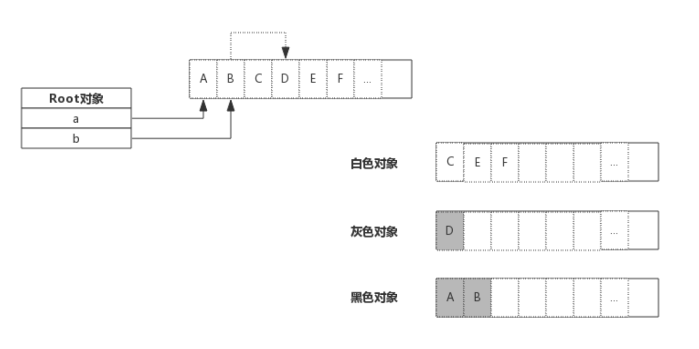
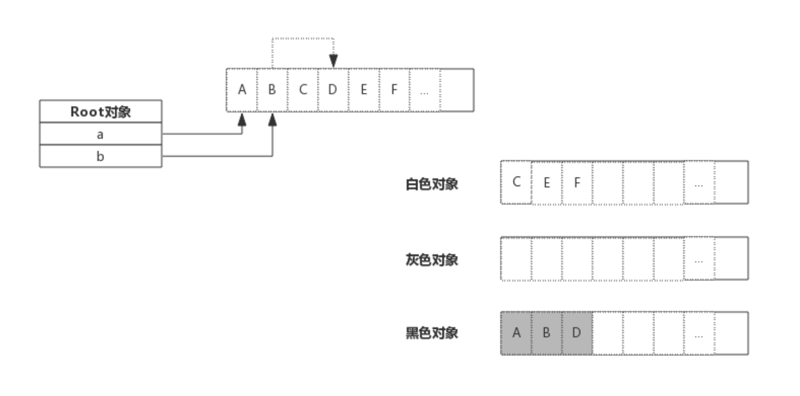

# **垃圾回收原理**

- 所谓垃圾就是**不再需要的内存块**，这些垃圾如果不清理就没办法再次被分配使用

- **在不支持垃圾回收的编程语言里，这些垃圾内存就是```泄露的内存```**。

- **Golang 的垃圾回收（GC）也是```内存管理```的一部分**，了解垃圾回收最好先了解前面介绍的内存分配原理。

<br>

# **1. 垃圾回收算法**
- 业界常见的垃圾回收算法有以下几种：

    - **引用计数**：**对每个对象维护一个引用计数**，**当引用该对象的对象被销毁时，引用`计数减 1`，当引用`计数器为 0` 时回收该对象**。

        - 优点：对象可以很快的被回收，不会出现内存耗尽或达到某个阀值时才回收。

        - 缺点：不能很好的处理循环引用，而且实时维护引用计数，有也一定的代价。

        - 代表语言：Python、PHP、Swift

    - **标记-清除**：**从```根变量```开始遍历所有引用的对象**，引用的对象标记为 “被引用”，没有被标记的进行回收。

        - 优点：解决了引用计数的缺点。

        - 缺点：**需要 STW，即要暂时停掉程序运行**。

        - 代表语言：**Golang (其采用三色标记法)**

    - **分代收集**：按照对象生命周期长短划分不同的代空间，生命周期长的放入老年代，而短的放入新生代，不同代有不能的回收算法和回收频率。

        - 优点：回收性能好

        - 缺点：算法复杂

        - 代表语言： JAVA

<br>

# **2. Golang 垃圾回收**
## **2.1. 垃圾回收原理**
- 简单的说，垃圾回收的核心就是**标记出哪些内存还在使用中（即```被引用到```），哪些内存不再使用了（即```未被引用```），把未被引用的内存回收掉**，以供后续内存分配时使用。

- 下图展示了一段内存，内存中即有已分配掉的内存，也有未分配的内存，垃圾回收的目标就是把那些**已经分配的但没有对象引用的内存**找出来并回收掉：

    

- 上图中，内存块 1、2、4 号位上的内存块已被分配（数字 1 代表已被分配，0 未分配）。变量 a，b 为一指针，指向内存的 1、2 号位。内存块的 4 号位曾经被使用过，但现在没有任何对象引用了，就需要被回收掉。

- **垃圾回收开始时从 ```root 对象```开始扫描，把 root 对象引用的内存标记为 “被引用”**

- 考虑到内存块中存放的可能是指针，所以还需要**递归的进行标记**

- 全部标记完成后，**只保留被标记的内存，未被标记的全部标识为未分配即完成了回收**。

<br>

## **2.2. 内存标记 (Mark)**
- 前面介绍内存分配时，介绍过 span 数据结构，span 中维护了一个个内存块，并**由一个位图 ```allocBits``` 表示每个内存块的分配情况**。在 span 数据结构中还有**另一个位图 ```gcmarkBits``` 用于标记内存块被引用情况**。

    

- 如上图所示，**```allocBits``` 记录了每块内存分配情况**，**而 ```gcmarkBits``` 记录了每块内存标记情况**。标记阶段对每块内存进行标记，有对象引用的的内存标记为 1 (如图中灰色所示)，没有引用到的保持默认为 0.

- ```allocBits``` 和 ```gcmarkBits``` 数据结构是完全一样的，标记结束就是内存回收，回收时将 ```allocBits``` 指向 ```gcmarkBits```，则代表**标记过的内存才是存活的**，```gcmarkBits``` 则会在下次标记时重新分配内存，非常的巧妙。

<br>

## **2.3. 三色标记法**
- 前面介绍了对象标记状态的存储方式，还需要有一个标记队列来存放待标记的对象，可以简单想象成把对象从标记队列中取出，将对象的引用状态标记在 span 的 ```gcmarkBits```，把对象引用到的其他对象再放入队列中。

- 三色只是为了叙述上方便抽象出来的一种说法，实际上对象并没有颜色之分。这里的三色，对应了**垃圾回收过程中对象的三种状态**：

    - 灰色：**对象还在标记队列中等待**

    - 黑色：**对象```已被标记```，gcmarkBits 对应的位为 1**（该对象**不会在本次 GC 中被清理**）

    - 白色：**对象```未被标记```，gcmarkBits 对应的位为 0**（该对象**将会在本次 GC 中被清理**）

- 例如，当前内存中有 A~F 一共 6 个对象，**根对象 a，b 本身为栈上分配的局部变量**，根对象 **a、b 分别引用了对象 A、B**，而 **B 对象又引用了对象 D**，则 GC 开始前各对象的状态如下图所示:

    

- 初始状态下**所有对象都是白色的**。

- 接着开始扫描根对象 a、b：

    

- 由于根对象引用了对象 A、B，那么 **A、B 变为灰色对象**，接下来就开始分析灰色对象，分析 A 时，**A 没有引用其他对象很快就转入黑色**，**B 引用了 D**，则**B 转入黑色的同时还需要将 D 转为灰色**，进行接下来的分析。如下图所示：

    

- 上图中灰色对象只有 D，由于**D 没有引用其他对象，所以 D 转入黑色**。标记过程结束：

    

- 最终，**黑色的对象会被保留下来，白色对象会被回收掉**。

<br>

## **2.4. Stop The World**
- 对于垃圾回收来说，回收过程中需要控制住内存的变化，**否则回收过程中```指针传递```会引起```内存引用关系```变化**，如果错误的回收了还在使用的内存，结果将是灾难性的。

- Golang 中的 ```STW（Stop The World）``` 就是**停掉所有的 goroutine，专心做垃圾回收**，待垃圾回收结束后再恢复 goroutine。

- **STW 时间的长短直接影响了应用的执行，时间过长对于一些 web 应用来说是不可接受的**，这也是广受诟病的原因之一。

- 为了缩短 STW 的时间，Golang 不断优化垃圾回收算法，这种情况得到了很大的改善。

<br>

# **3. 垃圾回收优化**
## **3.1. 写屏障（Write Barrier）**
- 前面说过**STW 目的是防止 GC 扫描时```内存变化```而停掉 goroutine**，而写屏障就是**让 goroutine 与 GC 同时运行**的手段。

- 虽然**写屏障不能完全消除 STW，但是可以大大减少 STW 的时间**。

- 写屏障类似一种开关，**在 GC 的特定时机开启**，**开启后指针传递时会标记指针**，即**本轮不回收，下次 GC 时再确定**。

- GC 过程中**新分配的内存会被立即标记**，用的并不是写屏障技术，也**即 GC 过程中分配的内存不会在本轮 GC 中回收**。

<br>

## **3.2. 辅助 GC（Mutator Assist）**
- 为了防止内存分配过快，在 GC 执行过程中，**如果 goroutine 需要分配内存，那么这个 goroutine 会参与一部分 GC 的工作**，即帮助 GC 做一部分工作，这个机制叫作 ```Mutator Assist```。

<br>

# **4. 垃圾回收触发时机**
## **4.1. 内存分配量达到阀值触发 GC**
- 每次内存分配时都会**检查当前内存分配量是否已达到阀值**，如果达到阀值则立即启动 GC。

    ```
    阀值 = 上次 GC 内存分配量 * 内存增长率
    ```

- **内存增长率由环境变量 ```GOGC``` 控制**，默认为 100，即**每当内存扩大一倍时启动 GC**。

<br>

## **4.2 定期触发 GC**
- **默认情况下，最长 `2 分钟`触发一次 GC，这个间隔在```src/runtime/proc.go:forcegcperiod```变量中被声明**：

    ```go
    // forcegcperiod is the maximum time in nanoseconds between garbage
    // collections. If we go this long without a garbage collection, one
    // is forced to run.
    //
    // This is a variable for testing purposes. It normally doesn't change.
    var forcegcperiod int64 = 2 * 60 * 1e9
    ```

<br>

## **4.3. 手动触发**
- 程序代码中也**可以使用 ```runtime.GC()``` 来手动触发 GC**。这主要用于 GC 性能测试和统计。

<br>

# **5. GC 性能优化**
- **GC 性能与```对象数量```负相关**，**对象越多 GC 性能越差，对程序影响越大**。

- **所以 GC 性能优化的思路之一就是```减少对象分配个数```，比如```对象复用```或使用```大对象组合多个小对象```等等**。

- 另外，**由于```内存逃逸```现象，有些隐式的内存分配也会产生，也有可能成为 GC 的负担**。

- 关于 GC 性能优化的具体方法，后面单独介绍。

<br>

# **6. 注**
- **根对象到底是什么？**
    - 根对象在垃圾回收的术语中又叫做根集合，它是**垃圾回收器在```标记过程```时最先检查的对象**，包括：

        1. **全局变量**：程序在编译期就能确定的那些存在于程序整个生命周期的变量。

        2. **执行栈**：每个 goroutine 都包含自己的执行栈，这些执行栈上包含**栈上的变量**及指向**分配的堆内存区块的指针**。

        3. **寄存器**：寄存器的值可能表示一个指针，参与计算的这些指针可能指向某些赋值器分配的堆内存区块。
