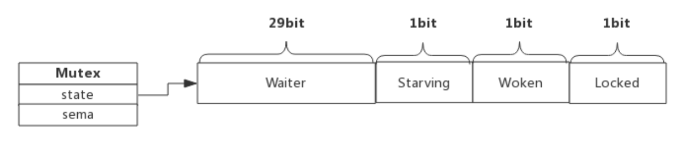
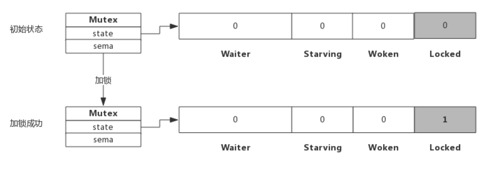
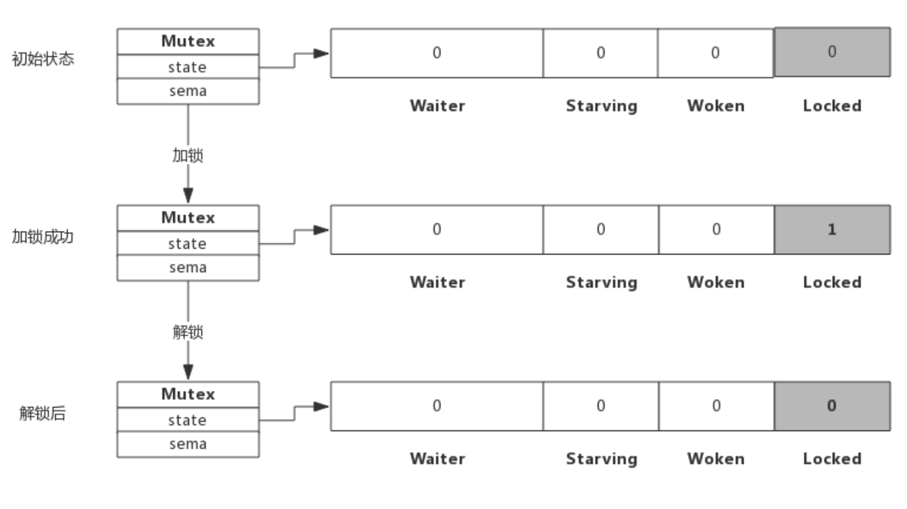
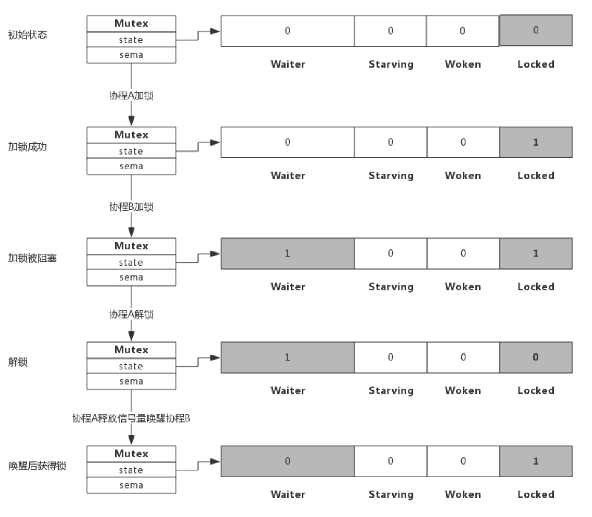

# **MUTEX**

<br>

- 互斥锁是并发程序中对共享资源进行访问控制的主要手段，对此 Go 语言提供了非常简单易用的 Mutex

    - **Mutex 为一结构体类型，对外暴露两个方法 `Lock()` 和 `Unlock()` 分别用于加锁和解锁**。

- Mutex 使用起来非常方便，但其内部实现却复杂得多，这包括 Mutex 的几种状态。另外，我们也想探究一下 Mutex 重复解锁引起 panic 的原因。

<br>

# **1. Mutex 数据结构**
## **1.1. Mutex 结构体**
- 源码包 `src/sync/mutex.go:Mutex` 定义了互斥锁的数据结构：

    - `Mutex.state` 表示**互斥锁的状态**，比如是否被锁定等。

    - `Mutex.sema` 表示**信号量**，**协程阻塞等待该信号量，解锁的协程释放信号量从而唤醒等待信号量的协程**。

        ```go
        type Mutex struct {
            state int32
            sema  uint32
        }
        ```

- **我们看到 `Mutex.state` 是 32 位的整型变量**，内部实现时**把该变量分成`四份`，用于记录 Mutex 的四种状态**。

- 下图展示 Mutex 的内存布局：

    1. `Locked`：**表示该 Mutex 是否已被锁定**

        - 0：没有锁定
        
        - 1：已被锁定。

    2. `Woken`：**表示是否有协程已被唤醒**

        - 0：没有协程唤醒
        
        - 1：已有协程唤醒，正在加锁过程中。

    3. `Starving`：**表示该 Mutex 是否处理饥饿状态**

        - 0：没有饥饿
        
        - 1：饥饿状态，说明有协程阻塞了超过 1ms。

    4. `Waiter`：**表示阻塞等待锁的协程个数**，**协程解锁时根据此值来判断是否需要释放信号量**。

        

- **协程之间抢锁实际上是`抢给 Locked 赋值的权利`，能给 Locked 域置 1，就说明抢锁成功**。

- **抢不到的话就阻塞等待 `Mutex.sema` 信号量，一旦持有锁的协程解锁，等待的协程会依次被唤醒**。

- **`Woken` 和 `Starving` 主要用于控制协程间的抢锁过程**，后面再进行了解。

<br>

## **1.2. Mutex 方法**
- **Mutext 对外提供两个方法，实际上也只有这两个方法**：

    - **`Lock()`：加锁方法**

    - **`Unlock()`：解锁方法**

- 下面我们分析一下加锁和解锁的过程，**加锁分成功和失败两种情况，成功的话直接获取锁，失败后当前协程被阻塞**，同样，解锁时跟据是否有阻塞协程也有两种处理。

<br>

# **2. 加解锁过程**
## **2.1. 简单加锁**
- 假定当前只有一个协程在加锁，没有其他协程干扰，那么过程如下图所示：

    

- **加锁过程会去判断 `Locked` 标志位是否为 0**

    - **如果是 0 则把 `Locked` 位置 1，代表`加锁成功`**。

    - 从上图可见，**加锁成功后，只是 `Locked 位置 1`，其他状态位没发生变化**。

<br>

## **2.2. 加锁被阻塞**
- **假定加锁时，锁已被其他协程占用了**，此时加锁过程如下图所示：

    

- 从上图可看到，**当协程 B 对一个已被占用的锁再次加锁时，`Waiter 计数器`增加了 1**，**此时`协程 B 将被阻塞`，直到 `Locked` 值变为 0 后才会被唤醒**。

<br>

## **2.3. 简单解锁**
- **假定解锁时，没有其他协程阻塞**，此时解锁过程如下图所示：

    

- **由于没有其他协程阻塞等待加锁，所以此时解锁时只需要把 `Locked 位置为 0` 即可，不需要释放信号量**。

<br>

## **2.4. 解锁并唤醒协程**
- **假定解锁时，有 1 个或多个协程阻塞**，此时解锁过程如下图所示：

    

- **协程 A 解锁过程分为两个步骤**
    
    - **一是把 `Locked 位置 0`**
    
    - **二是查看到 `Waiter > 0`，所以释放`一个信号量`**，**唤醒`一个阻塞的协程`，被唤醒的协程 B 把 `Locked 位置 1`，于是协程 B 获得锁**。

<br>

# **3. 自旋过程**
- 加锁时，**如果当前 `Locked` 位为 1，说明该锁当前由其他协程持有，`尝试加锁`的协程`并不是马上转入阻塞`**，而是会**持续的`探测 Locked 位是否变为 0`，这个过程即为自旋过程**。

- 自旋时间很短，**但如果在自旋过程中发现锁已被释放，`那么协程可以立即获取锁`**。此时**即便有协程被唤醒也无法获取锁，只能再次阻塞**。

- 自旋的好处是，**当加锁失败时不必立即转入阻塞，有`一定机会获取到锁`，这样可以避免`协程的切换`**。

<br>

## **3.1. 什么是自旋**
- 自旋对应于 CPU 的 `PAUSE` 指令，CPU 对该指令什么都不做，相当于 CPU 空转，对程序而言相当于 sleep 了一小段时间，时间非常短，当前实现是 30 个时钟周期。

- 自旋过程中**会持续探测 `Locked` 是否变为 0**，连续两次探测间隔就是执行这些 PAUSE 指令，它不同于 sleep，不需要将协程转为睡眠状态。

<br>

## **3.2. 自旋条件**
- **加锁时程序会自动判断是否可以自旋，无限制的自旋将会给 CPU 带来巨大压力**，所以判断是否可以自旋就很重要了。

- 自旋必须满足以下所有条件：
    - **自旋次数要足够小**，通常为 4，即自旋最多 4 次

    - **CPU 核数要大于 1**，**否则自旋没有意义，因为此时不可能有其他协程释放锁**

    - **协程调度机制中的 Process 数量要大于 1，比如使用 `GOMAXPROCS()` 将处理器设置为 1 就不能启用自旋**
    
    - 协程调度机制中的**可运行队列必须为空**，否则会延迟协程调度

- 可见，自旋的条件是很苛刻的，总而言之就是不忙的时候才会启用自旋。

<br>

## **3.3. 自旋的优势**
- 自旋的优势是**更充分的利用 CPU，尽量避免协程切换**。

    - 因为当前申请加锁的协程拥有 CPU，**如果经过短时间的自旋可以获得锁，当前协程可以继续运行，不必进入阻塞状态**。

<br>

## **3.4. 自旋的问题**
- **如果自旋过程中获得锁，那么之前`被阻塞的协程`将无法获得锁**

- **如果加锁的协程特别多，每次都通过自旋获得锁，那么之前`被阻塞的进程`将很难获得锁**，从而进入**饥饿状态**。

- 为了避免协程长时间无法获取锁，自 1.8 版本以来增加了一个状态，即 **Mutex 的 `Starving` 状态**。

    - 这个状态下不会自旋，**一旦有协程释放锁，那么一定会唤醒一个协程并成功加锁**。

<br>

# **4. Mutex 模式**
- 前面分析加锁和解锁过程中只关注了 Waiter 和 Locked 位的变化，现在我们看一下 Starving 位的作用。

- **每个 Mutex 都有两个模式，称为 `Normal` 和 `Starving`**。下面分别说明这两个模式。

<br>

## **4.1. normal 模式**
- **默认情况下，Mutex 的模式为 `normal`**。

- 该模式下，**协程如果加锁不成功不会`立即转入阻塞`排队**，而是**判断是否满足`自旋`的条件**，如果满足则会**启动自旋过程**，尝试抢锁。

<br>

## **4.2. starvation 模式**
- 自旋过程中能抢到锁，**一定意味着同一时刻有协程释放了锁**

- 我们知道释放锁时**如果发现有`阻塞等待`的协程，还会释放`一个信号量`来唤醒`一个等待协程`**，被唤醒的协程得到 CPU 后开始运行
    - 此时发现锁已被抢占了，**自己只好再次阻塞**
    
    - 不过阻塞前会**判断自上次阻塞到本次阻塞经过了多长时间**，如果超过 1ms 的话，**会将 `Mutex` 标记为“`饥饿`”模式**，然后再阻塞。

- **处于饥饿模式下，不会启动自旋过程**，也即**一旦有协程释放了锁，那么一定会唤醒协程**，被唤醒的协程将会成功获取锁，同时也会把等待计数减 1。

<br>

# **5. Woken 状态**
- **Woken 状态用于加锁和解锁过程的通信**

- 举个例子，同一时刻，两个协程一个在加锁，一个在解锁，在加锁的协程可能在自旋过程中，此时把 Woken 标记为 1，用于**通知解锁协程不必释放信号量了**，好比在说：你只管解锁好了，不必释放信号量，我马上就拿到锁了。

<br>

# **6. 为什么重复解锁要 panic**
- **可能你会想，为什么 Go 不能实现得更健壮些，多次执行 `Unlock()` 也不要 panic？**

- 仔细想想 Unlock 的逻辑就可以理解，这实际上很难做到。Unlock 过程分为**将 Locked 置为 0，然后判断 Waiter 值，`如果值 > 0，则释放信号量`**。

- 如果多次 `Unlock()`，**那么可能每次都释放一个信号量**

    - **这样会唤醒`多个协程`**，**多个协程唤醒后会继续在 `Lock()` 的逻辑里抢锁**，势必会增加 `Lock()` 实现的复杂度，也会引起**不必要的协程切换**。

<br>

# **7. 编程 Tips**
## **7.1. 使用 defer 避免死锁**
- **加锁后立即使用 defer 对其解锁，可以有效的避免死锁。**

<br>

## **7.2. 加锁和解锁应该成对出现**
- **加锁和解锁最好出现在同一个层次的代码块中**，比如同一个函数。

- 重复解锁会引起 panic，应避免这种操作的可能性。