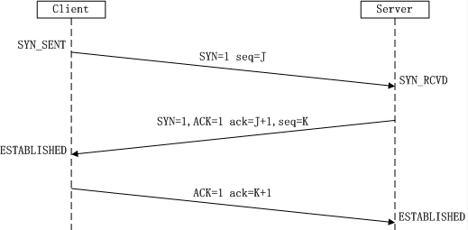

# **三次握手**
> 参考：https://mp.weixin.qq.com/s/gBr3UfC1HRcw4U-ZMmtRaQ  
> 参考：https://hit-alibaba.github.io/interview/basic/network/TCP.html  
> 参考：https://juejin.cn/post/6844903958624878606

<br>

# **1. TCP三次握手**
- **所谓三次握手 (Three-way Handshake)，是指建立一个 TCP 连接时，需要客户端和服务器总共发送3个包**。

- 三次握手的目的是：
    - **连接服务器指定端口，建立 TCP 连接**
    
    - **并同步连接双方的序列号和确认号**
    
    - **交换 TCP 窗口大小信息**
    
- **在 socket 编程中，客户端执行 `connect()` 时将触发三次握手**。

- **第一次握手 (SYN=1, seq=x):**
    - Client 将 SYN 置1，随机产生一个初始序列号 seq 发送给 Server，进入 ```SYN_SENT``` 状态；

    - ```SYN=1``` 的报文段**不能携带数据，但要消耗掉一个序号**。
    
- **第二次握手 (SYN=1, ACK=1, seq=K, ACKnum=J+1):**

    - Server 收到 Client 的 ```SYN=1```之后，知道客户端请求建立连接，**将自己的 SYN 置1，ACK 置1**，产生一个 **acknowledge number=客户端的序列号+1**，并**随机产生一个自己的初始序列号**，发送给客户端；
    
    - 进入 ```SYN_RCVD``` 状态；
    
- **第三次握手 (ACK=1，ACKnum=K+1)**
    - 客户端**检查 acknowledge number 是否为序列号+1，ACK 是否为1**，检查正确之后将自己的 ACK 置为1，产生一个 **acknowledge number = 服务器发的序列号+1**，发送给服务器；
    
    - 进入 ```ESTABLISHED``` 状态；
    
    - 服务器**检查 ACK 为1和 acknowledge number 为序列号+1**之后，也进入 ```ESTABLISHED``` 状态；
    
    - 完成三次握手，连接建立。

- **```ACK``` 报文段可以携带数据，不携带数据则不消耗序号**。

    

<br>

# **2 为什么需要三次握手**
- 第一次握手：**客户端发送网络包，服务端收到了**。
    - 这样**服务端**就能得出结论：
        - **客户端的```发送能力```、服务端的```接收能力```是正常的**。

- 第二次握手：**服务端发包，客户端收到了**。
    - 这样**客户端**就能得出结论：
        - **服务端的```接收、发送能力```，客户端的```接收、发送能力```是正常的**。
        
        - 不过此时**服务器并不能确认客户端的```接收能力```是否正常**。

- 第三次握手：**客户端发包，服务端收到了**。
    - 这样**服务端就能得出结论：客户端的```接收、发送能力```正常**
    
    - **服务器自己的```发送、接收能力```也正常**。

<br>

## **2.1 TCP建立连接可以两次握手吗？**
- 首先，可能会出现已失效的连接请求报文段又传到了服务器端。
    - 客户端共发出了两个连接请求报文段，**其中第一个丢失，第二个到达了服务端**
    
    - 但是**第一个丢失的报文段只是在某些网络结点长时间滞留了**，延误到连接释放以后的某个时间才到达服务端
    
    - 此时服务端**误认为客户端又发出一次新的连接请求**，于是就向客户端发出确认报文段，同意建立连接
    
    - **不采用三次握手，只要服务端发出确认，就建立新的连接了**
    
    - 此时**客户端忽略服务端发来的确认，也不发送数据，则服务端一致等待客户端发送数据**，浪费资源。
    
- 采用 “三次握手” 的办法可以防止上述现象发生。
    - 例如刚才那种情况，**client 不会向 server 的确认发出确认**。
    
    - server 由于收不到确认，就知道 client 并没有要求建立连接。

- 其次，两次握手无法保证 Client 正确接收第二次握手的报文（**Server 无法确认 Client 是否收到**），也无法保证 Client 和 Server 之间成功互换初始序列号。

<br>

## **2.2 可以采用四次握手吗？**
- **可以。但是会降低传输的效率**。

- 四次握手是指：
    - **第二次握手：Server 只发送 ACK 和 acknowledge number**；而 **Server 的 SYN 和初始序列号在第三次握手时发送**；原来协议中的第三次握手变为第四次握手。出于优化目的，四次握手中的二、三可以合并。

<br>

## **2.3 第三次握手中，如果客户端的 ACK 未送达服务器，会怎样？**
- **Server 端**：
    - **由于 Server 没有收到 ```ACK``` 确认，因此会重发之前的 ```SYN+ACK```（默认重发五次，之后自动关闭连接进入 ```CLOSED``` 状态）**
    
    - **Client 收到后会重新传 ```ACK``` 给 Server**。

- **Client 端**，两种情况：
    - 在 Server 进行超时重发的过程中，**如果 Client 向服务器发送数据，数据头部的 ```ACK``` 是为1的**，所以服务器收到数据之后会读取 ```ACK number```，进入 ```establish``` 状态

    - **在 Server 进入 ```CLOSED``` 状态之后，如果 Client 向服务器发送数据，服务器会以 ```RST``` 包应答**。

<br>

## **2.4 如果已经建立了连接，但客户端出现了故障怎么办？**
- **服务器每收到一次客户端的请求后都会重新复位一个计时器**，时间通常是设置为2小时

- **若两小时还没有收到客户端的任何数据，服务器就会发送一个探测报文段**，以后每隔75秒钟发送一次

- **若一连发送10个探测报文仍然没反应**，服务器就认为客户端出了故障，接着就关闭连接。

<br>

## **2.5 初始序列号是什么？**
- **TCP连接的一方A，随机选择一个```32位的序列号```（Sequence Number）作为发送数据的初始序列号（Initial Sequence Number，ISN）**，比如为1000

- **以该序列号为原点，对要传送的数据进行编号**：1001、1002...

- 三次握手时，把这个初始序列号传送给另一方B，以便在传输数据时，B可以确认什么样的数据编号是合法的

- 同时在进行数据传输时，A还可以确认B收到的每一个字节，**如果A收到了B的确认编号（acknowledge number）是2001，就说明编号为1001-2000的数据已经被B成功接受**。