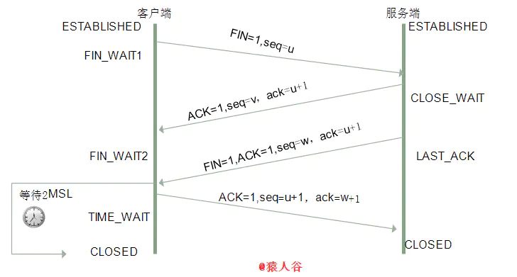

# **四次挥手**

<br>

## **1. 什么是四次挥手**
- **第一次挥手**：
  - **Client 将 ```FIN``` 置为1，发送一个```序列号 seq``` 给 Server**
  
  - 进入 ```FIN_WAIT_1``` 状态；

- **第二次挥手**：
  - **Server 收到 ```FIN``` 之后，发送一个 ```ACK=1```，```acknowledge number = 收到的序列号+1```**
  
  - 进入 ```CLOSE_WAIT``` 状态
  
  - 此时**客户端已经没有要发送的数据了，但仍可以接受服务器发来的数据**。

- **第三次挥手**：
  - **Server 将 ```FIN``` 置1，发送一个```序列号```给 Client；进入 ```LAST_ACK``` 状态**

- **第四次挥手**：
  - Client 收到服务器的 ```FIN``` 后，进入 ```TIME_WAIT``` 状态
  
  - 接着将 ```ACK``` 置1，发送一个 ```acknowledge number = 序列号+1```给服务器
  
  - 服务器收到后，确认 acknowledge number 后，变为 ```CLOSED``` 状态，不再向客户端发送数据
  
  - **客户端等待```2*MSL```（报文段最长寿命）时间后，也进入 ```CLOSED``` 状态**。完成四次挥手。

    

<br>

## **2. 挥手为什么需要四次？为什么不能把服务器发送的 ACK 和 FIN 合并起来，变成三次挥手（CLOSE_WAIT 状态意义是什么）？**
- 因为服务器收到客户端断开连接的请求时，**可能还有一些数据没有发完**

- 这时**先回复 ```ACK```**，表示接收到了断开连接的请求。

- **等到数据发完之后再发 ```FIN```**，断开服务器到客户端的数据传送。

- **只有等到我服务端所有的报文都发送完了，我才能发送 FIN 报文，因此不能一起发送**。故需要四次挥手。

<br>

## **3. 如果第二次挥手时服务器的ACK没有送达客户端，会怎样？**
- 客户端没有收到 ACK 确认，会**重新发送 ```FIN``` 请求**。

<br>

## **4. 四次挥手释放连接时，等待 2MSL 的意义？（客户端 TIME_WAIT 状态的意义是什么？）**
- ```MSL(Maximum Segment Lifetime)```，可译为“**最长报文段寿命**”，**它是任何报文在网络上存在的最长时间，超过这个时间报文将被丢弃**。

- 2MSL 就是**一个发送和一个回复所需的最大时间**。

- **如果直到 2MSL，Client 都没有再次收到 FIN，那么 Client 推断 ```ACK 已经被成功接收```，则结束 TCP 连接**。

- 两个理由：
  - **保证客户端发送的最后一个 ```ACK``` 报文段能够到达服务端**。 
    - **第四次挥手时，客户端发送给服务器的 ```ACK``` 有可能丢失**，TIME_WAIT 状态就是用来**重发可能丢失的 ACK 报文**。
    
    - **如果 Server 没有收到 ACK，就会重发 ```FIN```**
    
    - 如果 Client 在 2*MSL 的时间内收到了 FIN，就会**重新发送 ACK 并再次等待 2MSL**，**防止 Server 没有收到 ACK 而不断重发 FIN**。

  - **防止“已失效的连接请求报文段”出现在本连接中**。 
    - 客户端在发送完最后一个 ACK 报文段后，再经过 2MSL，就可以**使本连接持续的时间内所产生的所有报文段都从网络中消失**
    
    - **使下一个新的连接中不会出现这种```旧的连接请求报文段```**。

<br>

> - 参考：
>   - https://mp.weixin.qq.com/s/gBr3UfC1HRcw4U-ZMmtRaQ  
>   - https://hit-alibaba.github.io/interview/basic/network/TCP.html  
>   - https://juejin.cn/post/6844903958624878606