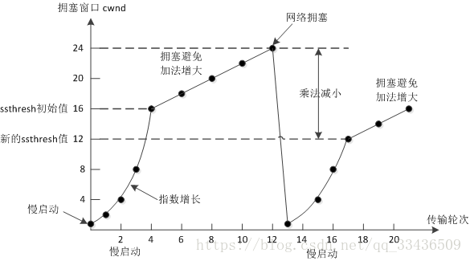

# **TCP的拥塞控制是怎么实现的**

- 拥塞控制主要由四个算法组成：
    
    1. **慢启动**
    
    2. **拥塞避免**
    
    3. **快重传**
    
    4. **快恢复**

    

 

## **1. 慢启动**
- 刚开始发送数据时，**先把`拥塞窗口`（congestion window）设置为一个最大报文段 `MSS` 的数值**，**每收到一个新的确认报文之后，就把拥塞窗口加1个 `MSS`**。

- **这样每经过一个`传输轮次`（或者说是每经过一个往返时间 `RTT`），拥塞窗口的大小就会`加倍`**。

    

 

## **2. 拥塞避免**
- 当拥塞窗口的大小达到**慢开始门限**（slow start threshold）时，开始执行拥塞避免算法

- **拥塞窗口大小不再指数增加，而是线性增加**，即每经过一个传输轮次只增加 `1MSS`

- 无论在慢开始阶段还是在拥塞避免阶段，**只要`发送方`判断网络出现拥塞（其根据就是没有收到确认）**，就要**把慢开始门限 `ssthresh` 设置为出现拥塞时的发送方窗口值的一半（但不能小于 2）**。

- 然后**把拥塞窗口 `cwnd` 重新设置为 1**，执行**慢开始算法**。（这是**不使用快重传的情况**）

 

## **3. 快重传**
- **快重传要求`接收方`在收到一个`失序的报文段`后就立即发出`重复确认`**（为的是使发送方及早知道有报文段没有到达对方）而不要等到自己发送数据时捎带确认。

- 快重传算法规定，**`发送方`只要一连收到`三个重复确认`就应当立即重传对方尚未收到的报文段**，而不必继续等待设置的重传计时器时间到期。

    

 

## **4. 快恢复**
- **当发送方连续收到三个重复确认时，就把`慢开始门限减半`，然后执行`拥塞避免`算法**。

- **不执行慢开始算法的原因**：因为**如果网络出现拥塞的话就不会收到好几个重复的确认**，所以发送方认为现在网络可能没有出现拥塞。

- 也有的快重传是**把开始时的拥塞窗口 `cwnd` 值再增大一点**，即等于 `ssthresh + 3*MSS` 。

- 这样做的理由是：
    
    - 既然发送方收到三个重复的确认，就表明有三个分组已经离开了网络。**这三个分组不再消耗网络的资源而是停留在接收方的缓存中**。可见**现在网络中减少了三个分组**。因此可以适当把拥塞窗口扩大些。

 

> 参考：https://github.com/wolverinn/Waking-Up/blob/master/Computer%20Network.md#TCP%E7%9A%84%E6%8B%A5%E5%A1%9E%E6%8E%A7%E5%88%B6%E6%98%AF%E6%80%8E%E4%B9%88%E5%AE%9E%E7%8E%B0%E7%9A%84